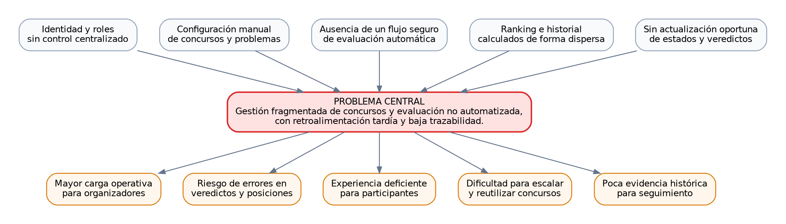

# 01. Contexto y diagnóstico inicial

## Ficha del proyecto

| Campo                | Valor                                                           |
| -------------------- | --------------------------------------------------------------- |
| Proyecto             | **UPDS JUDGE**                                                  |
| Tipo                 | Proyecto académico con orientación a producto real              |
| Proceso central      | Organización de concursos y evaluación automática de soluciones |
| Equipo               | GPTeam                                                          |
| Repositorio frontend | <https://github.com/Alex-Fernandez-2003/UPDS-JUDGE-FRONT.git>     |
| Repositorio backend  | <https://github.com/wilsonyucra413-sys/UPDSjudge>                 |
| Estado actual        | Análisis, diseño y preparación para desarrollo                  |

> **Nota de vigencia (auditoría frontend 2026-07-28):** este documento conserva el diagnóstico histórico previo a la implementación. El frontend actual sí existe bajo `frontend/` y contiene rutas, layouts, autenticación, concursos, problemas, envíos, ranking y administración de roles. Para el estado vigente, consultar `auditorias/auditoria-documentacion-frontend-estado-actual.md`.

## Integrantes

- Wilson Yucra Rengifo
- Cristhian Joel Amador Gallardo
- Arnold Daniel Torrez Zarate
- Daniel Javier Aramayo Mancilla
- Enny Anaí Lopez Saldaña Beymar
- Beymar Angelo Vasquez Acha
- Alex Saul Fernandez Valdez

# 1. Contexto del problema

La programación competitiva necesita un entorno que coordine participantes, concursos, problemas, lenguajes, envíos, casos de prueba, veredictos y posiciones. Cuando estas actividades se realizan con herramientas separadas o de forma manual, los organizadores deben dedicar tiempo a registrar participantes, distribuir problemas, ejecutar soluciones, comunicar resultados y recalcular rankings.

UPDS JUDGE busca centralizar ese flujo para el contexto académico de la UPDS. El producto se concibe como una aplicación web que permite preparar concursos, importar problemas y casos, recibir código fuente, delegar la evaluación a un motor especializado y mostrar el resultado al participante.

# 2. Proceso central

El proceso central es:

```text
Configurar concurso → publicar problemas → registrar participantes → recibir soluciones
→ evaluar código → persistir veredictos → calcular ranking → conservar historial
```

Este proceso combina gestión académica y ejecución técnica. El frontend facilita la interacción; el backend valida reglas, protege datos y coordina la evaluación; el motor Judge0 compila y ejecuta código; y la base de datos conserva la trazabilidad.

# 3. Stakeholders

| Stakeholder                | Responsabilidad o interés                                                                       |
| -------------------------- | ----------------------------------------------------------------------------------------------- |
| Participante               | Registrarse, ingresar a concursos, consultar problemas, enviar soluciones y revisar resultados. |
| Administrador de Concursos | Crear eventos, importar problemas, configurar límites, publicar y congelar rankings.            |
| Administrador de Roles     | Delegar permisos sin entregar acceso indiscriminado.                                            |
| Equipo de desarrollo       | Implementar frontend, backend, persistencia, integración y pruebas.                             |
| Evaluador académico        | Verificar coherencia entre problema, MVP, backlog, UML, datos y planificación.                  |
| Motor Judge0               | Compilar y ejecutar soluciones bajo límites controlados.                                        |

# 4. Situación actual y evidencia

## 4.1 Elementos disponibles

- Pantallas de mayor fidelidad para problemas, envíos y ranking hechas en Figma.
- Diagrama de datos preliminar con usuarios, roles, concursos, problemas, casos, lenguajes, participantes y envíos.
- Captura de backlog con 15 historias y estimaciones temporales.
- Repositorio frontend definido.

## 4.2 Elementos no evidenciados todavía

> Estado histórico de la etapa de diagnóstico; no describe el checkout actual del frontend.

- Código de frontend o backend implementado.
- Configuración desplegada de Judge0.
- Política final de almacenamiento de casos de prueba.
- Evidencia de pruebas automatizadas o despliegues.

La documentación distingue estos vacíos para evitar afirmar avances inexistentes.

# 5. Problema central

La comunidad académica no cuenta todavía con una plataforma integrada y trazable que permita organizar concursos de programación, evaluar automáticamente las soluciones y publicar resultados oportunos, lo que incrementa la carga operativa, el riesgo de inconsistencias y la dificultad para conservar historial y ranking confiables.

# 6. Causas

| Tipo        | Causa                                                                                                         |
| ----------- | ------------------------------------------------------------------------------------------------------------- |
| Operativa   | La configuración de concursos, problemas y participantes puede quedar distribuida en herramientas diferentes. |
| Técnica     | No existe un flujo consolidado para recibir código y coordinar su evaluación segura.                          |
| Información | Los envíos, resultados, intentos y penalizaciones no están centralizados.                                     |
| Gestión     | Los permisos de organizadores y administradores necesitan control explícito.                                  |
| Experiencia | El participante no recibe necesariamente un estado actualizado del procesamiento.                             |

# 7. Efectos

| Tipo          | Efecto                                                                   |
| ------------- | ------------------------------------------------------------------------ |
| Operativo     | Mayor tiempo para preparar y supervisar una competencia.                 |
| Calidad       | Riesgo de errores al comunicar veredictos o calcular posiciones.         |
| Usuario       | Incertidumbre durante la espera y dificultad para revisar el historial.  |
| Académico     | Menor evidencia para analizar desempeño y retroalimentar el aprendizaje. |
| Escalabilidad | Dificultad para repetir concursos con más participantes y problemas.     |

# 8. Árbol de problemas



# 9. Decisiones apoyadas por el sistema

UPDS JUDGE no es un DSS clásico, pero incorpora un componente de apoyo a decisiones basado en datos verificables:

- El participante decide qué problema abordar y en qué lenguaje continuar.
- El organizador identifica problemas con baja tasa de aceptación.
- El administrador observa volumen de envíos y posibles cuellos de botella.
- El docente compara desempeño, penalización y progresión.
- El equipo técnico identifica estados acumulados en cola o errores internos.

# 10. Indicadores iniciales

| Indicador                 | Pregunta que responde                         | Decisión apoyada                            |
| ------------------------- | --------------------------------------------- | ------------------------------------------- |
| Participantes activos     | ¿Cuántos usuarios están compitiendo?          | Dimensionar soporte y capacidad.            |
| Envíos por minuto         | ¿Existe una carga atípica?                    | Ajustar capacidad del evaluador.            |
| Tasa de aceptación        | ¿Qué proporción de envíos es correcta?        | Evaluar dificultad global.                  |
| Aceptación por problema   | ¿Qué problema resulta más difícil?            | Revisar enunciado, límites o complejidad.   |
| Distribución por lenguaje | ¿Qué compiladores se usan más?                | Priorizar soporte y pruebas.                |
| Penalización promedio     | ¿Cuánto tardan los participantes en resolver? | Analizar desempeño del concurso.            |
| Estados en cola           | ¿Hay retrasos del motor?                      | Intervenir antes de afectar la competencia. |

# 11. Conclusión del diagnóstico

El valor del proyecto no se limita a crear formularios CRUD. La parte crítica consiste en aplicar reglas de acceso, procesar paquetes de problemas, coordinar una evaluación externa, normalizar veredictos, mantener ranking oficial y diferenciar envíos de práctica. La solución necesita una arquitectura separada, contratos estables y protección rigurosa de casos de prueba y credenciales.
