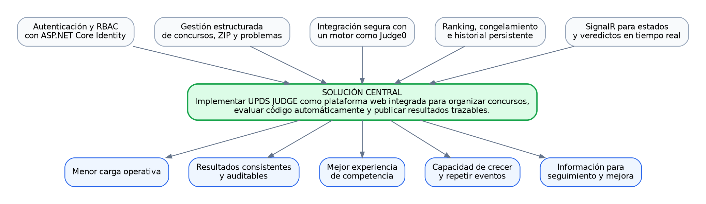

# 02. MVP y propuesta de valor

## Proyecto

**UPDS JUDGE** — plataforma universitaria para concursos de programación competitiva.

# 1. Árbol de soluciones

La solución central consiste en implementar una plataforma web integrada que gestione identidad, concursos, problemas, envíos, evaluación, veredictos, ranking e historial.

# 2. Visión del producto

Para estudiantes y organizadores de concursos de programación, **UPDS JUDGE** es una plataforma web que permite preparar competencias, evaluar soluciones automáticamente y consultar resultados trazables. A diferencia de un proceso manual basado en archivos, mensajes y ejecución local, centraliza reglas, permisos, veredictos, ranking e historial.

# 3. Propuesta de valor

- Reduce trabajo repetitivo del organizador.
- Entrega retroalimentación rápida al participante.
- Aplica reglas de ranking de forma uniforme.
- Conserva evidencia de envíos y resultados.
- Permite delegar administración mediante roles.
- Prepara una base reutilizable para concursos futuros.

# 4. Es / No es / Hace / No hace

| Categoría | Definición                                                                        |
| --------- | --------------------------------------------------------------------------------- |
| Es        | Un juez en línea y gestor de concursos de programación.                           |
| Es        | Una aplicación con frontend y backend en repositorios separados.                  |
| Es        | Una plataforma que integra ASP.NET Core, PostgreSQL y un evaluador externo.       |
| Es        | Un sistema con roles de participante, Admin Concursos y Admin Roles.              |
| No es     | Un LMS completo ni un sistema general de gestión universitaria.                   |
| No es     | Un IDE colaborativo en el navegador durante el MVP.                               |
| No es     | Un detector de plagio o similitud de código en la primera entrega.                |
| No es     | Un reemplazo del sandbox especializado del motor de evaluación.                   |
| Hace      | Registra, autentica y autoriza usuarios.                                          |
| Hace      | Crea concursos e importa problemas/casos desde ZIP.                               |
| Hace      | Recibe código y muestra veredictos.                                               |
| Hace      | Calcula ranking, penalización, congelamiento e historial.                         |
| No hace   | No expone casos de prueba privados al cliente.                                    |
| No hace   | No entrega secretos de Judge0 al frontend.                                        |
| No hace   | No modifica el ranking oficial con envíos de upsolving.                           |
| No hace   | No garantiza disponibilidad ilimitada sin monitoreo y capacidad adecuada.         |

# 5. Canvas MVP

| Bloque            | Contenido                                                                                                                     |
| ----------------- | ----------------------------------------------------------------------------------------------------------------------------- |
| Usuarios          | Participantes, administradores de concursos, administradores de roles y docentes organizadores.                              |
| Problema          | Gestión fragmentada, evaluación tardía, ranking inconsistente y poca trazabilidad.                                            |
| Propuesta         | Unificar el ciclo completo de un concurso en una plataforma web.                                                              |
| Flujo principal   | Autenticarse → ingresar a concurso → elegir problema → enviar código → recibir veredicto → consultar ranking.                |
| Funciones mínimas | Las 15 historias entregadas: UJ-05 a UJ-20, excluyendo el identificador no provisto UJ-17.                                   |
| Resultado         | Concurso operable con evaluación automática y resultados persistentes.                                                        |
| Métricas          | Tiempo de respuesta, tasa de aceptación, envíos por minuto, errores internos, participantes y penalización.                  |
| Riesgos           | Ejecución de código no confiable, saturación de Judge0, exposición de casos, contratos inestables y fechas mal configuradas. |
| Restricciones     | Repositorios separados; backend ASP.NET Core MVC; PDF alojado externamente según HU; lenguajes iniciales C++, Python y C#.   |
| Fuera del MVP     | Equipos, plagiarism detection, editor colaborativo, torneos avanzados, certificados y analítica predictiva.                  |

# 6. Alcance funcional del MVP

## 6.1 Identidad y permisos

- Registro e inicio de sesión.
- JWT con roles.
- Asignación y revocación auditada de roles.

## 6.2 Concursos

- CRUD controlado.
- Fecha, duración, privacidad, PDF y congelamiento.
- Importación de ZIP con estructura por incisos.
- Configuración de límites por problema.

## 6.3 Participación

- Listado por estado.
- Acceso a concursos privados.
- Consulta de problemas y PDF.

## 6.4 Evaluación

- Selección de lenguaje y archivo.
- Validaciones de extensión, tamaño y permisos.
- Integración con Judge0.
- Consulta de estados y veredictos mediante solicitudes HTTP.

## 6.5 Resultados

- Upsolving independiente.
- Ranking ICPC simplificado.
- Congelamiento público.
- Historial personal filtrable.

# 7. Objetivo general

Diseñar e implementar un MVP de UPDS JUDGE que permita administrar concursos de programación, recibir y evaluar soluciones de forma automatizada, consultar veredictos y calcular rankings trazables, mediante un frontend React con Vite independiente y un backend ASP.NET Core MVC/Web API separado.

# 8. Objetivos específicos

1. Implementar autenticación y autorización por roles.
2. Permitir la creación de concursos y la importación segura de problemas.
3. Integrar un motor de evaluación compatible con C++, Python y C#.
4. Mantener un historial de envíos con estados, veredictos, tiempos y memoria.
5. Calcular ranking y congelamiento sin incluir upsolving.
6. Diseñar una interfaz consistente, accesible y responsive.
7. Preparar documentación, contratos y evidencias para iniciar sprints de desarrollo.

# 9. Objetivo SMART

Diseñar, documentar y dejar listo para desarrollo incremental durante la planificación académica vigente un MVP llamado **UPDS JUDGE**, compuesto por un frontend independiente y un backend ASP.NET Core MVC/Web API, capaz de cubrir las 15 historias de usuario provistas, evaluar al menos C++, Python y C#, consultar estados de los envíos mediante HTTP y calcular el ranking oficial, con criterios verificables, modelos UML, persistencia y Definition of Ready.

# 10. Hipótesis de validación

Si los organizadores pueden configurar un concurso, importar problemas y recibir evaluaciones sin ejecutar manualmente cada solución, y si los participantes reciben veredictos e historial en una sola interfaz, entonces disminuirá la carga operativa y aumentará la claridad del proceso competitivo.

# 11. Criterios de éxito del MVP

- Las historias críticas UJ-09, UJ-14, UJ-15, UJ-18 y UJ-19 completan sus criterios de aceptación.
- Ningún caso de prueba privado es accesible desde el frontend.
- El ranking reproduce los resultados de un conjunto de prueba conocido.
- Un envío aceptado puede consultarse y visualizarse correctamente en el historial mediante solicitudes HTTP.
- Un envío de upsolving no altera el ranking oficial.
- Las rutas administrativas rechazan usuarios sin rol.