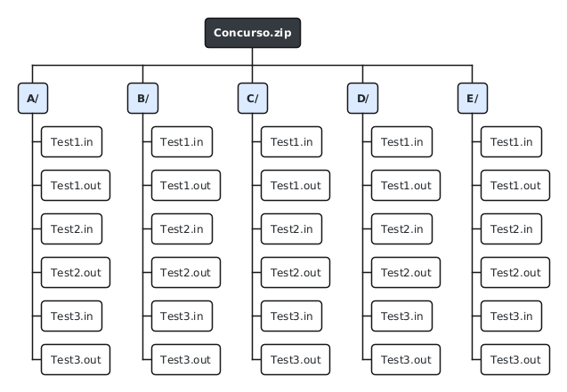

# 04. Definition of Ready y refinamiento

## UPDS JUDGE

# 1. Definition of Ready del producto

Una historia puede entrar a un sprint cuando cumple lo siguiente:

- [ ] Está redactada con rol, acción y beneficio.
- [ ] Conserva un identificador único y una épica.
- [ ] Tiene prioridad y estimación ratificadas por el equipo.
- [ ] Incluye criterios de aceptación verificables.
- [ ] Especifica permisos y actores autorizados.
- [ ] Identifica datos de entrada, salida y persistencia.
- [ ] Incluye estados de carga, vacío, error y éxito para frontend.
- [ ] Cuenta con referencia visual o decisión explícita de diseño.
- [ ] Tiene contrato de API acordado o mock estable.
- [ ] Define validaciones de seguridad y límites.
- [ ] Identifica dependencias con backend, Judge0, SignalR o almacenamiento.
- [ ] Puede probarse de forma aislada o con dobles de prueba.
- [ ] No presenta bloqueos críticos conocidos.

# 2. Definition of Ready por repositorio

## 2.1 Frontend

- Endpoint y DTO conocidos.
- Roles y comportamiento de navegación definidos.
- Diseño desktop y reglas responsive acordadas.
- Copys y estados visuales en español.
- Mock disponible cuando el backend todavía no esté integrado.

## 2.2 Backend

- Regla de negocio validada.
- Entidades y migraciones identificadas.
- Código de respuesta HTTP definido.
- Política de autorización establecida.
- Casos de prueba y estrategia de integración disponibles.

# 3. Reglas de negocio transversales

1. Las contraseñas de usuario y de concursos no se almacenan en texto plano.
2. Los roles se validan en backend; ocultar una opción en UI no es autorización.
3. Los casos de prueba y salidas esperadas son privados.
4. El frontend nunca recibe credenciales de Judge0 ni de base de datos.
5. Un participante solo realiza envíos oficiales dentro del periodo permitido.
6. El upsolving se identifica y no modifica el ranking oficial.
7. El ranking prioriza problemas resueltos y luego menor penalización.
8. La penalización suma el minuto de aceptación más 20 minutos por intento fallido previo.
9. El congelamiento afecta únicamente la representación pública.
10. Las transiciones de estado de un envío deben persistirse y ser auditables.

# 4. Formato ZIP propuesto

El formato ZIP está diseñado y documentado, pero permanece pendiente de validación final por el equipo y por el responsable de la integración backend/Judge0. La propuesta usa un archivo `Concurso.zip` con una carpeta de primer nivel por ejercicio, identificada por un inciso como `A/`, `B/` o `C/`. Cada carpeta contiene pares numerados `TestN.in` y `TestN.out` con el mismo número positivo `N`.

## Imagen referencial

---

# 5. Historias críticas refinadas

## 5.1 UJ-09 — Importar paquete ZIP

**Precondiciones:** administrador autenticado; concurso existente; límites de carga configurados.

**Entrada:** `contestId`, archivo ZIP, usuario actor.

**Flujo propuesto:**

1. El frontend envía el archivo mediante `multipart/form-data`.
2. El backend valida rol, concurso, tipo MIME y tamaño.
3. Se extrae en un directorio temporal aislado evitando _zip slip_.
4. Se valida que las carpetas de primer nivel sean incisos permitidos y únicos.
5. Se comprueba la existencia de pares numerados `TestN.in` y `TestN.out` con el mismo identificador.
6. Se almacena el contenido privado.
7. Se crean problemas y casos dentro de una transacción.
8. Se devuelve un resumen de elementos creados.

**Alternativas:** ZIP corrupto, inciso duplicado, par incompleto, archivo excesivo, concurso publicado, error de almacenamiento.

**Criterio de atomicidad:** una importación inválida no deja problemas o casos parciales.

## 5.2 UJ-14 — Enviar solución

**Precondiciones:** sesión válida; participación activa; concurso en curso o upsolving habilitado; lenguaje activo.

**Entrada:** problema, lenguaje, archivo fuente.

**Flujo principal:** validar → persistir En cola → enviar al evaluador → devolver `202 Accepted` → procesar asíncronamente.

**Alternativas:** extensión inválida, tamaño excesivo, problema no publicado, concurso cerrado, usuario no participante, evaluador no disponible.

## 5.3 UJ-15 — Veredicto en tiempo real

**Precondición:** envío persistido y canal SignalR autenticado.

**Estados:** `EN_COLA`, `COMPILANDO`, `EVALUANDO`, `FINALIZADO`, `ERROR_INTERNO`, `CANCELADO`.

**Normalización:** los estados externos se traducen al catálogo interno antes de almacenarse o publicarse.

**Fallback:** si SignalR se desconecta, el cliente consulta `GET /api/submissions/{id}` con retroceso gradual.

## 5.4 UJ-18 — Ranking

**Datos necesarios:** participantes activos, problemas, envíos oficiales, fecha de inicio y veredictos.

**Algoritmo:**

- Contar un problema cuando existe al menos un `Accepted` oficial.
- Tomar el primer Accepted del participante para ese problema.
- Contar intentos fallidos oficiales anteriores al Accepted.
- Penalización = minutos desde inicio hasta Accepted + 20 × intentos fallidos.
- Ordenar por resueltos descendente y penalización ascendente.
- Aplicar criterio de desempate estable documentado.

## 5.5 UJ-19 — Congelamiento

**Instante de congelamiento:** `fechaInicio + duración - minutosCongelamiento`.

**Vista pública:** oculta el efecto de envíos posteriores al instante, señalando actividad pendiente.

**Vista administrativa:** continúa mostrando los resultados reales.

**Descongelamiento:** recalcula y publica el ranking completo en una operación consistente.

# 6. Contratos API iniciales

| Método | Ruta                          | Propósito                       |
| ------ | ----------------------------- | ------------------------------- |
| POST   | `/api/auth/register`          | Registrar usuario.              |
| POST   | `/api/auth/login`             | Obtener JWT.                    |
| GET    | `/api/contests`               | Listar concursos por estado.    |
| POST   | `/api/contests`               | Crear concurso.                 |
| POST   | `/api/contests/{id}/join`     | Participar en concurso privado. |
| POST   | `/api/contests/{id}/package`  | Importar ZIP.                   |
| GET    | `/api/contests/{id}/problems` | Consultar problemas.            |
| POST   | `/api/submissions`            | Crear envío.                    |
| GET    | `/api/submissions/me`         | Historial personal.             |
| GET    | `/api/submissions/{id}`       | Estado de un envío.             |
| GET    | `/api/contests/{id}/ranking`  | Ranking público.                |
| PUT    | `/api/admin/users/{id}/roles` | Modificar roles.                |
| HUB    | `/hubs/submissions`           | Eventos de veredicto.           |

# 7. Definition of Done

- [ ] Criterios de aceptación cumplidos.
- [ ] Código revisado y fusionado mediante Pull Request.
- [ ] Pruebas unitarias y de integración relevantes aprobadas.
- [ ] Autorización validada en backend.
- [ ] Errores y estados de UI implementados.
- [ ] No se registran secretos ni código fuente sensible en logs.
- [ ] Documentación y contrato actualizados.
- [ ] Evidencia adjunta al issue.
- [ ] Despliegue o ejecución local reproducible.

# 8. Riesgos de refinamiento pendientes

- Confirmar la variante y despliegue de Judge0.
- Determinar almacenamiento definitivo de código y casos.
- Definir límite de envíos por usuario y ventana temporal.
- Acordar desempate de ranking.
- Definir política de reintentos ante caídas del evaluador.
