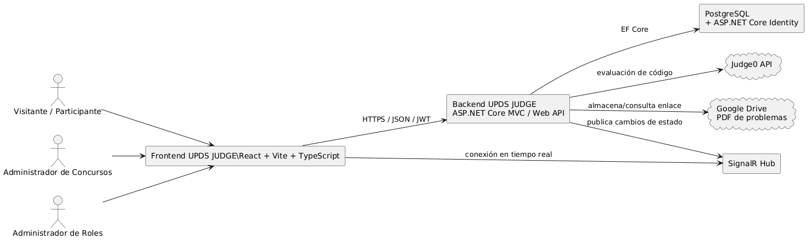
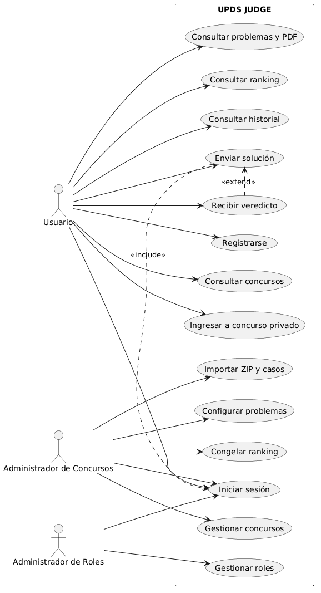
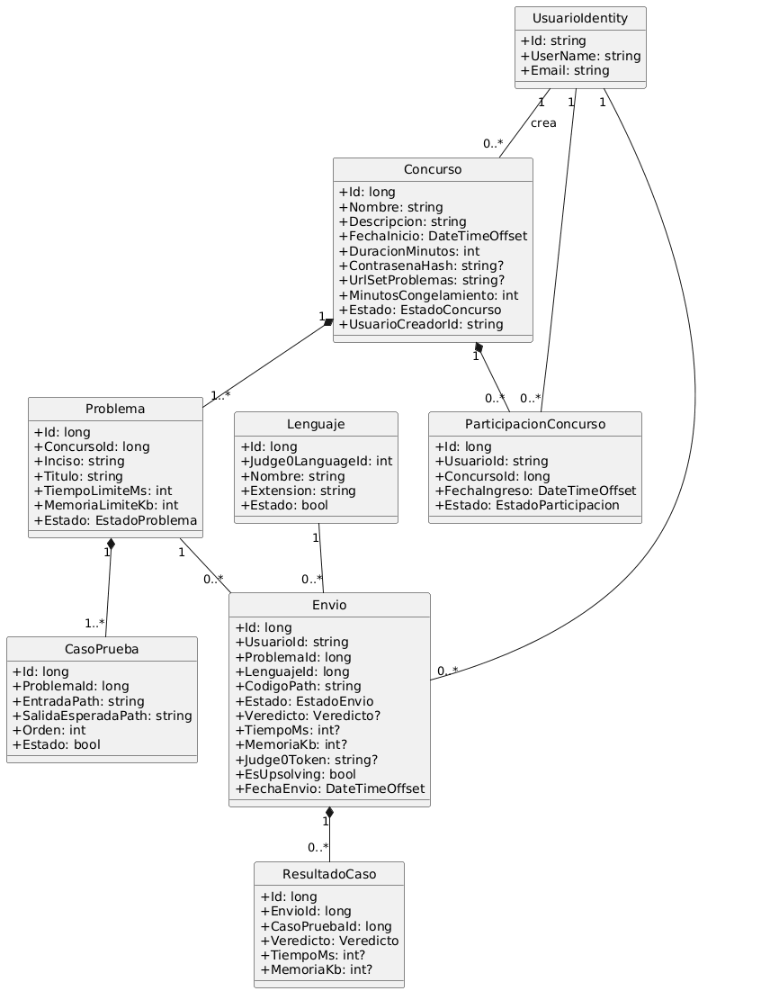
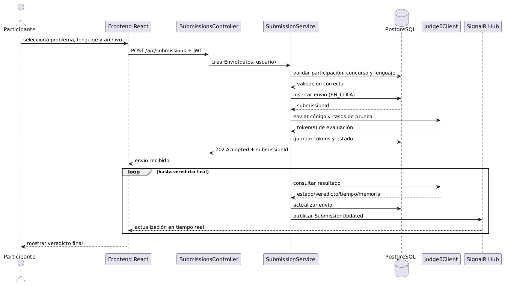
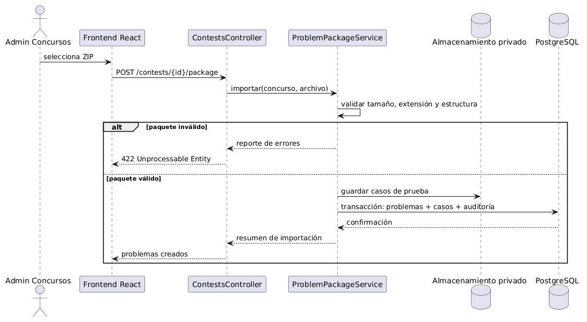
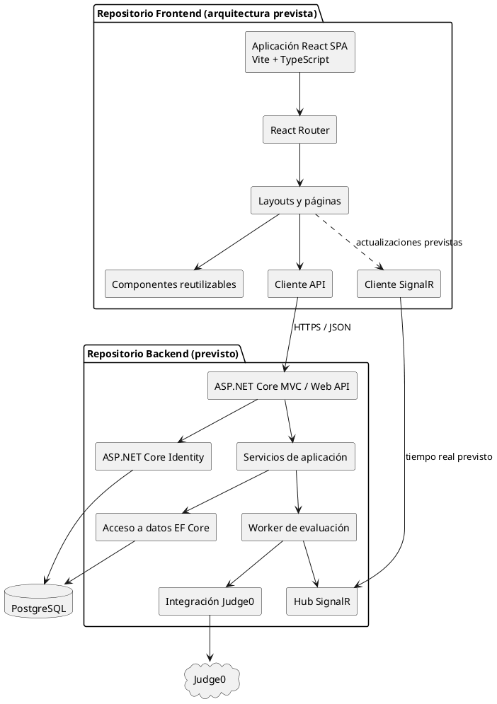

# 05. Modelado UML

## UPDS JUDGE

# 1. Propósito

Este documento transforma los casos de uso y la base de datos preliminar en un modelo consistente con la separación frontend/backend y con ASP.NET Core MVC/Web API.

# 2. Actores

| Actor                      | Capacidades principales                                                                                  |
| -------------------------- | -------------------------------------------------------------------------------------------------------- |
| Visitante                  | Registrarse e iniciar sesión.                                                                            |
| Participante               | Consultar concursos, registrarse, ver problemas, enviar código, revisar veredictos, ranking e historial. |
| Administrador de Concursos | Crear, editar, eliminar, importar problemas, configurar límites y congelamiento.                         |
| Administrador de Roles     | Buscar usuarios, asignar y revocar roles.                                                                |
| Judge0                     | Compilar y ejecutar código; devolver estado, tiempo y memoria.                                           |

# 3. Modelo de contexto

Fuente editable: [`puml/modelo-contexto.puml`](puml/modelo-contexto.puml).

# 4. Casos de uso

Fuente editable: [`puml/casos-uso-general.puml`](puml/casos-uso-general.puml).

Los tres actores y sus funciones se obtuvieron del archivo Draw.io original. Se normalizaron expresiones como “iniciar sección” a “iniciar sesión” y se alinearon con las historias del backlog.

# 5. Diagrama de clases de persistencia

Fuente editable: [`puml/diagrama-clases.puml`](puml/diagrama-clases.puml).

## 5.1 Clases principales

| Clase                 | Responsabilidad                                                  |
| --------------------- | ---------------------------------------------------------------- |
| UsuarioIdentity       | Identidad y autenticación gestionadas por ASP.NET Core Identity. |
| Concurso              | Configuración temporal, privacidad, estado y congelamiento.      |
| ParticipacionConcurso | Relación única entre usuario y concurso.                         |
| Problema              | Inciso, título y límites aplicables dentro de un concurso.       |
| CasoPrueba            | Referencias privadas a entrada y salida esperada.                |
| Lenguaje              | Mapeo entre lenguaje interno y `Judge0LanguageId`.               |
| Envio                 | Código presentado, estados, veredicto y marca de upsolving.      |
| ResultadoCaso         | Resultado técnico por caso, reservado al backend.                |

# 6. Diagrama de secuencia: envío y evaluación

### Diagrama de secuencia de envío

Fuente editable: [`puml/secuencia-envio-solucion.puml`](puml/secuencia-envio-solucion.puml).

---

### Diagrama de secuencia de importación

Fuente editable: [`puml/secuencia-importacion-zip.puml`](puml/secuencia-importacion-zip.puml).

---

## Responsabilidades por capa

- **Frontend:** captura datos, valida aspectos básicos y muestra estados.
- **Controller:** valida solicitud, identidad y contrato HTTP.
- **Service:** aplica reglas de negocio y coordina persistencia/integraciones.
- **EF Core/PostgreSQL:** mantiene consistencia y trazabilidad.
- **Judge0Client:** encapsula la API externa.
- **Worker:** consulta resultados sin bloquear la solicitud HTTP.
- **SignalR Hub:** publica cambios al usuario autorizado.

# 7. Secuencia adicional: importación ZIP

Fuente editable: [`puml/secuencia-importacion-zip.puml`](puml/secuencia-importacion-zip.puml).

La importación debe ejecutarse con validación previa y transacción. El contenido temporal se elimina al completar o fallar el proceso.

# 8. Arquitectura de componentes

Fuente editable: [`puml/arquitectura-componentes.puml`](puml/arquitectura-componentes.puml).

# 9. Correspondencia con MVC

El backend se crea a partir de ASP.NET Core MVC, pero actúa principalmente como API para un frontend independiente:

- **Model:** entidades EF Core, modelos de dominio, DTO y validaciones.
- **Controller:** endpoints HTTP y autorización.
- **View:** la interfaz principal no se renderiza mediante las vistas Razor del backend, ya que se desarrolla en el repositorio frontend con React y Vite. El backend devuelve respuestas HTTP/JSON consumidas por la aplicación React. Las Razor Views pueden conservarse únicamente para páginas internas si el equipo las necesitara.
- **Services:** lógica de aplicación añadida para evitar controladores con responsabilidades excesivas.

Esta interpretación conserva MVC sin acoplar la interfaz del producto al repositorio backend.

# 10. Trazabilidad UML–Backlog

| Elemento UML                    | Historias relacionadas     |
| ------------------------------- | -------------------------- |
| UsuarioIdentity y roles         | UJ-05, UJ-06, UJ-07        |
| Concurso                        | UJ-08, UJ-11, UJ-12, UJ-19 |
| Problema y CasoPrueba           | UJ-09, UJ-10, UJ-13        |
| Envio, Lenguaje y ResultadoCaso | UJ-14, UJ-15, UJ-16, UJ-20 |
| Servicio de ranking             | UJ-18, UJ-19               |
