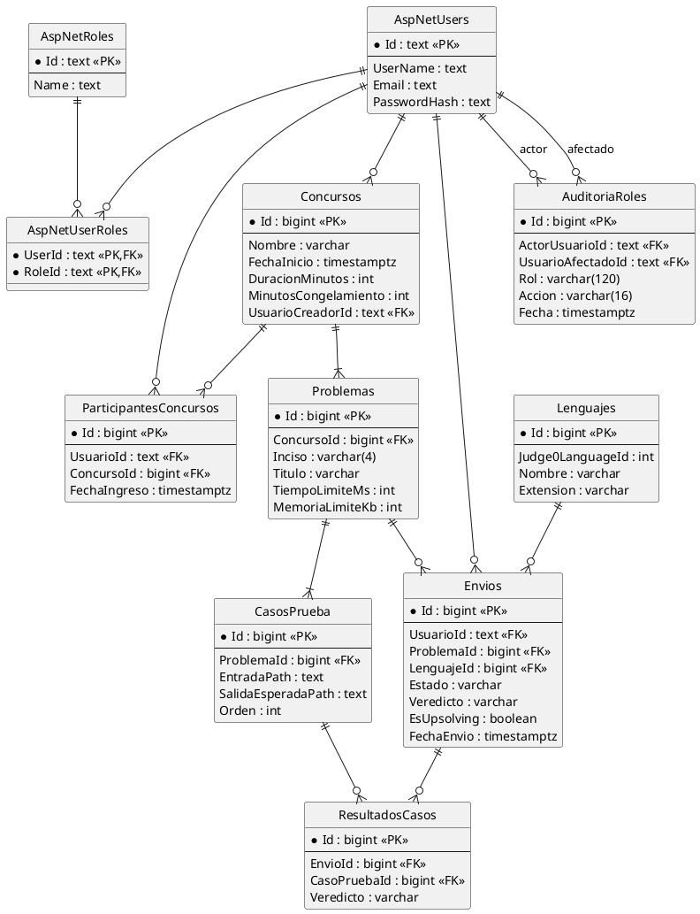

# 06. Arquitectura de datos

## UPDS JUDGE

# 1. Decisión arquitectónica

La persistencia propuesta utiliza PostgreSQL y Entity Framework Core. La autenticación y los roles se delegan a ASP.NET Core Identity. El esquema preliminar entregado se toma como base conceptual, pero se corrigen dos puntos críticos:

1. No se mantiene una columna `contrasena` en la tabla de usuarios; Identity conserva un hash y sus controles internos.
2. Los casos de prueba no se almacenan como texto accesible por la API pública; se guardan en almacenamiento privado y la base conserva referencias.


# 2. Modelo relacional propuesto



Fuente editable: [`puml/modelo-relacional.puml`](puml/modelo-relacional.puml).

# 3. Tablas de identidad

Las tablas `AspNetUsers`, `AspNetRoles` y `AspNetUserRoles` serán creadas por migraciones de ASP.NET Core Identity. El SQL manual no debe reemplazar sus mecanismos de hashing, normalización, tokens y seguridad.

# 4. Tablas de dominio

## 4.1 Concursos

| Campo                | Tipo conceptual | Restricción | Descripción                                             |
| -------------------- | --------------- | ----------- | ------------------------------------------------------- |
| Id                   | bigint          | PK          | Identificador.                                          |
| Nombre               | varchar(160)    | obligatorio | Nombre visible.                                         |
| Descripcion          | text            | opcional    | Contexto del evento.                                    |
| FechaInicio          | timestamptz     | obligatorio | Instante de inicio.                                     |
| DuracionMinutos      | int             | > 0         | Duración total.                                         |
| ContrasenaHash       | text            | opcional    | Acceso privado, nunca texto plano.                      |
| UrlSetProblemas      | text            | opcional    | Enlace al PDF.                                          |
| MinutosCongelamiento | int             | 0..duración | Ventana de congelamiento.                               |
| Estado               | enum            | obligatorio | Borrador, programado, en curso, finalizado o cancelado. |
| UsuarioCreadorId     | text            | FK Identity | Responsable.                                            |

## 4.2 ParticipantesConcursos

Garantiza una única participación por usuario y concurso. Conserva fecha y estado para cancelación o descalificación.

## 4.3 Problemas

Cada problema pertenece a un concurso en el modelo MVP. Se exige inciso único por concurso, título, límite de tiempo, memoria límite, estado y orden. La interfaz administrativa ingresa o muestra el tiempo en segundos; antes de persistirlo se normaliza en `tiempo_limite_ms` mediante `milisegundos = segundos × 1000`. El sufijo `Ms` identifica la unidad técnica de persistencia.

## 4.4 CasosPrueba

Contiene referencias privadas, orden y estado. El contenido no se devuelve al participante.

## 4.5 Lenguajes

Conserva nombre, extensión, estado y el identificador requerido por Judge0.

## 4.6 Envios

| Campo                | Propósito                            |
| -------------------- | ------------------------------------ |
| UsuarioId            | Propietario del envío.               |
| ProblemaId           | Problema evaluado.                   |
| LenguajeId           | Lenguaje seleccionado.               |
| CodigoPath           | Referencia privada al código.        |
| Estado               | Progreso interno.                    |
| Veredicto            | Resultado normalizado.               |
| TiempoMs / MemoriaKb | Métricas técnicas.                   |
| Judge0Token          | Correlación con el servicio externo. |
| EsUpsolving          | Excluir del ranking oficial.         |
| FechaEnvio           | Trazabilidad temporal.               |

## 4.7 ResultadosCasos

Permite auditoría técnica por caso. Debe exponerse solo a administradores autorizados o mantenerse completamente interno según la política del concurso.

## 4.8 AuditoriaRoles

Registra asignaciones y revocaciones sensibles. Conforme al script SQL inicial, conserva `Id`, `ActorUsuarioId`, `UsuarioAfectadoId`, `Rol`, `Accion` (`ASIGNAR` o `REVOCAR`) y `Fecha`. Los dos identificadores de usuario son referencias a Identity; sus claves foráneas físicas se incorporarán mediante las migraciones del backend, ya que las tablas de Identity no se crean en el script manual.

# 5. Integridad y restricciones

- Un usuario no puede participar dos veces en el mismo concurso.
- Un inciso y un orden son únicos dentro de un concurso.
- Tiempo, memoria y duración son positivos.
- El congelamiento no supera la duración.
- Un envío referencia un usuario, problema y lenguaje existentes.
- Un resultado por caso es único para la combinación envío/caso.
- No se elimina físicamente un lenguaje usado; se desactiva.
- Los concursos finalizados conservan envíos e historial.

# 6. Estados y veredictos

## Estados de concurso

```text
BORRADOR → PROGRAMADO → EN_CURSO → FINALIZADO
                         └────────→ CANCELADO
```

## Estados de envío

```text
EN_COLA → COMPILANDO → EVALUANDO → FINALIZADO
                    └────────────→ ERROR_INTERNO
```

## Veredictos iniciales

```text
ACCEPTED
WRONG_ANSWER
TIME_LIMIT_EXCEEDED
MEMORY_LIMIT_EXCEEDED
COMPILATION_ERROR
RUNTIME_ERROR
INTERNAL_ERROR
```

# 7. Índices

- `concursos(estado, fecha_inicio)`.
- `participantes_concursos(concurso_id, estado)`.
- `envios(usuario_id, fecha_envio desc)`.
- `envios(problema_id, veredicto)`.
- `envios(estado, fecha_envio)`.
- `resultados_casos(envio_id)` mediante su restricción única.

# 8. Consultas analíticas soportadas

| Consulta                        | Datos                                                  |
| ------------------------------- | ------------------------------------------------------ |
| Ranking oficial                 | Participaciones, envíos oficiales, problemas y fechas. |
| Tasa de aceptación por problema | Envíos y veredicto.                                    |
| Lenguajes más utilizados        | Envíos y lenguajes.                                    |
| Cola y tiempo de evaluación     | Estados y marcas temporales.                           |
| Participación por concurso      | ParticipantesConcursos.                                |
| Historial personal              | UsuarioId, filtros y fecha.                            |
| Problemas con mayor dificultad  | Intentos, participantes y Accepted.                    |

# 9. Seguridad de datos

- Aplicar autorización por política en ASP.NET Core.
- No confiar en roles enviados por el navegador.
- Usar almacenamiento privado para código y casos.
- Aplicar límites de archivo y extracción segura del ZIP.
- Evitar logs con código fuente, contraseñas o tokens.
- Rotar credenciales de Judge0 y base de datos.
- Usar HTTPS y CORS limitado al origen del frontend.
- Separar DTO públicos de entidades EF Core.

# 10. Script inicial

El archivo [`database/script-inicial.sql`](database/script-inicial.sql) crea el dominio PostgreSQL, índices, enums y lenguajes iniciales. Las tablas Identity quedan bajo migraciones del backend.

# 11. Estrategia de migraciones

1. Crear solución backend en su repositorio.
2. Configurar Identity y proveedor PostgreSQL.
3. Modelar entidades de dominio.
4. Generar migración inicial con EF Core.
5. Revisar SQL antes de aplicarlo.
6. Ejecutar migraciones en desarrollo y pruebas.
7. Mantener migraciones en control de versiones del backend, no del frontend.
