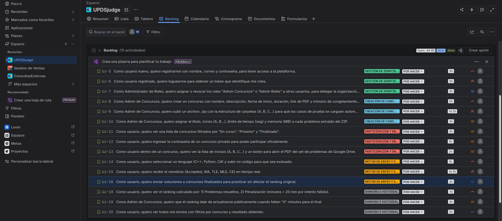
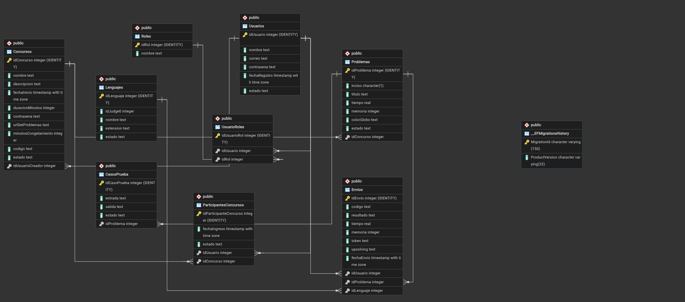
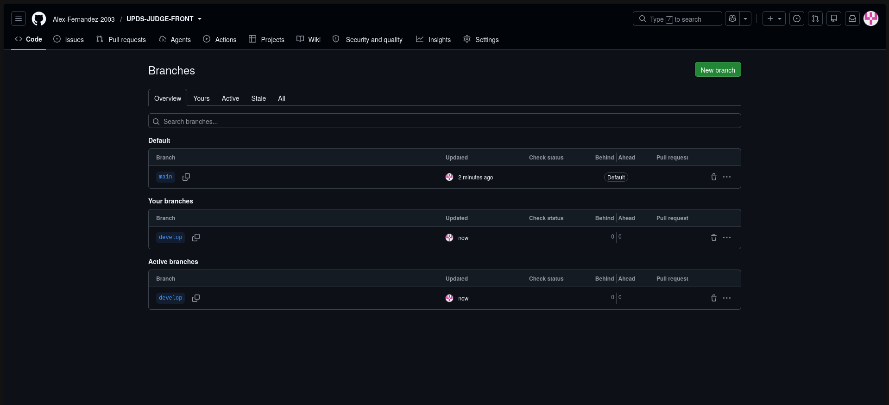
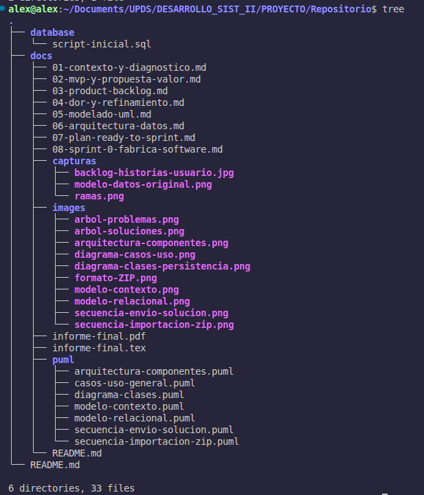
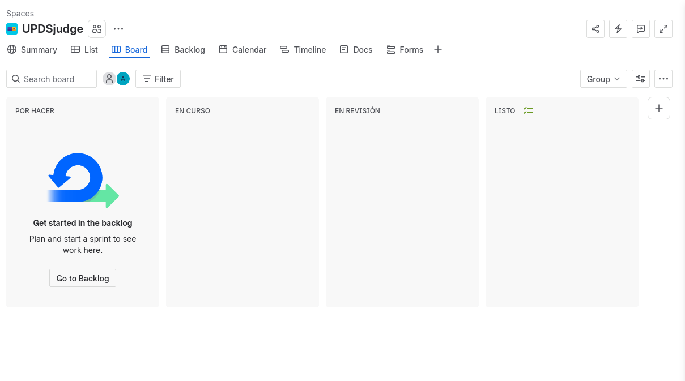
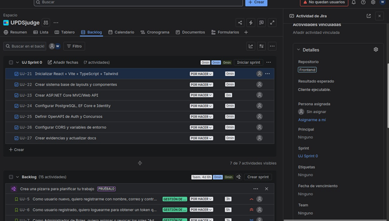
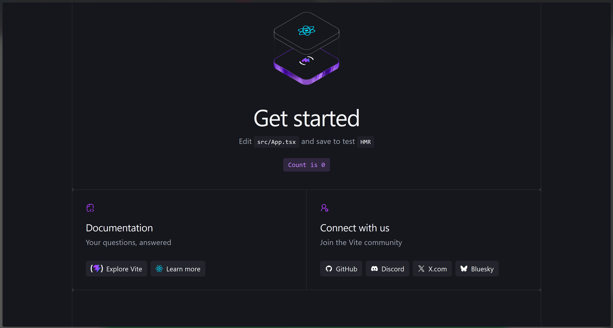
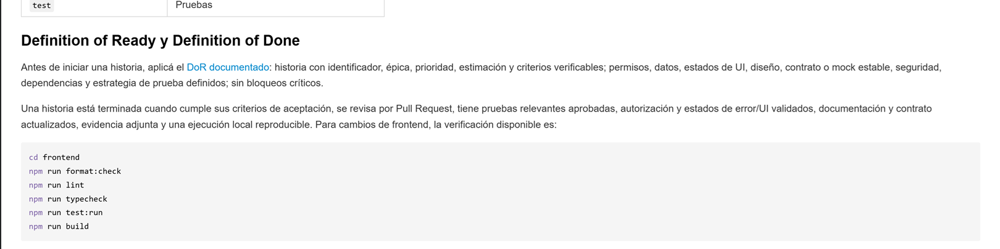

# 08. Sprint 0 — Preparando la fábrica de software

## UPDS JUDGE

# 1. Propósito

Construir una base reproducible para que frontend y backend se desarrollen en paralelo con contratos, seguridad, calidad y evidencias comunes.

> **Nota de vigencia (auditoría frontend 2026-07-28):** este documento conserva el plan y el resultado histórico del Sprint 0. Las frases que describen `frontend/` como ausente o pendiente pertenecen a esa etapa. El frontend actual existe y su inventario verificable se documenta en `auditorias/auditoria-documentacion-frontend-estado-actual.md`.

# 2. Repositorios

## 2.1 Frontend

- URL: <https://github.com/Alex-Fernandez-2003/UPDS-JUDGE-FRONT.git>
- Responsabilidad prevista en Sprint 0: aplicación React con Vite, componentes, navegación y clientes de integración documentados. En aquel baseline la carpeta `frontend/` todavía no estaba presente; esa afirmación es histórica.

## 2.2 Backend

- Repositorio separado.
- URL: <https://github.com/wilsonyucra413-sys/UPDSjudge>
- Responsabilidad: ASP.NET Core MVC/Web API, Identity, EF Core, Judge0, SignalR, reglas y migraciones.

# 3. Ramas

```text
main       versión estable
develop    integración
feature/*  historias o funcionalidades
fix/*      correcciones
chore/*    infraestructura y configuración
```

Reglas:

- No hacer push directo a `main`.
- Pull Request con al menos una revisión.
- Vincular PR con historia/tarea.
- Cuando exista una configuración CI verificable, ejecutar el pipeline antes de fusionar.

# 4. Estructura propuesta del repositorio frontend

El repositorio del frontend centraliza la documentación académica, los diagramas editables y los recursos de referencia del proyecto.

La siguiente era la estructura prevista: la aplicación React se incorporaría dentro de `frontend/`, mientras que los documentos y modelos permanecerían separados del código fuente. El árbol conserva la propuesta de Sprint 0 y no debe interpretarse como inventario actual.

```text
REPOSITORIO/
├── database/
│   └── script-inicial.sql
│
├── docs/
│   ├── capturas/
│   │   ├── backlog-historias-usuario.jpg
│   │   └── modelo-datos-original.png
│   │
│   ├── images/
│   │   ├── arbol-problemas.png
│   │   ├── arbol-soluciones.png
│   │   ├── arquitectura-componentes.png
│   │   ├── diagrama-casos-uso.png
│   │   ├── diagrama-clases-persistencia.png
│   │   ├── formato-ZIP.png
│   │   ├── modelo-contexto.png
│   │   ├── modelo-relacional.png
│   │   ├── secuencia-envio-solucion.png
│   │   └── secuencia-importacion-zip.png
│   │
│   ├── puml/
│   │   ├── arquitectura-componentes.puml
│   │   ├── casos-uso-general.puml
│   │   ├── diagrama-clases.puml
│   │   ├── modelo-contexto.puml
│   │   ├── modelo-relacional.puml
│   │   ├── secuencia-envio-solucion.puml
│   │   └── secuencia-importacion-zip.puml
│   │
│   ├── 01-contexto-y-diagnostico.md
│   ├── 02-mvp-y-propuesta-valor.md
│   ├── 03-product-backlog.md
│   ├── 04-dor-y-refinamiento.md
│   ├── 05-modelado-uml.md
│   ├── 06-arquitectura-datos.md
│   ├── 07-plan-ready-to-sprint.md
│   ├── 08-sprint-0-fabrica-software.md
│   ├── informe-final.pdf
│   ├── informe-final.tex
│   └── README.md
│
├── frontend/
│   ├── public/
│   │   └── assets/
│   │
│   ├── src/
│   │   ├── assets/
│   │   │
│   │   ├── components/
│   │   │   ├── common/
│   │   │   ├── forms/
│   │   │   ├── navigation/
│   │   │   └── tables/
│   │   │
│   │   ├── features/
│   │   │   ├── auth/
│   │   │   ├── contests/
│   │   │   ├── problems/
│   │   │   ├── submissions/
│   │   │   ├── ranking/
│   │   │   └── administration/
│   │   │
│   │   ├── hooks/
│   │   ├── layouts/
│   │   │
│   │   ├── lib/
│   │   │   ├── api/
│   │   │   ├── auth/
│   │   │   └── realtime/
│   │   │
│   │   ├── pages/
│   │   ├── routes/
│   │   ├── styles/
│   │   ├── types/
│   │   ├── App.tsx
│   │   ├── main.tsx
│   │   └── vite-env.d.ts
│   │
│   ├── .env.example
│   ├── eslint.config.js
│   ├── index.html
│   ├── package.json
│   ├── package-lock.json
│   ├── tsconfig.app.json
│   ├── tsconfig.json
│   ├── tsconfig.node.json
│   └── vite.config.ts
│
├── .gitignore
└── README.md
```

## 4.1 Responsabilidad de las carpetas principales

| Carpeta                    | Responsabilidad                                                                                             |
| -------------------------- | ----------------------------------------------------------------------------------------------------------- |
| `database/`                | Contiene el script SQL inicial utilizado como referencia académica y documental.                            |
| `docs/`                    | Contiene informes, diagramas, capturas, modelos UML y evidencias del proyecto.                              |
| `docs/capturas/`           | Guarda evidencias visuales del backlog, modelo de datos, tablero y flujo de trabajo.                        |
| `docs/images/`             | Contiene las imágenes generadas a partir de los diagramas y modelos del proyecto.                           |
| `docs/puml/`               | Contiene los archivos PlantUML editables.                                                                   |
| `frontend/`                | Estructura prevista durante Sprint 0; actualmente existe y se audita por separado.                            |
| `frontend/src/components/` | Ubicación propuesta para componentes visuales reutilizables.                                                |
| `frontend/src/features/`   | Ubicación propuesta para funcionalidades por dominio.                                                       |
| `frontend/src/lib/`        | Ubicación propuesta para clientes, utilidades e integraciones compartidas.                                  |
| `frontend/src/pages/`      | Ubicación propuesta para pantallas principales.                                                             |
| `frontend/src/routes/`     | Ubicación propuesta para configuración de rutas.                                                            |

La carpeta `database/` conserva el diseño SQL de referencia utilizado en la documentación. Las migraciones y decisiones definitivas de persistencia serán gestionadas por el responsable del repositorio backend.

No deben almacenarse en Git:

```text
frontend/node_modules/
frontend/dist/
frontend/.env
```

La previsión exigía documentar variables mediante `frontend/.env.example`. Ese archivo existe actualmente; la configuración vigente se describe en el informe de auditoría.

# 5. Estructura backend

```text
UPDS.Judge.sln
src/
├── UPDS.Judge.Web/
│   ├── Controllers/
│   ├── Hubs/
│   ├── Models/
│   ├── Views/
│   └── Program.cs
├── UPDS.Judge.Application/
│   ├── DTOs/
│   ├── Interfaces/
│   └── Services/
├── UPDS.Judge.Domain/
│   ├── Entities/
│   ├── Enums/
│   └── Rules/
├── UPDS.Judge.Infrastructure/
│   ├── Data/
│   ├── Identity/
│   ├── Judge0/
│   ├── Storage/
│   └── BackgroundServices/
tests/
├── UPDS.Judge.UnitTests/
└── UPDS.Judge.IntegrationTests/
```

`Views/` existe por la plantilla MVC, pero la UI principal se desarrolla en React con Vite.

# 6. Tablero en Jira

Columnas:

```text
BACKLOG | POR HACER | EN CURSO | EN REVISIÓN | LISTO
```

Campos:

- Épica.
- Historia.
- Repositorio.
- Prioridad.
- Puntos.
- Responsable.
- Sprint.
- Dependencia.

# 7. Issues del Sprint 0

| ID    | Tarea                                            | Repositorio | Resultado esperado                         |
| ----- | ------------------------------------------------ | ----------- | ------------------------------------------ |
| S0-01 | Inicializar React + Vite + TypeScript + Tailwind | Frontend    | Cliente ejecutable.                        |
| S0-02 | Crear sistema base de layouts y componentes      | Frontend    | Header, sidebar, botones, inputs y tablas. |
| S0-03 | Crear ASP.NET Core MVC/Web API                   | Backend     | API ejecutable y Swagger.                  |
| S0-04 | Configurar PostgreSQL, EF Core e Identity        | Backend     | Migración inicial.                         |
| S0-05 | Definir OpenAPI de Auth y Concursos              | Ambos       | Contrato versionado.                       |
| S0-06 | Configurar CORS y variables de entorno           | Ambos       | Comunicación local segura.                 |
| S0-07 | Crear evidencias y actualizar docs               | Docs        | Sprint 0 auditable.                        |

# 8. Pipeline mínimo previsto

No existe configuración CI verificable en este checkout. Los siguientes flujos son objetivos de Sprint 0 y su evidencia permanece pendiente.

## Frontend

```text
install → format check → lint → type check → tests → build
```

## Backend

```text
restore → build → unit tests → integration tests → publish
```

# 9. Acuerdos de trabajo

## 9.1 Daily Scrum

| Elemento         | Acuerdo                                         |
| ---------------- | ----------------------------------------------- |
| Frecuencia       | Diaria durante el sprint.                       |
| Duración máxima  | 10 a 15 minutos.                                |
| Horario sugerido | 22:30, hora Bolivia.                            |
| Canal            | Discord                                         |
| Preguntas guía   | ¿Qué hice ayer? ¿Qué haré hoy? ¿Tengo bloqueos? |

## 9.2 Roles operativos

| Rol                              | Responsable sugerido                                         | Responsabilidad                                                        |
| -------------------------------- | ------------------------------------------------------------ | ---------------------------------------------------------------------- |
| Coordinación del squad           | Alex Saúl Fernández Valdez.                                  | Ordenar entregables, tablero y revisión general.                       |
| Apoyo técnico/documental         | Alex Saúl Fernández Valdez.                                  | Apoyar documentación, validación y revisión de tareas.                 |
| Revisor de PR                    | Alex Saúl Fernández Valdez.                                  | Revisar cambios antes de mezclar a `develop`.                          |
| Responsable de evidencias        | Personal creador del documento correspondiente a la HU.      | Tomar capturas y verificar que coincidan con la entrega.               |
| Tester del producto              | Enny Anaí Lopez Saldaña Beymar y Beymar Angelo Vasquez Acha. | Probar los cambios al finalizar un sprint para buscar errores`main`.   |
| Encargado del backend            | Wilson Yucra Rengifo.                                        | Crear los endpoints del backend necesarios para el equipo de frontend. |
| Encargado de assets del proyecto | Enny Anaí Lopez Saldaña Beymar y Beymar Angelo Vasquez.      | Crear assets e íconos necesarios para el frontend.                     |

## 9.3 Flujo de Git

1. Toda nueva tarea inicia desde `develop`.
2. Se crea una rama específica por historia o tarea.
3. La rama debe usar prefijo claro:
   - `feature/`
   - `fix/`
   - `docs/`
   - `chore/`
4. Se realizan commits pequeños y descriptivos.
5. Se abre Pull Request hacia `develop`.
6. Otro integrante revisa el PR.
7. Si cumple DoD, se aprueba y se mezcla.
8. Al final del sprint, `develop` se integra a `main` si está estable.

## 9.4 Convención de nombres de ramas

| Tipo               | Ejemplo                |
| ------------------ | ---------------------- |
| Funcionalidad      | `feature/auth-login`   |
| Formulario         | `feature/profile-form` |
| Layout principal   | `feature/app-layout`   |
| Integración de API | `feature/api-client`   |
| Documentación      | `docs/sprint-0-report` |
| Corrección         | `fix/navigation-guard` |

## 9.5 Convención de commits

Formato sugerido:

```txt
tipo: descripción breve
```

Ejemplos:

```txt
docs: actualizar documentación del Sprint 0
feat: inicializar aplicación React con Vite y TypeScript
feat: crear layout principal y navegación
feat: configurar cliente para consumir la API
feat: implementar componentes base reutilizables
fix: corregir protección de rutas privadas
chore: configurar lint y estructura del frontend
```

Tipos permitidos:

| Tipo       | Uso                                        |
| ---------- | ------------------------------------------ |
| `feat`     | Nueva funcionalidad.                       |
| `fix`      | Corrección de error.                       |
| `docs`     | Documentación.                             |
| `chore`    | Configuración o mantenimiento.             |
| `refactor` | Mejora interna sin cambiar comportamiento. |
| `test`     | Pruebas.                                   |

## 9.6 Estándares de codificación

| Elemento                    | Estándar                                                     |
| --------------------------- | ------------------------------------------------------------ |
| Variables y funciones       | `camelCase`                                                  |
| Clases, componentes o tipos | `PascalCase`                                                 |
| Tablas y columnas SQL       | `snake_case`                                                 |
| Ramas Git                   | `kebab-case` con prefijo                                     |
| Archivos Markdown           | `kebab-case.md`                                              |
| Archivos PUML               | `kebab-case.puml`                                            |
| Mensajes al usuario         | Claros, breves y no técnicos                                 |
| Datos sensibles             | No exponer tokens, claves, prompts completos ni credenciales |

---

# 10. Evidencias

Las evidencias se almacenan dentro de `docs/capturas/`. Una evidencia se marca como disponible únicamente cuando el archivo correspondiente existe en el repositorio.

| Evidencia                                            | Estado     | Archivo o referencia                     |
| ---------------------------------------------------- | ---------- | ---------------------------------------- |
| Enlace al repositorio frontend                       | Disponible | Incluido en este documento               |
| Enlace al repositorio backend                        | Disponible | Incluido en este documento               |
| Captura del backlog de historias de usuario          | Disponible | `capturas/backlog-historias-usuario.jpg` |
| Captura del modelo de datos original                 | Disponible | `capturas/modelo-datos-original.png`     |
| Captura de las ramas `main` y `develop`              | Disponible | `capturas/ramas.png`                     |
| Captura de la estructura actual del repositorio      | Disponible | `capturas/estructura-repositorio.png`    |
| Captura del tablero de Jira                          | Disponible | `capturas/tablero-jira.png`              |
| Captura de los issues del Sprint 0                   | Disponible | `capturas/issues-sprint-0.png`           |
| Captura de la aplicación React con Vite en ejecución | Disponible | `capturas/react-vite-sprint-0.png`       |
| Captura de DoD y DoR en la documentación             | Disponible | `capturas/dod-dor-readme.png`            |

---

## 10.1 Capturas disponibles verificables

### Captura del backlog de historias de usuario

La captura documenta las historias de usuario identificadas para UPDS JUDGE y su organización inicial dentro del backlog.



---

### Captura del modelo de datos original

La captura conserva como referencia el modelo de datos planteado durante la etapa inicial del proyecto.



---

### Captura de ramas `main` y `develop`



---

### Captura de estructura actual del repositorio



---

### Captura del tablero de Jira



---

### Captura de los issues del Sprint 0



---

### Captura de la aplicación React con Vite en ejecución



---

### Captura de DoD y DoR en la documentación



---

# 11. Resultado esperado

Al cerrar el Sprint 0, las historias del producto deben poder desarrollarse sin depender de configuraciones manuales desconocidas y sin acoplar los repositorios mediante código duplicado.
