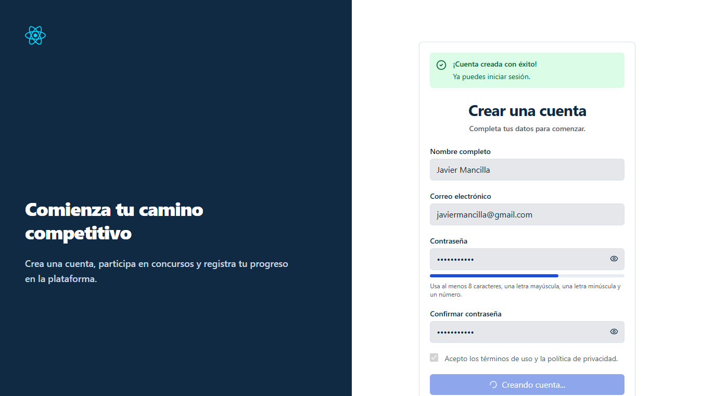
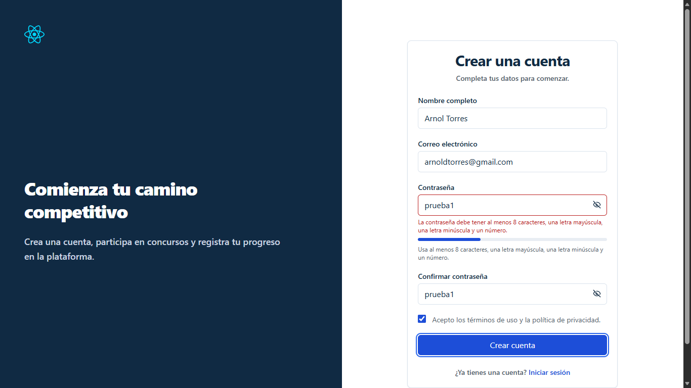

# UJ-05 — Registro de usuario y creación de cuenta

## Estado

- frontend implementation functional complete
- authenticated end-to-end pending
- final visual refinement pending
- manual captures pending/non-blocking

La implementación cubre el flujo funcional de registro desde el frontend: captura de datos, validación de formulario, envío al backend y confirmación de creación de cuenta. La verificación de extremo a extremo con el backend real permanece pendiente.

## Change asociado

`uj05-register-user-account-frontend`

## Motivo

UJ-05 implementa el proceso de creación de cuenta para nuevos usuarios de la plataforma. El objetivo es permitir que un usuario se registre con nombre, correo y contraseña para posteriormente iniciar sesión y acceder a las funcionalidades del sistema.

## Historia de usuario

| ID    | Historia                                                                                                  | Prioridad | Estimación académica normalizada |
| ----- | --------------------------------------------------------------------------------------------------------- | --------- | -------------------------------- |
| UJ-05 | Como usuario nuevo, quiero registrarme con nombre, correo y contraseña para tener acceso a la plataforma. | Crítica   | 3 puntos                         |

## Alcance implementado

La ruta de registro renderiza `RegisterPage` utilizando `AuthLayout` y `AuthTemplate`. La pantalla permite ingresar nombre, correo electrónico y contraseña, validar los campos requeridos y enviar la solicitud de creación de cuenta.

El flujo implementado incluye:

- captura de nombre, correo y contraseña;
- validación de formato y obligatoriedad;
- envío de la solicitud al backend mediante el cliente HTTP compartido;
- recepción de la respuesta de creación;
- navegación hacia el flujo de autenticación posterior.

## Criterios cumplidos

- Permite ingresar nombre completo, correo electrónico y contraseña.
- Requiere todos los campos antes de enviar el formulario.
- Valida el formato del correo electrónico.
- Valida longitud mínima de la contraseña.
- Recorta espacios innecesarios en nombre y correo.
- Deshabilita el envío mientras la solicitud está en progreso.
- Consume el endpoint de registro centralizado.
- Muestra mensajes de éxito o error en la interfaz.
- Permite navegar al inicio de sesión desde la pantalla de registro.

## Diseño de la pantalla

La pantalla utiliza la misma composición visual del módulo de autenticación para mantener consistencia de interfaz.

El formulario contiene:

- nombre completo;
- correo electrónico;
- contraseña;
- acción principal **Crear cuenta**;
- enlace de navegación hacia **Iniciar sesión**.

Durante el envío se bloquean los controles para evitar registros duplicados.

## Estructura implementada

### Páginas

- `features/auth/Pages/RegisterPage.tsx`

### Componentes

- `features/auth/Components/RegisterForm.tsx`
- `features/auth/Components/CodeIllustration.tsx`

### Plantillas

- `features/auth/templates/AuthTemplate.tsx`

### Servicios

- `features/auth/authService.ts`
- `features/auth/authTypes.ts`

### Infraestructura compartida

- `lib/api/http-client.ts`
- `lib/api/endpoints.ts`

### Rutas

- `routes/router.tsx`

## Contrato backend

El cliente realiza una solicitud de registro utilizando el cliente HTTP compartido y la ruta centralizada de endpoints.

### Solicitud

**POST** `/api/auth/register`

### Cuerpo esperado

```json
{
  "name": "Juan Pérez",
  "email": "juan@correo.com",
  "password": "********"
}
```

### Respuesta consumida por la interfaz

```json
{
  "message": "Usuario registrado correctamente",
  "userId": "<id>"
}
```

La documentación describe el contrato que construye el frontend; no confirma el comportamiento interno del backend real.

## Flujo frontend

El flujo de registro implementado es el siguiente:

1. El usuario ingresa nombre, correo y contraseña.
2. `RegisterForm` valida los campos del formulario.
3. El formulario invoca `authService.register()`.
4. El servicio envía la solicitud mediante `http-client`.
5. La respuesta se transforma al tipo definido en `authTypes.ts`.
6. La interfaz muestra confirmación de creación o errores correspondientes.
7. El usuario puede continuar hacia el inicio de sesión.

## Validaciones implementadas

### Nombre

- obligatorio;
- no puede contener solo espacios.

### Correo electrónico

- obligatorio;
- debe tener un formato válido de email.

### Contraseña

- Obligatoria.
- Debe cumplir la longitud mínima definida por la aplicación (mínimo 8 caracteres).
- Debe contener al menos una letra mayúscula.
- Debe contener al menos una letra minúscula.
- Debe contener al menos un número.

Las validaciones se ejecutan antes de realizar la solicitud al backend.

## Manejo de errores

Los errores se presentan mediante mensajes visibles en la interfaz.

Casos contemplados:

| Escenario            | Comportamiento              |
| -------------------- | --------------------------- |
| Nombre vacío         | Mensaje de validación       |
| Correo vacío         | Mensaje de validación       |
| Correo inválido      | Mensaje de validación       |
| Contraseña vacía     | Mensaje de validación       |
| Contraseña muy corta | Mensaje de validación       |
| Correo ya registrado | Alerta de error             |
| Error de red         | Mensaje general de conexión |

Mientras la solicitud está pendiente, el botón de envío permanece deshabilitado.

## Integración con el cliente HTTP

El registro utiliza la infraestructura compartida de API:

- `lib/api/http-client.ts`
- `lib/api/endpoints.ts`

Esto centraliza:

- URL base;
- manejo de errores;
- configuración de solicitudes;
- serialización JSON.

El componente de presentación no realiza llamadas HTTP directas.

## Navegación posterior

La pantalla incluye navegación hacia el flujo de autenticación.

Comportamiento esperado:

- un usuario existente puede ir a **Iniciar sesión**;
- un usuario recién registrado puede continuar con el proceso de login para obtener su token de acceso.

## Archivos principales

- `features/auth/Pages/RegisterPage.tsx`
- `features/auth/Components/RegisterForm.tsx`
- `features/auth/templates/AuthTemplate.tsx`
- `features/auth/authService.ts`
- `features/auth/authTypes.ts`
- `lib/api/http-client.ts`
- `lib/api/endpoints.ts`
- `routes/router.tsx`

## Evidencia

### 1. Pantalla de registro


### 2. Registro exitoso



### 3. Validación de campos



### 4. Correo ya existente


## Confirmaciones de seguridad

- La contraseña no se muestra en texto plano fuera del campo de entrada.
- Los componentes de presentación no almacenan credenciales.
- Las solicitudes utilizan el cliente HTTP centralizado.
- Los controles se bloquean durante el envío para evitar registros duplicados.
- La interfaz no expone información sensible del backend.

## Integraciones pendientes

- Verificar creación real de usuarios con el backend productivo.
- Confirmar validaciones definitivas del servidor.
- Implementar verificación de correo electrónico si el backend la soporta.
- Completar capturas finales verificadas.
- Validar manualmente el comportamiento responsive de la pantalla.

## Fuera de alcance

- Recuperación de contraseña.
- Inicio de sesión automático después del registro.
- Verificación por correo electrónico.
- Autenticación multifactor.
- Administración de perfiles y permisos.

## Conclusión

UJ-05 cuenta con una implementación funcional de registro en frontend que permite a un usuario nuevo crear una cuenta mediante nombre, correo y contraseña. El flujo incluye validación de formulario, comunicación con el backend mediante la infraestructura compartida de API y manejo de estados de éxito y error. La integración completa con el backend real y las validaciones definitivas del servidor permanecen pendientes de verificación de extremo a extremo.