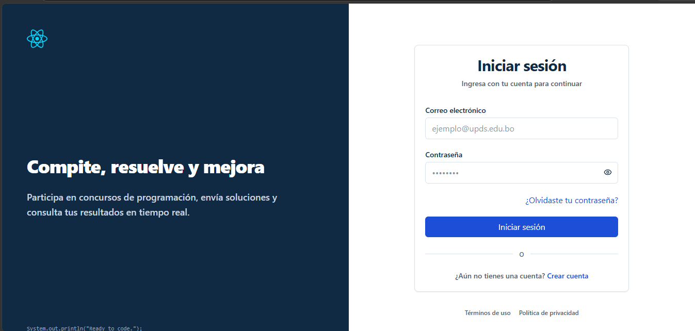
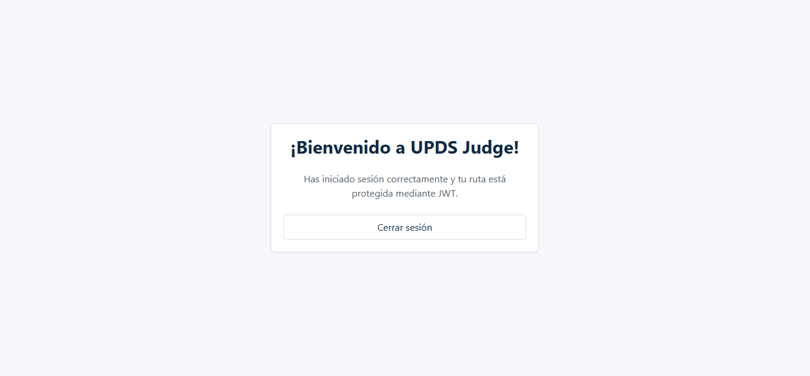
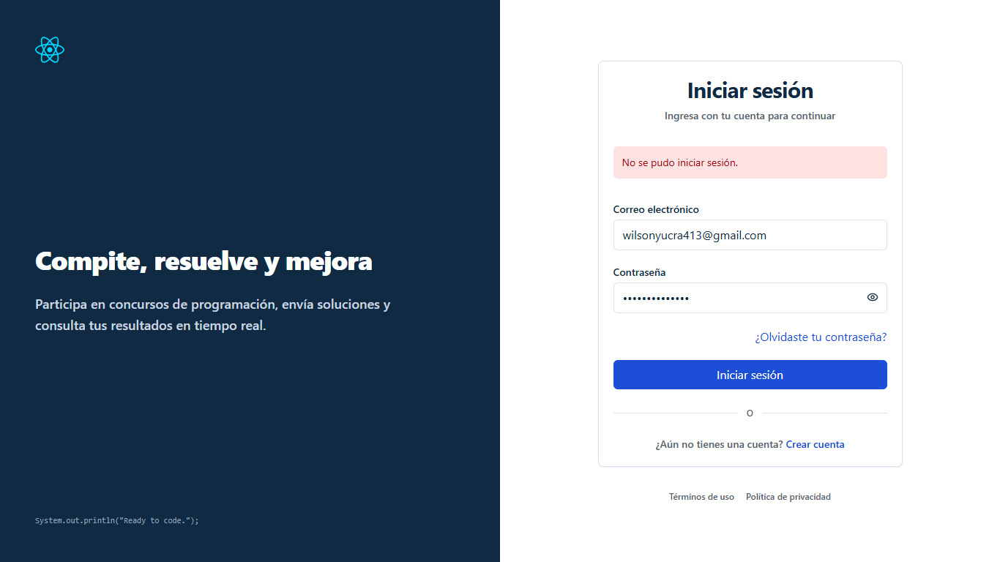

# UJ-06 — Inicio de sesión y obtención de token con roles

## Estado

- frontend implementation functional complete
- authenticated end-to-end pending
- final visual refinement pending
- manual captures pending/non-blocking

La implementación cubre el flujo funcional de autenticación desde el frontend: captura de credenciales, envío al backend, recepción del token y persistencia de la sesión. La verificación de extremo a extremo con el backend real y los roles devueltos permanece pendiente.

## Change asociado

`uj06-login-authentication-token-roles-frontend`

## Motivo

UJ-06 implementa el acceso de usuarios registrados a la plataforma. El objetivo es autenticar las credenciales del usuario y obtener un token que identifique la sesión y permita conocer sus roles para habilitar rutas protegidas y funcionalidades según permisos.

## Historia de usuario

| ID    | Historia                                                                                   | Prioridad | Estimación académica normalizada |
| ----- | ------------------------------------------------------------------------------------------ | --------- | -------------------------------- |
| UJ-06 | Como usuario registrado, quiero loguearme para obtener un token que identifique mis roles. | Crítica   | 5 puntos                         |

## Alcance implementado

La ruta de autenticación renderiza `LoginPage` utilizando `AuthLayout` y `AuthTemplate`. La pantalla permite ingresar credenciales, validar campos obligatorios, enviar la solicitud de autenticación y persistir la sesión obtenida.

El flujo implementado incluye:

- captura de correo y contraseña;
- validación básica de formulario;
- envío de credenciales al backend mediante el cliente HTTP compartido;
- recepción del token de acceso;
- persistencia de la sesión en la capa de autenticación;
- protección de rutas mediante `ProtectedRoute`.

## Criterios cumplidos — UJ-06

- Permite ingresar correo electrónico y contraseña.
- Requiere ambos campos antes de enviar el formulario.
- Valida el formato del correo electrónico.
- Recorta espacios innecesarios en el correo antes del envío.
- Deshabilita el envío mientras la autenticación está en progreso.
- Consume el endpoint de autenticación centralizado.
- Persiste la sesión obtenida en la capa `lib/auth`.
- Permite el acceso a rutas protegidas cuando existe una sesión válida.
- Muestra errores de autenticación en la interfaz.

## Diseño de la pantalla

La pantalla utiliza una composición orientada a autenticación con dos zonas principales:

- **Zona visual:** ilustración y mensaje de bienvenida.
- **Zona funcional:** formulario de inicio de sesión.

El formulario contiene:

- correo electrónico;
- contraseña;
- acción principal **Iniciar sesión**;
- enlace de navegación hacia **Crear cuenta**.

Durante el envío se bloquean los controles para evitar solicitudes duplicadas.

## Estructura implementada

### Páginas

- `features/auth/Pages/LoginPage.tsx`

### Componentes

- `features/auth/Components/LoginForm.tsx`
- `features/auth/Components/CodeIllustration.tsx`

### Plantillas

- `features/auth/templates/AuthTemplate.tsx`

### Servicios

- `features/auth/authService.ts`
- `features/auth/authTypes.ts`

### Sesión y transporte

- `lib/auth/auth-session.ts`
- `lib/auth/auth-transport.ts`

### Rutas

- `routes/ProtectedRoute.tsx`
- `routes/router.tsx`

## Contrato backend

El cliente realiza una solicitud de autenticación utilizando el cliente HTTP compartido y la ruta centralizada de endpoints.

La respuesta que consume la interfaz tiene la forma:

```json
{
  "accessToken": "<jwt>",
  "refreshToken": "<refresh>",
  "roles": ["ADMIN", "USER"],
  "user": {
    "id": "<id>",
    "email": "usuario@correo.com",
    "name": "Usuario"
  }
}
```

Esta documentación describe el contrato que construye el frontend; no confirma detalles internos ni el procesamiento real del backend.

## Solicitud de autenticación

La autenticación se realiza mediante:

```http
POST /api/auth/login
Content-Type: application/json
```

Cuerpo esperado:

```json
{
  "email": "usuario@correo.com",
  "password": "********"
}
```

## Flujo frontend

`LoginPage` renderiza `LoginForm` dentro de `AuthTemplate`. El formulario valida los campos y envía las credenciales a través de `authService.login()`. El servicio utiliza el cliente HTTP compartido y la respuesta se transforma a los tipos definidos en `authTypes.ts`.

Si la autenticación es exitosa:

1. se recibe el token de acceso;
2. se persiste la sesión mediante `auth-session.ts`;
3. el router permite acceder a rutas protegidas;
4. el usuario puede navegar al dashboard.

## Persistencia de sesión

La capa `lib/auth` centraliza el manejo de la sesión.

Responsabilidades principales:

- guardar el token de acceso;
- recuperar la sesión al iniciar la aplicación;
- limpiar la sesión al cerrar sesión;
- exponer el estado autenticado al router.

Los componentes de presentación no acceden directamente al almacenamiento.

## Protección de rutas

`ProtectedRoute` actúa como guard de navegación.

Comportamiento implementado:

- si existe una sesión válida, renderiza la ruta solicitada;
- si no existe sesión, redirige al login;
- evita el acceso directo por URL a páginas protegidas como `DashboardPage`.

Este mecanismo desacopla la autenticación de las páginas individuales.

## Manejo de errores

Los errores se presentan mediante mensajes visibles en la interfaz.

| Escenario                   | Comportamiento                            |
| --------------------------- | ----------------------------------------- |
| Correo vacío                | Mensaje de validación del formulario      |
| Contraseña vacía            | Mensaje de validación del formulario      |
| Correo con formato inválido | Mensaje de validación del formulario      |
| Credenciales inválidas      | Alerta de autenticación                   |
| Error de red                | Mensaje general de conexión               |
| Sesión expirada             | Redirección al login y limpieza de sesión |

Mientras la solicitud está pendiente, el botón de envío permanece deshabilitado.

## Integración con el cliente HTTP

La autenticación se integra con la infraestructura compartida:

- `lib/api/http-client.ts`
- `lib/api/endpoints.ts`
- `lib/auth/auth-transport.ts`

El transporte de autenticación agrega automáticamente el encabezado:

```http
Authorization: Bearer <token>
```

De esta manera, los módulos posteriores (`contests`, `problems`, `submissions`, etc.) no necesitan gestionar manualmente el token.

## Archivos principales

| Tipo                | Archivo                                    |
| ------------------- | ------------------------------------------ |
| Página              | `features/auth/Pages/LoginPage.tsx`        |
| Componente          | `features/auth/Components/LoginForm.tsx`   |
| Plantilla           | `features/auth/templates/AuthTemplate.tsx` |
| Servicio            | `features/auth/authService.ts`             |
| Tipos               | `features/auth/authTypes.ts`               |
| Sesión              | `lib/auth/auth-session.ts`                 |
| Transporte          | `lib/auth/auth-transport.ts`               |
| Cliente HTTP        | `lib/api/http-client.ts`                   |
| Endpoints           | `lib/api/endpoints.ts`                     |
| Protección de rutas | `routes/ProtectedRoute.tsx`                |
| Router              | `routes/router.tsx`                        |

## Evidencia

| Evidencia | Descripción                  |
| --------- | ---------------------------- |
| Captura 1 | Pantalla de inicio de sesión |
| Captura 2 | Inicio de sesión exitoso     |
| Captura 3 | Credenciales inválidas       |
| Captura 4 | Acceso a ruta protegida      |

### 1. Pantalla de inicio de sesión



---

### 2. Inicio de sesión exitoso



---

### 3. Credenciales inválidas



---

## Confirmaciones de seguridad

| Confirmación                                                                      |
| --------------------------------------------------------------------------------- |
| La contraseña no se almacena en componentes de presentación.                      |
| El token se gestiona únicamente desde la capa `lib/auth`.                         |
| Las rutas protegidas requieren una sesión válida.                                 |
| El cliente HTTP centraliza el encabezado Bearer.                                  |
| Los controles se bloquean durante la autenticación para evitar envíos duplicados. |
| La interfaz no expone información sensible del token.                             |

## Integraciones pendientes

| Pendiente                                                            |
| -------------------------------------------------------------------- |
| Verificar autenticación real con el backend productivo.              |
| Confirmar la estructura definitiva del JWT y los claims de roles.    |
| Implementar renovación automática de token si el backend la soporta. |
| Completar capturas finales verificadas.                              |
| Validar manualmente el comportamiento responsive de la pantalla.     |

## Fuera de alcance

| Funcionalidad                       |
| ----------------------------------- |
| Recuperación de contraseña          |
| Verificación por correo electrónico |
| Autenticación multifactor           |
| Gestión de sesiones concurrentes    |
| Administración de usuarios y roles  |

## Conclusión

UJ-06 cuenta con una implementación funcional de autenticación en frontend que permite a un usuario registrado iniciar sesión, obtener un token de acceso, persistir la sesión y acceder a rutas protegidas según el estado autenticado. La integración completa con el backend real y la validación definitiva de roles y claims del JWT permanecen pendientes de verificación de extremo a extremo.