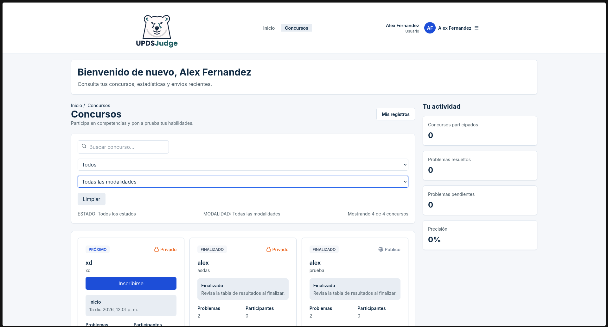
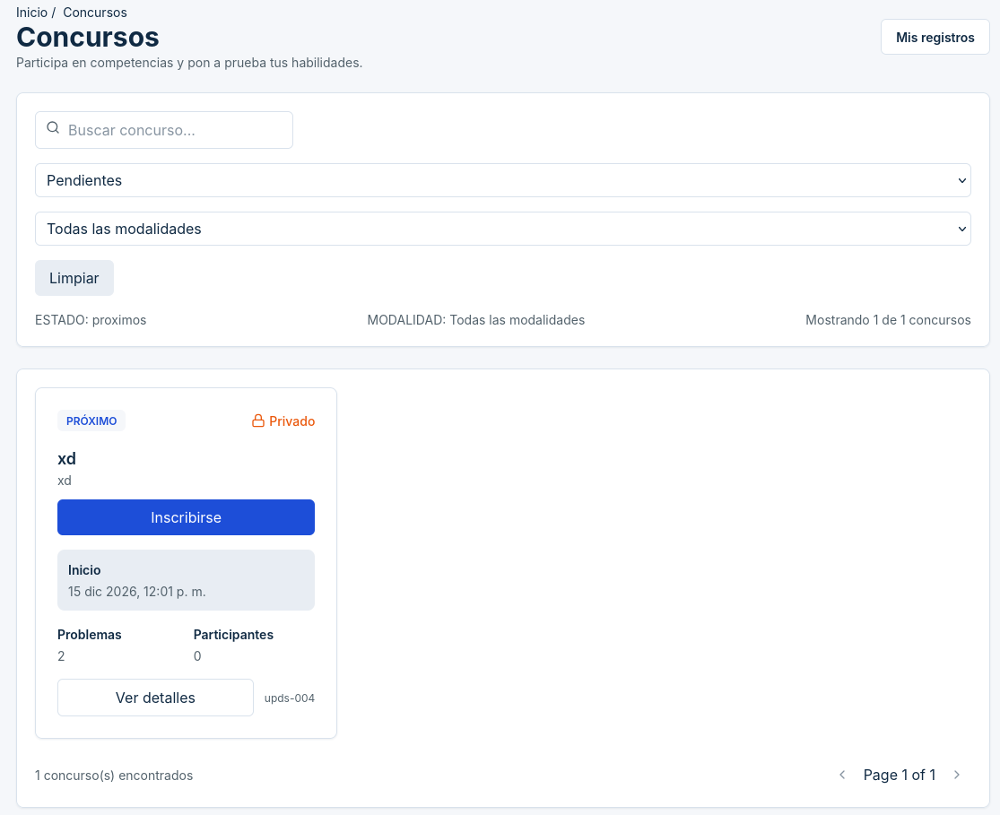
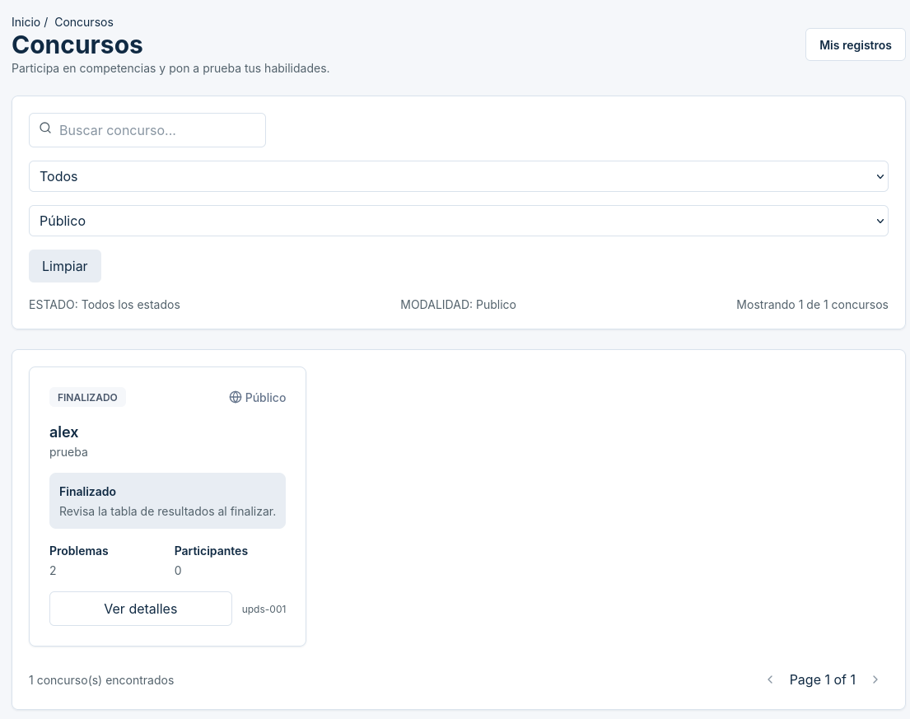
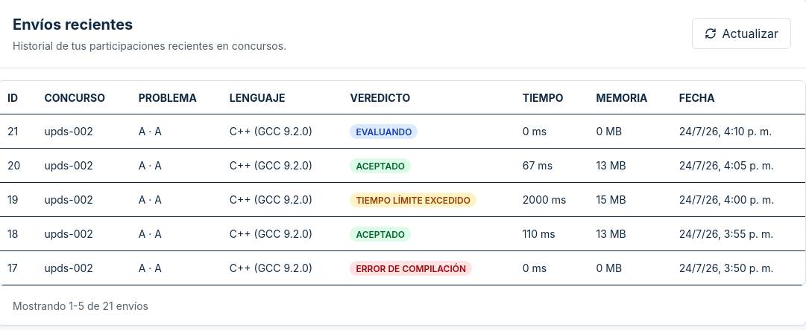
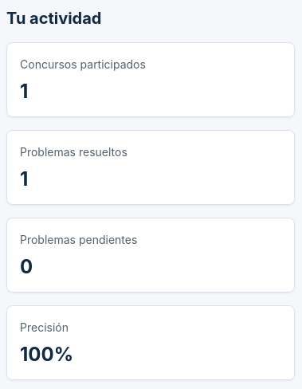
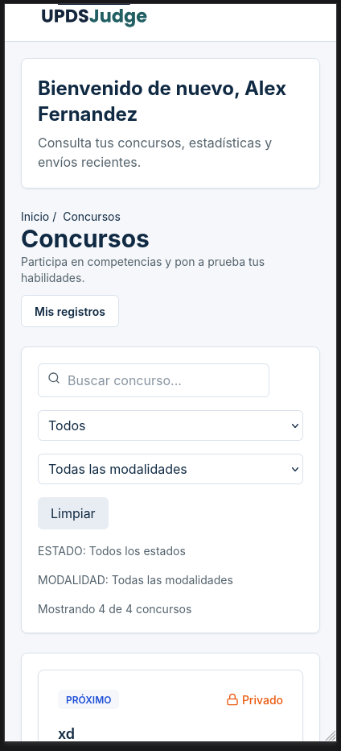

# UJ-11 — Lista de concursos filtrados para el usuario

## Proyecto

**UPDS JUDGE**

## Historia de usuario

Como usuario, quiero ver una lista de concursos filtrados por "En curso",
"Próximo" y "Finalizado".

## Integrantes

- Alex Saúl Fernández Valdez
- Daniel Arnold Torrez Zarate

## Estado

**IMPLEMENTADO.**

La lista de concursos, el dashboard del usuario, las estadísticas rápidas y los envíos recientes están integrados en el código actual. Los contratos consumidos se asumen correctos para esta auditoría y las seis capturas referenciadas existen.

## Changes asociados

- `uj11-partial-user-dashboard-stats-submissions-integration`

No se identificó otro change existente de OpenSpec dedicado exclusivamente a
la lista de concursos de UJ-11.

## Contexto

La UJ-11 reúne dos aportes que quedaron integrados en una única experiencia de
usuario: la consulta filtrada de concursos y el dashboard con estadísticas y
los cinco envíos más recientes. La referencia visual solo orienta jerarquía y
distribución; no agrega ranking, puntos, clasificaciones, entrenamientos ni
campos que no estén respaldados por el contrato.

## Alcance implementado

### Lista de concursos

`UserContestsPage` consume `GET /api/Concursos` y presenta los concursos en
cards mediante `UserContestsGrid` y `ContestCard`.

- filtros de estado para todos, activos, próximos y finalizados;
- filtro de modalidad `Publico` / `Privado`;
- búsqueda debounced de 350 ms;
- paginación de diez resultados por página;
- acción para actualizar el listado;
- estados de carga y vacío en la grilla;
- cards con estado temporal, modalidad, fechas y datos del concurso;
- contador y barra de progreso para concursos activos.

La historia usa los conceptos **En curso**, **Próximo** y **Finalizado**. En el
selector actual los valores contractuales son `activos`, `proximos` y
`finalizados`; el estado de una card se muestra como `Activo`, `Proximo` o
`Finalizado`.

Los controles `Inscribirse`, `Acceder` y `Ver detalles` derivan su comportamiento desde `getContestUserAction`. La inscripción usa `JoinContestModal` y `POST /api/ParticipanteConcursos/unirse`; los accesos navegan a rutas contextuales reales.

### Estadísticas rápidas

`UserContestStatsSection` consulta de forma independiente:

```http
GET /api/ParticipanteConcursos/stats-contest
```

Muestra cuatro métricas, skeleton durante carga, ceros cuando no hay datos y
un `Alert` si la consulta falla:

| Campo                   | Descripción                                       |
| ----------------------- | ------------------------------------------------- |
| `concursosParticipados` | Concursos distintos considerados por el endpoint. |
| `problemasResueltos`    | Problemas con resultado aceptado.                 |
| `problemasPendientes`   | Problemas enviados todavía no resueltos.          |
| `precisionPorcentaje`   | Precisión calculada por backend.                  |

El frontend no recalcula estas métricas; solo muestra la respuesta. La
precisión se presenta con sufijo `%`.

### Envíos recientes

`RecentSubmissionsSection` consulta:

```http
GET /api/Envios/mis-envios
```

El dashboard solicita exclusivamente la primera página con
`pagina=1` y `tamanoPagina=5`. Muestra una tabla de concurso, problema,
lenguaje, veredicto, tiempo, memoria y fecha; además calcula la metadata con
los valores reales de la respuesta. `idEnvio` permanece disponible para uso
interno, pero no se presenta como una columna visual.

La sección conserva loading, vacío, error y botón **Actualizar**. Ese botón
vuelve a ejecutar solamente la query de envíos recientes, evita dobles
activaciones mientras actualiza y no recarga la página.

### Dashboard del usuario

`UserDashboardPage`, bajo `features/contests/user/pages`, integra:

- mensaje de bienvenida mediante `UserWelcome`;
- lista filtrada de concursos;
- estadísticas rápidas;
- envíos recientes.

La página se renderiza dentro de `UserLayout`, por lo que conserva logo,
navegación, menú de usuario y logout existentes.

## Arquitectura frontend

```text
frontend/src/features/contests/user/
├── components/
│   ├── ContestCard.tsx
│   ├── UserContestsGrid.tsx
│   └── UserWelcome.tsx
├── pages/
│   ├── UserContestsPage.tsx
│   ├── UserDashboardPage.test.tsx
│   └── UserDashboardPage.tsx
├── RecentSubmissionsSection.tsx
├── RecentSubmissionsTable.tsx
├── UserContestStatsSection.tsx
├── hooks.ts
├── index.ts
├── mapper.ts
├── service.ts
├── types.ts
└── user-dashboard.test.tsx
```

Flujo principal:

```text
UserDashboardPage
├── UserContestsPage
│   └── usePublicConcursosList → listPublicConcursos → HttpClient → GET /api/Concursos
├── UserContestStatsSection
│   └── useUserContestStats → getUserContestStats → HttpClient → stats-contest
└── RecentSubmissionsSection
    └── useUserSubmissions → listUserSubmissions → HttpClient → mis-envios
```

## Contratos backend

### Concursos

```http
GET /api/Concursos
```

Parámetros usados por frontend:

| Parámetro      | Uso                                                        |
| -------------- | ---------------------------------------------------------- |
| `filtro`       | `activos`, `proximos`, `finalizados` o ausente para todos. |
| `modalidad`    | `Publico` o `Privado` cuando se selecciona modalidad.      |
| `busqueda`     | Texto de búsqueda ya debounceado.                          |
| `pagina`       | Página solicitada.                                         |
| `tamanoPagina` | Tamaño de página; la pantalla usa 10.                      |

Correspondencia de presentación:

| Etiqueta o concepto | Valor contractual / estado mostrado     |
| ------------------- | --------------------------------------- |
| En curso            | filtro `activos`; card `Activo`         |
| Próximo             | filtro `proximos`; card `Proximo`       |
| Finalizado          | filtro `finalizados`; card `Finalizado` |
| Público             | `Publico`                               |
| Privado             | `Privado`                               |

La respuesta utilizada contiene metadata (`total`, `pagina`, `tamanoPagina`) y
una colección `concursos`. Las cards usan, entre otros, código, nombre,
descripción, modalidad, estado temporal, fechas, duración, tiempo restante e
indicador de inscripción recibido por el DTO de lista.

### Estadísticas

El contrato de estadísticas se describe en la tabla de métricas anterior. Los
valores son producidos por `stats-contest`; el frontend no los deriva a partir
de envíos ni concursos.

### Envíos

```http
GET /api/Envios/mis-envios
```

Parámetros soportados:

```text
resultado
concursoCodigo
inciso
pagina
tamanoPagina
```

Campos consumidos por el DTO:

```text
idEnvio
concursoCodigo
problemaTitulo
inciso
lenguaje
veredicto
consumoTiempo
consumoMemoria
fechaEnvio
```

Unidades confirmadas:

```text
consumoTiempo   → milisegundos → ms
consumoMemoria  → megabytes    → MB
```

Los valores finitos conservan su escala original. Un cero real se muestra como
`0 ms` o `0 MB`; un dato ausente o no finito se muestra como `—`. El contrato
actual no entrega un campo Archivo, por lo que no se implementa esa columna.

### Veredictos

| Valor backend           | Etiqueta visible        |
| ----------------------- | ----------------------- |
| `Accepted`              | ACEPTADO                |
| `Wrong Answer`          | RESPUESTA INCORRECTA    |
| `Time Limit Exceeded`   | TIEMPO LÍMITE EXCEDIDO  |
| `Memory Limit Exceeded` | MEMORIA LÍMITE EXCEDIDA |
| `Compilation Error`     | ERROR DE COMPILACIÓN    |
| `Runtime Error`         | ERROR DE EJECUCIÓN      |
| `Pendiente`             | EVALUANDO               |

`EVALUANDO` está respaldado por el estado backend `Pendiente`. Los valores
no reconocidos conservan un fallback neutral; la implementación actual no
mapea abreviaturas como `AC`, `WA`, `TLE`, `MLE`, `CE` o `RE` de forma separada.

## Integración final del dashboard del usuario

```text
User Layout
└── Página principal del usuario
    ├── Mensaje de bienvenida
    └── Contenido principal
        ├── Lista de concursos
        ├── Envíos recientes
        └── Estadísticas rápidas
```

### Escritorio

```text
Bienvenida arriba

Columna izquierda:
- concursos;
- envíos recientes.

Columna derecha:
- estadísticas rápidas.
```

La grilla usa una proporción aproximada de dos partes para contenido principal
y una para estadísticas; el `aside` de estadísticas inicia alineado con la
lista de concursos.

### Tablet y móvil

En tablet la columna de estadísticas se mantiene lateral si el ancho lo
permite. En móvil se usa una columna única con el orden real: bienvenida,
lista de concursos, estadísticas rápidas y envíos recientes. No se oculta
ninguna sección ni se agregan elementos de la referencia no implementados.

## Refinamiento visual final del dashboard

El dashboard utiliza un contenedor amplio centrado y una grilla de escritorio
aproximada 75 % / 25 %: concursos, filtros y envíos recientes quedan en la
columna izquierda; las estadísticas rápidas ocupan el `aside` derecho. En
móvil la composición conserva una sola columna y el orden lógico de lectura.

Los filtros existentes conservan su comportamiento y se aprovechan en una fila
horizontal cuando el ancho de escritorio lo permite; en tablet y móvil pueden
envolver sin desbordarse. Las cuatro estadísticas se presentan verticalmente,
una tarjeta por fila.

La tabla de envíos conserva datos, mappers, unidades, badges y scroll
horizontal. Su orden visual definitivo es: `CONCURSO`, `PROBLEMA`, `LENGUAJE`,
`VEREDICTO`, `TIEMPO`, `MEMORIA`, `FECHA`. `idEnvio` permanece como
identificador interno y no se agregó una columna equivalente, Archivo ni una
segunda fecha.

## Routing y autenticación

La ruta canónica del usuario es:

```text
/student/concursos
```

El flujo mantiene:

```text
login con rol Usuario
→ getInitialRoute
→ /student/concursos
→ UserDashboardPage
```

La ruta está protegida por `ProtectedRoute`, requiere el rol `Usuario` mediante
`RoleRoute` y se renderiza dentro de `UserLayout`.

| Situación                                        | Resultado actual               |
| ------------------------------------------------ | ------------------------------ |
| Sin token en ruta de usuario                     | `/login`                       |
| Usuario autenticado                              | `/student/concursos`           |
| Administrador sin rol Usuario en ruta de usuario | `/forbidden`                   |
| Administrador + Usuario                          | prioridad a `/admin/dashboard` |

La antigua página temporal
`frontend/src/features/auth/Pages/UserLandingPage.tsx` fue eliminada. La ruta
histórica `/student` redirige con `replace` a `/student/concursos`.

## Componentes compartidos reutilizados

La implementación reutiliza componentes existentes y sus estilos base; las
piezas que admiten `className` conservan esa extensibilidad para composición:

- `Card`, `Button`, `Badge`, `Alert`, `Skeleton` y `ProgressBar`;
- `DataTable`;
- `Breadcrumbs` y `Pagination`;
- `ContestsFiltersBar` compartida con la funcionalidad administrativa.

## Pruebas y validaciones

Durante aquella integración se registraron 17 archivos de test y 84 tests aprobados. Esa cifra es evidencia histórica del cierre y no representa el conteo permanente del proyecto.

Cobertura observada en los tests existentes:

- formateadores de tiempo y memoria, incluyendo cero, ausencias y valores no
  finitos;
- mapper de veredictos y metadata de paginación;
- parámetros del servicio de envíos y prevención de doble refresh;
- composición del dashboard: bienvenida con nombre y fallback, orden de
  secciones y región lateral de estadísticas;
- routing protegido, acceso sin token, redirect de Usuario y denegación para
  administrador sin rol `Usuario`;
- regresiones administrativas presentes en las pruebas de rutas y concursos
  existentes.

Resultados de la última validación registrada:

| Validación         | Resultado registrado                                                    |
| ------------------ | ----------------------------------------------------------------------- |
| `format:check`     | Falló por formato preexistente en 4 archivos ajenos a esta integración. |
| `lint`             | Pasó con 15 warnings existentes.                                        |
| `typecheck`        | Falló con 12 errores preexistentes.                                     |
| `test:run`         | Pasó: 17 archivos, 84 tests.                                            |
| `build`            | Falló por los mismos errores de tipos preexistentes.                    |
| `dev`              | Inició y respondió en un puerto temporal.                               |
| `git diff --check` | Pasó en la última validación registrada.                                |

No se registró una validación manual end-to-end con backend real ni una revisión
manual de los breakpoints como completadas.

## Archivos principales

- `frontend/src/features/contests/user/pages/UserDashboardPage.tsx`
- `frontend/src/features/contests/user/pages/UserContestsPage.tsx`
- `frontend/src/features/contests/user/components/UserWelcome.tsx`
- `frontend/src/features/contests/user/components/UserContestsGrid.tsx`
- `frontend/src/features/contests/user/components/ContestCard.tsx`
- `frontend/src/features/contests/user/RecentSubmissionsSection.tsx`
- `frontend/src/features/contests/user/UserContestStatsSection.tsx`
- `frontend/src/features/contests/user/hooks.ts`
- `frontend/src/features/contests/user/service.ts`
- `frontend/src/features/contests/user/mapper.ts`
- `frontend/src/routes/router.tsx`
- `frontend/src/lib/auth/session.ts`

## Integración UJ-12 y navegación

Las acciones de las cards ya no dependen de condiciones dispersas en JSX. `getContestUserAction` centraliza inscripción pública/privada, acceso activo, consulta finalizada y bloqueos. La inscripción se realiza mediante el modal y `POST /api/ParticipanteConcursos/unirse`; al completarse invalida solo la lista pública, sin recargar la página ni perder filtros locales.

La navegación permitida usa la ruta canónica de envíos del concurso:

```text
/student/contests/:contestCode/submissions
```

El formulario de envíos existente sigue siendo la pantalla de detalle disponible. La composición con UJ-13 está integrada: `features/problems` existe y las cards navegan a Problemas después de una inscripción exitosa.

## Estado actual comprobado

- El login, los datos remotos y las acciones usan contratos consumidos por el frontend y asumidos correctos.
- La inscripción y la navegación contextual están implementadas.
- El historial global existe en `/student/history`, con filtros por concurso y resultado y paginación server-side.
- La columna Archivo no existe porque el DTO consumido no la aporta; no se considera pendiente funcional.
- Los resultados actuales de lint, typecheck, tests y build se registran en el informe de auditoría.

## Resultado de la colaboración

La UJ-11 fue desarrollada de forma conjunta por Alex Saúl Fernández Valdez y
Daniel Arnold Torrez Zarate. La implementación integra la lista filtrada de
concursos con los componentes del dashboard del usuario, incluyendo
estadísticas rápidas, envíos recientes y routing posterior al inicio de
sesión.

## Evidencias

> Estado: evidencias existentes verificadas por ruta; no se generaron capturas nuevas en esta auditoría.

### 1. Dashboard integrado del usuario



---

### 2. Filtro Estado



---

### 3. Filtro Modalidad



---

### 4. Envíos recientes



---

### 5. Estadísticas rápidas



---

### 6. Responsive



## Final flexible recent-submissions table

`RecentSubmissionsTable` uses a flexible full-width container and a
`w-full table-fixed` table while retaining a 900px minimum width for local
mobile horizontal scrolling. The responsive visual check remains a
non-blocking manual evidence item.

## Seguimiento Sprint 2

Se agregó un acceso administrativo de solo frontend para reutilizar
`UserContestsPage` dentro de `AdminLayout`. La ruta
`/admin/user-access/contests` conserva `AdminSidebar` y adapta los destinos de
detalle al namespace administrativo. No monta `UserLayout` ni duplica el
listado, filtros o cards.
