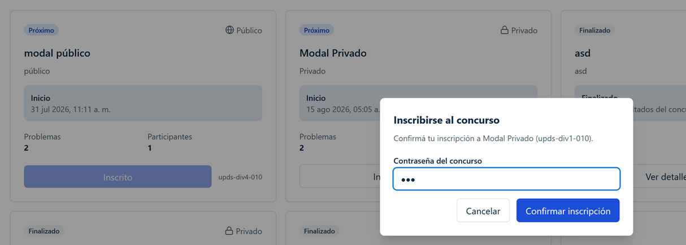
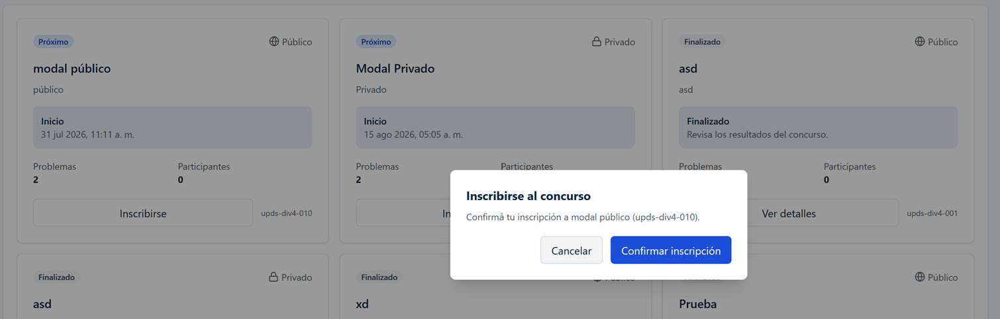
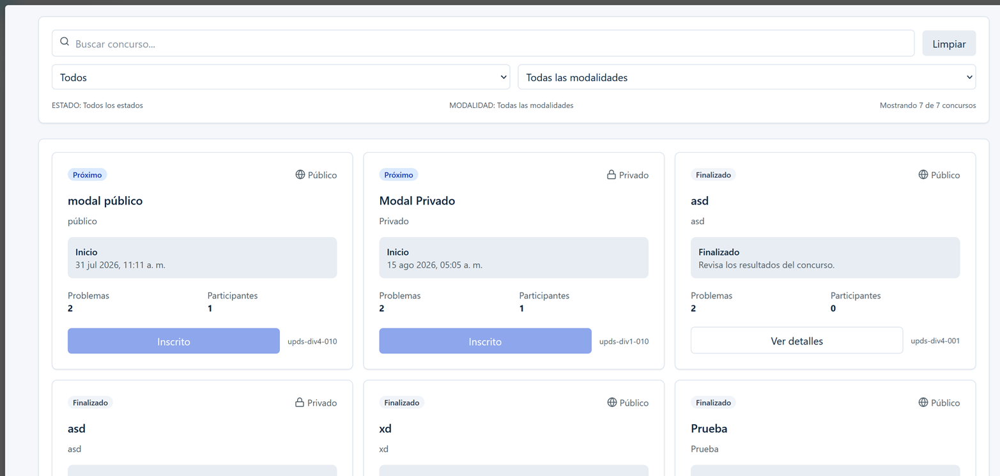

# UJ-12 — Inscripción a concursos públicos y privados

## Estado

**Integración frontend implementada; validación manual con backend pendiente.**

## Flujo

Las cards de `UserContestsPage` derivan su acción con una política central pura:

- próximo público no inscrito: abre confirmación pública;
- próximo privado no inscrito: solicita contraseña;
- próximo inscrito: muestra `Inscrito`;
- concurso activo no inscrito: informa que las inscripciones están cerradas;
- finalizado privado no inscrito: solicita contraseña, inscribe y dirige al detalle;

La confirmación reutiliza un único modal. La contraseña queda únicamente en estado local del modal, se limpia al cancelar o completar el envío y no se agrega a rutas, storage, logs ni mutation keys.

## Contrato

```http
POST /api/ParticipanteConcursos/unirse
Content-Type: application/json
```

Payload público:

```json
{ "codigo": "contest-code", "contrasena": null }
```

Payload privado:

```json
{ "codigo": "contest-code", "contrasena": "valor-efimero" }
```

Respuesta esperada:

```json
{ "mensaje": "Inscripción registrada.", "codConcurso": "contest-code" }
```

`HttpClient` incorpora autenticación mediante el transporte compartido. El modal no crea headers ni lee la sesión.

## Actualización y errores

La mutación de TanStack Query invalida únicamente el prefijo de la lista pública de concursos, por lo que filtros, búsqueda y página siguen siendo estado local de la pantalla. Durante la petición se deshabilita la confirmación; un error mantiene el modal abierto y se anuncia con `role="alert"`.

## Evidencia

### 1. Captura del modal para ingresar a concurso privado



---

### 2. Captura del modal para ingresar a concurso público



---

### 3. Captura de concursos registrados



---

## Privado finalizado

Para un concurso privado finalizado sin inscripción, la card mantiene el botón
**Inscribirse** habilitado y abre el modal reutilizado. Con contraseña correcta,
`POST /api/ParticipanteConcursos/unirse` registra la inscripción, invalida la
lista de concursos y navega a Problemas. Una contraseña incorrecta conserva el
modal abierto, muestra el error contractual y permite reintentar sin navegar.

Un usuario ya inscrito no abre el modal ni repite la mutación: accede directamente
a su detalle contextual. Tras una inscripción exitosa, el contexto de usuario usa
la ruta `studentContestProblems`; el de administración usa
`adminUserContestProblems`, por lo que conserva `AdminLayout`.
El acceso directo continúa respaldado por el dashboard del backend: no se simula
acceso cuando ese contrato no reconoce inscripción.

## Pruebas

La política cubre los ocho casos de acceso, normalización de valores y los tres modos de detalle. Quedan pendientes pruebas end-to-end con backend real, teclado visual y respuestas de error específicas del backend.

## Seguimiento Sprint 2 — privado finalizado

El contrato vigente permite la inscripción a un concurso privado finalizado. La
policy `PRIVATE_FINISHED_REQUIRES_PASSWORD` activa el mismo flujo protegido de
contraseña que los privados próximos, sin ampliar la regla a privados activos.
La contraseña se mantiene efímera: no se persiste en storage, rutas, query keys,
logs ni errores. Las pruebas cubren éxito, error, cancelación, usuario ya
inscrito y destinos de usuario y administración.
