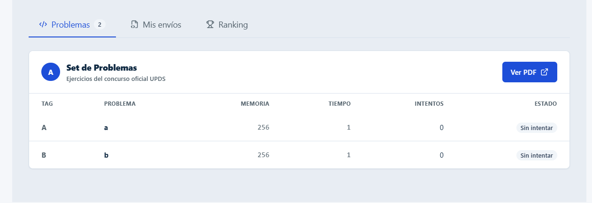

# UJ-13 — Lista de incisos y acceso al PDF del set de problemas

## Estado

- frontend implementation functional complete
- Google Drive PDF integration complete
- manual captures pending/non-blocking

La implementación cubre el flujo funcional de visualización del set de problemas desde el frontend: listado de incisos con su estado individual y acceso directo al PDF del enunciado alojado en Google Drive mediante un enlace externo.

## Motivo

UJ-13 implementa el acceso del usuario concursante al set de problemas de su concurso. El objetivo es que pueda ver de forma clara el listado de incisos (A, B, C...) junto con su estado individual, y acceder al enunciado completo en PDF alojado en Google Drive mediante un botón dedicado.

## Historia de usuario

| ID    | Historia                                                                                                                                           | Prioridad | Estimación académica normalizada |
| ----- | -------------------------------------------------------------------------------------------------------------------------------------------------- | --------- | -------------------------------- |
| UJ-13 | Como usuario dentro de un concurso, quiero ver la lista de incisos (A, B, C...) y un botón para abrir el PDF del set de problemas de Google Drive. | Alta      | 3 puntos                         |

## Alcance implementado

La ruta de problemas renderiza `ContestProblemsPage` utilizando `UserLayout`. La pantalla permite visualizar el listado de incisos del concurso, sus métricas de resolución y acceder al PDF del enunciado.

El flujo implementado incluye:

- carga del dashboard del concurso mediante el servicio compartido;
- listado de incisos (A, B, C...) con título, memoria, tiempo, intentos y estado;
- codificación visual por estado del inciso;
- enlace directo al PDF del set de problemas alojado en Google Drive;
- protección de la ruta mediante `ProtectedRoute` y `RoleRoute`.

## Criterios cumplidos — UJ-13

- El usuario visualiza el listado completo de incisos (A, B, C...) del set de problemas del concurso.
- Cada inciso muestra su título, memoria, tiempo y cantidad de intentos.
- Cada inciso muestra su estado (`Aceptado`, `Respuesta incorrecta`, `Sin intentar`, `TLE`) con codificación de color.
- El estado "Aceptado" se distingue visualmente con un ícono de verificación.
- Se muestra un mensaje de vacío cuando el concurso todavía no tiene problemas cargados.
- Existe un botón "Ver PDF" visible en el panel de problemas.
- El botón abre el PDF real del set de problemas alojado en Google Drive, en una pestaña nueva.
- El botón queda deshabilitado si el concurso no tiene una URL de set de problemas configurada.
- La vista es accesible únicamente para usuarios con sesión válida y rol de usuario concursante.

## Diseño de la pantalla

La pantalla utiliza una composición orientada al concurso con tres zonas principales:

- **Encabezado del concurso:** nombre, estado, metadatos (fecha fin, hora fin, participantes) y acceso a reglas.
- **Métricas rápidas:** problemas resueltos sobre el total y cantidad de intentos totales.
- **Panel de contenido por pestañas:** problemas (listado de incisos + botón "Ver PDF"), mis envíos y ranking.

El panel de problemas contiene:

- título del panel y breve descripción;
- botón principal **Ver PDF**;
- tabla de incisos con tag, título, memoria, tiempo, intentos y estado.

## Estructura implementada

### Páginas

- `features/problems/pages/ContestProblemsPage.tsx`

### Componentes

- `features/problems/components/ProblemsTable.tsx`

### Servicios

- `features/problems/service.ts`
- `features/problems/types.ts`

### Sistema de diseño

- `components/common/ui.tsx` (`Badge`, `Button`, `Card`, `Surface`, `Divider`, `Avatar`, `Alert`, `Spinner`, `EmptyState`, `IconButton`, `LinkButton`)

### Rutas

- `routes/ProtectedRoute.tsx`
- `routes/RoleRoute.tsx`
- `routes/router.tsx`

## Contrato backend

El cliente realiza una solicitud al dashboard del concurso utilizando el servicio compartido `getContestDashboard`.

La respuesta que consume la interfaz tiene la forma:

```json
{
  "codigo": "upds-div4-113",
  "nombre": "UPDS Division 4",
  "estadoTiempo": "en curso",
  "cantidadParticipantes": 42,
  "fechaFin": "2026-07-24T20:00:00Z",
  "minutosCongelamiento": 60,
  "segundosRestantes": 3600,
  "urlSetProblemas": "https://drive.google.com/file/d/<id>/view",
  "problemasResueltos": 3,
  "totalProblemas": 7,
  "intentosTotales": 5,
  "problemas": [
    {
      "inciso": "A",
      "titulo": "Suma de dos enteros",
      "intentos": 1,
      "memoria": "2.1 MB",
      "tiempo": "0.02s",
      "estado": "Aceptado"
    }
  ]
}
```

Esta documentación describe el contrato que consume el frontend; no confirma detalles internos ni el procesamiento real del backend.

## Solicitud del dashboard

La carga del concurso se realiza mediante:

```http
GET /api/contests/:codigo/dashboard
```

## Flujo frontend

`ContestProblemsPage` obtiene el `codigo` del concurso desde los parámetros de la ruta y solicita el dashboard mediante `getContestDashboard(codigo)`. Mientras la solicitud está en curso se muestra un indicador de carga; si falla, se muestra un mensaje de error.

Si la carga es exitosa:

1. se calculan las métricas rápidas (`problemasResueltos`, `intentosTotales`);
2. se renderiza el listado de incisos mediante `ProblemsTable`;
3. el botón "Ver PDF" queda habilitado con el enlace `urlSetProblemas` del dashboard.

## Acceso al PDF del set de problemas

El botón "Ver PDF" consume directamente el campo `urlSetProblemas` del dashboard del concurso:

- si `urlSetProblemas` tiene un valor, se renderiza como `LinkButton` (`<a>` real con estilos de botón), con `target="_blank"` y `rel="noopener noreferrer"`, abriendo el PDF de Google Drive en una pestaña nueva sin descargar ni generar ningún archivo local;
- si `urlSetProblemas` viene vacío o indefinido, se renderiza un `Button` deshabilitado en su lugar, evitando un enlace roto.

Se optó por un elemento de navegación (`LinkButton`) en lugar de un botón con lógica JavaScript (`onClick` + `window.open`), ya que la acción es semánticamente una navegación a un recurso externo. Esto habilita además el comportamiento nativo del navegador (abrir en pestaña nueva desde el menú contextual, copiar dirección del enlace, etc.).

## Protección de rutas

`ProtectedRoute` y `RoleRoute` actúan como guards de navegación sobre la ruta de problemas.

Comportamiento implementado:

- si existe una sesión válida y el rol es `roles.user`, renderiza la ruta solicitada dentro de `UserLayout`;
- si no existe sesión, redirige al login;
- si la sesión existe pero el rol no corresponde, bloquea el acceso;
- evita el acceso directo por URL sin los permisos adecuados.

Este mecanismo desacopla la autenticación y autorización de la página individual.

## Manejo de errores

Los errores se presentan mediante mensajes visibles en la interfaz.

| Escenario                                 | Comportamiento                                      |
| ----------------------------------------- | --------------------------------------------------- |
| Código de concurso ausente en la URL      | Alerta de error                                     |
| Fallo al cargar el dashboard del concurso | Alerta de error                                     |
| Carga en progreso                         | Indicador de carga con texto "Cargando concurso..." |
| Set de problemas vacío                    | Mensaje de vacío dentro de la tabla de incisos      |
| `urlSetProblemas` no configurada          | Botón "Ver PDF" deshabilitado, sin enlace roto      |
| Usuario sin rol adecuado accede a la URL  | Bloqueo mediante `RoleRoute`                        |
| Usuario sin sesión accede a la URL        | Redirección mediante `ProtectedRoute`               |

Mientras la solicitud del dashboard está pendiente, el contenido de la pantalla permanece en estado de carga.

## Integración con el sistema de diseño

La vista se integra completamente con los componentes base compartidos:

- `components/common/ui.tsx`

Componentes reutilizados: `Card`, `Surface`, `Badge`, `Alert`, `Avatar`, `Divider`, `Spinner`, `EmptyState`, `IconButton`, `Button`, `LinkButton`.

De esta manera, la vista no reimplementa estilos propios y hereda automáticamente cualquier ajuste visual futuro del sistema de diseño.

## Archivos principales

| Tipo                | Archivo                                             |
| ------------------- | --------------------------------------------------- |
| Página              | `features/problems/pages/ContestProblemsPage.tsx`   |
| Componente          | `features/problems/components/ProblemsTable.tsx`    |
| Servicio            | `features/problems/service.ts`                      |
| Tipos               | `features/problems/types.ts`                        |
| Sistema de diseño   | `components/common/ui.tsx`                          |
| Protección de rutas | `routes/ProtectedRoute.tsx`, `routes/RoleRoute.tsx` |
| Router              | `routes/router.tsx`                                 |

## Evidencia

| Evidencia | Descripción                                     |
| --------- | ----------------------------------------------- |
| Captura 1 | Panel "Set de Problemas" con listado de incisos |

### 1. Listado de incisos



---

## Confirmaciones de seguridad

| Confirmación                                                                                                              |
| ------------------------------------------------------------------------------------------------------------------------- |
| La vista de incisos requiere sesión válida y rol de usuario concursante.                                                  |
| El botón "Ver PDF" no expone credenciales ni tokens de acceso en el cliente.                                              |
| El enlace a Google Drive se abre con `rel="noopener noreferrer"`, evitando que la pestaña nueva acceda a `window.opener`. |
| No se genera ni descarga ningún archivo local en el navegador del usuario.                                                |

## Estado de integración transversal

En el workspace integrado no existe `features/problems/` pese a que esta historia documenta `ContestProblemsPage`, `ProblemsTable` y su servicio. Por ello no se recreó una segunda implementación ni se compuso una ruta de problemas sin contrato verificable. La ruta de participación disponible es `/student/contests/:contestCode/submissions`; la composición de incisos y PDF queda pendiente de integrar los archivos reales de UJ-13 y confirmar el endpoint de dashboard.

## Integraciones pendientes

| Pendiente                                                                                                                     |
| ----------------------------------------------------------------------------------------------------------------------------- |
| Validar manualmente el comportamiento responsive del panel de incisos.                                                        |
| Confirmar si el tono `warning` es el definitivo para el estado `TLE`, o si corresponde un tono adicional.                     |
| Definir comportamiento esperado si `urlSetProblemas` apunta a un recurso privado de Drive sin permisos públicos configurados. |
| Completar capturas finales verificadas.                                                                                       |

## Fuera de alcance

| Funcionalidad                                                                      |
| ---------------------------------------------------------------------------------- |
| Edición o administración de problemas desde esta vista                             |
| Vista previa embebida del PDF dentro de la aplicación (se abre en pestaña externa) |

## Conclusión

UJ-13 cuenta con una implementación funcional que permite a un usuario dentro de un concurso ver el listado de incisos del set de problemas con su estado individual, y acceder al PDF real del enunciado alojado en Google Drive mediante un enlace directo, sin descargar ni generar archivos locales.

## Seguimiento Sprint 2

`ContestProblemsPage` consume el encabezado reutilizable de contexto del concurso. Las métricas de fecha fin, hora fin, participantes, problemas resueltos e intentos permanecen fuera del encabezado. `Ver PDF` permanece exclusivamente dentro de `ProblemsTable`.
