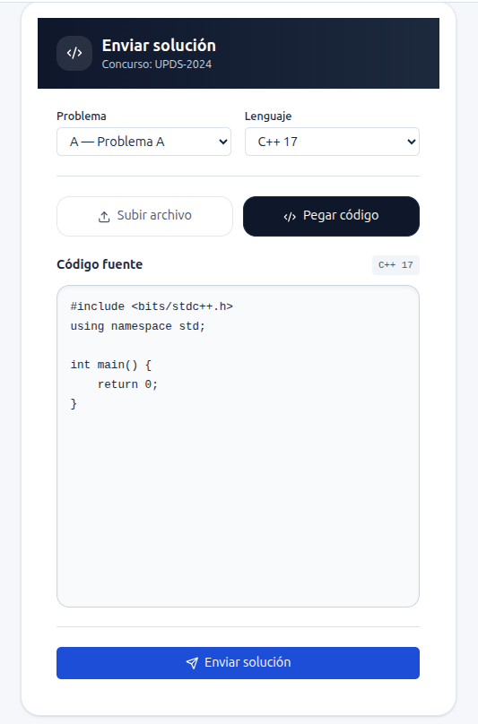
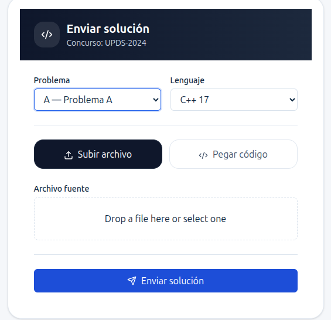
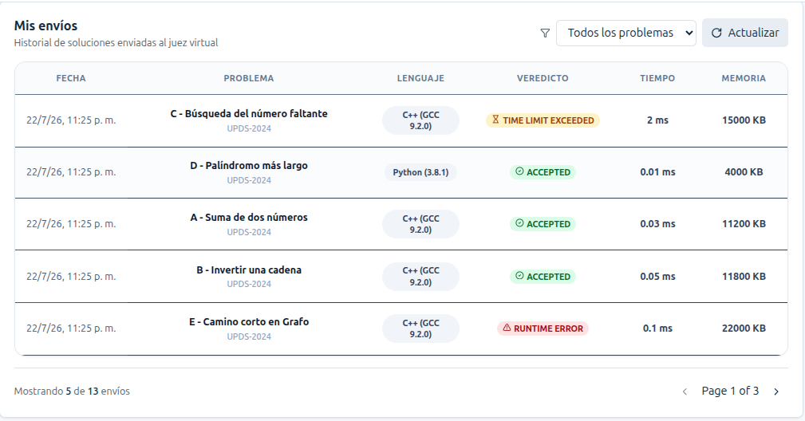
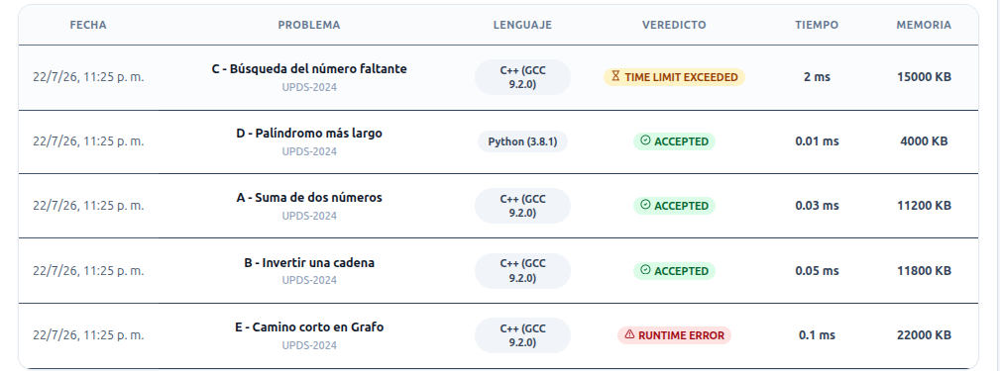

# HU-14 y HU-15 — Enviar solución y recibir veredicto de evaluación

# Estado

## Integración transversal

La ruta canónica conectada desde la lista de concursos es:

```text
/student/contests/:contestCode/submissions
```

La pantalla reconstruye el código desde el parámetro de ruta, por lo que no depende de `location.state`. La política de acceso de la lista permite navegación solamente a concursos activos inscritos o finalizados consultables. La composición con UJ-13 está integrada mediante `ContestContextHeader` y `getContestDashboard`; el módulo `frontend/src/features/problems/` existe y comparte la navegación contextual.

**Estado frontend comprobado: IMPLEMENTADO CON LIMITACIONES.** La implementación cubre el flujo de envío y consulta contextual que realiza un participante durante un concurso de programación. El estudiante puede seleccionar un problema, escoger un lenguaje de programación compatible, escribir o cargar su solución, enviarla al servidor para su evaluación mediante Judge0 y visualizar posteriormente el resultado obtenido dentro del historial de envíos.

Las capturas del manual representan un pendiente únicamente documental y no afectan el correcto funcionamiento de la aplicación.

# Change asociado

**hu14-hu15-submit-solution-and-verdict**

# Motivo

Las historias de usuario **HU-14** y **HU-15** fueron implementadas conjuntamente debido a que forman un único flujo funcional dentro del módulo de participación del estudiante.

La primera historia permite preparar y enviar una solución; la segunda se refleja cuando el contrato HTTP devuelve o expone el veredicto y el frontend vuelve a consultar el historial.

Desde la perspectiva del participante ambas acciones conforman una única experiencia de usuario, por lo que comparten componentes, modelos, servicios, validaciones y comunicación con el backend.

# Historias de Usuario

| ID | Historia | Prioridad | Estimación |
|----|----------|-----------|------------|
| **HU-14** | Como usuario, quiero seleccionar un lenguaje (C++, Python, C#) y subir mi código para que sea evaluado. | Crítica | 5 puntos |
| **HU-15** | Como usuario, quiero recibir el veredicto (Accepted, WA, TLE, MLE, CE) en tiempo real. | Alta | 3 puntos |

---

# Objetivo

Desarrollar un módulo que permita al participante enviar soluciones a los problemas de un concurso y recibir el resultado de la evaluación realizada por Judge0 de forma inmediata.

El flujo implementado permite:

- Seleccionar un problema.
- Seleccionar un lenguaje de programación.
- Subir un archivo fuente o escribir el código manualmente.
- Validar la información ingresada.
- Enviar el código fuente al backend.
- Ejecutar la evaluación mediante Judge0.
- Mostrar el resultado obtenido.
- Registrar automáticamente el envío dentro del historial del usuario.

---

# Alcance implementado

La funcionalidad fue implementada dentro de la ruta:

```text
/student/contests/:contestCode/submissions
```

La página **SubmissionsPage** centraliza toda la experiencia del participante durante el desarrollo de un concurso de programación.

La vista integra los siguientes componentes:

- Información del concurso activo.
- Encabezado del concurso.
- Temporizador de tiempo restante.
- Navegación mediante pestañas.
- Formulario de envío.
- Editor de código con PrismJS.
- Carga de archivos mediante FileDropzone.
- Historial de envíos.
- Filtro por problema.
- Estadísticas personales.
- Paginación.
- Visualización del veredicto.

Toda la comunicación con el backend se realiza mediante servicios independientes siguiendo la arquitectura modular implementada en el proyecto.

---

# Funcionalidades implementadas para HU-14

La historia HU-14 comprende todo el proceso relacionado con la preparación y envío de una solución.

Se implementaron las siguientes funcionalidades:

- Selección del problema correspondiente al concurso.
- Selección del lenguaje de programación.
- Compatibilidad con C++.
- Compatibilidad con Python.
- Compatibilidad con C#.
- Dos modalidades de envío:
  - Subir archivo.
  - Pegar código.
- Conversión automática del archivo fuente a texto utilizando **FileReader**.
- Editor de código integrado.
- Resaltado de sintaxis mediante **PrismJS**.
- Plantillas iniciales para cada lenguaje soportado.
- Validación del formulario antes del envío.
- Validación del tamaño máximo permitido.
- Validación de extensiones compatibles.
- Confirmación de honestidad académica.
- Construcción automática del DTO enviado al backend.
- Bloqueo del botón de envío mientras la solicitud está en proceso.

---

# Funcionalidades implementadas para HU-15

La historia HU-15 inicia una vez que Judge0 finaliza el proceso de evaluación.

Las funcionalidades implementadas incluyen:

- Consumo de la respuesta contractual del envío.
- Nueva consulta HTTP del historial después de un envío exitoso.
- Visualización del resultado disponible en el historial.
- Presentación del veredicto mediante **VerdictBadge**.
- Visualización del problema evaluado.
- Visualización del lenguaje utilizado.
- Visualización del tiempo de ejecución.
- Visualización del consumo de memoria.
- Actualización automática de estadísticas personales.
- Actualización del total de envíos.
- Filtrado por problema.
- Paginación del historial.
- Actualización manual mediante el botón **Actualizar**.

---

# Criterios cumplidos — HU-14

Durante el desarrollo se verificó el cumplimiento de los siguientes criterios funcionales:

- El usuario debe seleccionar un problema antes de realizar el envío.
- El usuario debe seleccionar un lenguaje compatible.
- El sistema permite alternar entre subir un archivo o escribir directamente el código.
- El editor carga automáticamente una plantilla según el lenguaje seleccionado.
- PrismJS proporciona resaltado de sintaxis únicamente visual.
- El archivo físico nunca es enviado al backend.
- El navegador convierte el archivo a texto plano utilizando FileReader.
- El DTO enviado contiene únicamente el código fuente en formato string.
- El formulario valida todos los datos antes de enviar la petición.
- El botón permanece bloqueado durante la evaluación para evitar múltiples solicitudes simultáneas.
- El usuario recibe mensajes de error cuando la información ingresada no cumple las validaciones.

---

# Criterios cumplidos — HU-15

Se verificó el cumplimiento de los siguientes criterios:

- El historial muestra automáticamente el nuevo envío realizado.
- El sistema presenta el veredicto devuelto por Judge0.
- Cada veredicto utiliza un componente visual (**VerdictBadge**) con colores diferenciados.
- La tabla presenta información relevante del envío.
- Se muestran el tiempo de ejecución y el consumo de memoria.
- El historial puede filtrarse por problema.
- La paginación permite navegar entre los diferentes registros.
- Las estadísticas personales se actualizan automáticamente.
- Toda la información permanece sincronizada con los datos obtenidos desde el backend.

# Diseño de la pantalla

La funcionalidad de envío y seguimiento de soluciones se implementó dentro de la página **SubmissionsPage**, diseñada para ofrecer al participante toda la información necesaria durante el desarrollo del concurso sin necesidad de cambiar de pantalla.

El diseño utiliza una distribución tipo **Split Layout**, dividiendo la interfaz en dos áreas principales.

La columna izquierda concentra el proceso de envío de soluciones, mientras que la columna derecha presenta el historial de envíos realizados por el usuario junto con sus estadísticas personales.

Esta organización permite que el participante pueda enviar nuevas soluciones y consultar inmediatamente sus resultados sin perder el contexto del concurso.

La interfaz mantiene el mismo lenguaje visual utilizado en el resto de la plataforma, empleando tarjetas (Cards), componentes reutilizables, espaciado consistente y una jerarquía visual clara.

En dispositivos móviles el diseño se adapta automáticamente, colocando el formulario sobre la tabla para mantener una correcta experiencia de usuario.

---

# Secciones de la interfaz

La pantalla se divide en los siguientes módulos principales.

## Header del concurso

El encabezado presenta la información general del concurso.

Incluye:

- Nombre del concurso.
- Estado actual (Activo, Próximo o Finalizado).
- Tiempo restante del concurso.
- Navegación mediante pestañas.
- Información del usuario autenticado.

Este bloque permanece visible durante toda la interacción del participante.

## SubmitForm

El componente **SubmitForm** representa el núcleo de la historia de usuario HU-14.

Su responsabilidad consiste en recopilar toda la información necesaria para generar una nueva solución.

El formulario incluye:

- Selector del problema.
- Selector del lenguaje.
- Selector del modo de envío.
- Editor de código.
- Dropzone para carga de archivos.
- Confirmación de honestidad académica.
- Botón de envío.

Toda la información es validada antes de ser enviada al backend.

## CodeEditor

Cuando el participante selecciona la opción **Pegar código**, se habilita un editor integrado desarrollado mediante **react-simple-code-editor** y **PrismJS**.

El editor proporciona:

- Resaltado de sintaxis.
- Numeración natural de líneas.
- Indentación.
- Escritura libre del código.
- Plantillas iniciales según el lenguaje seleccionado.

Las plantillas implementadas incluyen:

### C++

```cpp
#include <bits/stdc++.h>
using namespace std;

int main()
{
    ios::sync_with_stdio(false);
    cin.tie(nullptr);

    return 0;
}
```

### Python

```python
def solve():
    pass

if __name__ == "__main__":
    solve()
```

### C #

```csharp
using System;

class Program
{
    static void Main()
    {

    }
}
```

PrismJS únicamente colorea el código mostrado al usuario.

No interpreta, ejecuta ni modifica el contenido del programa.

## FileDropzone

Cuando el participante selecciona la modalidad **Subir archivo**, el sistema habilita un área Drag & Drop implementada mediante el componente **FileDropzone**.

El componente permite:

- Arrastrar archivos.
- Seleccionar archivos desde el explorador.
- Validar extensiones.
- Validar tamaño máximo.
- Mostrar el archivo seleccionado.

El archivo nunca es enviado directamente al servidor.

Antes del envío se convierte internamente a texto plano utilizando **FileReader**.

## SubmissionsTable

El componente **SubmissionsTable** implementa el historial de envíos correspondiente a la historia HU-15.

La tabla presenta:

- Lenguaje.
- Problema.
- Archivo.
- Veredicto.
- Tiempo de ejecución.
- Memoria utilizada.

Toda la información es obtenida desde el backend mediante peticiones HTTP.

## VerdictBadge

Cada resultado es representado mediante un componente visual independiente denominado **VerdictBadge**.

Este componente encapsula toda la lógica relacionada con la representación del estado de la evaluación.

Los principales estados soportados son:

| Veredicto | Color |
|-----------|-------|
| Accepted | Verde |
| Wrong Answer | Rojo |
| Compilation Error | Naranja |
| Runtime Error | Morado |
| Time Limit Exceeded | Amarillo |
| Memory Limit Exceeded | Azul |
| Evaluando | Gris |

Esta separación facilita futuras ampliaciones del sistema.

## SubmissionsFilter

El historial incorpora un filtro por problema.

Las opciones disponibles no se encuentran codificadas manualmente.

El filtro recibe dinámicamente la lista de problemas pertenecientes al concurso actual.

De esta forma, cuando un concurso posee diferente cantidad de problemas, el filtro se adapta automáticamente sin requerir modificaciones en el frontend.

## SubmissionsStats

El componente **SubmissionsStats** resume el desempeño del participante.

Las estadísticas son calculadas automáticamente a partir del historial obtenido desde el backend.

Actualmente se muestran:

- Total de envíos.
- Soluciones aceptadas.
- Soluciones incorrectas.

La arquitectura permite incorporar nuevas métricas sin afectar los componentes existentes.

# Arquitectura del módulo

El módulo fue desarrollado siguiendo una arquitectura orientada a **Features**, donde toda la funcionalidad relacionada con el envío de soluciones se encuentra aislada dentro del directorio:

```text
features/submissions
```

La estructura principal es la siguiente:

```text
features/
└── submissions/
    ├── Pages/
    │   └── SubmissionsPage.tsx
    │
    ├── components/
    │   ├── submitForm.tsx
    │   ├── submtCodeEditor.tsx
    │   ├── submissionsTable.tsx
    │   ├── submissionsFilter.tsx
    │   ├── submissionsStats.tsx
    │   └── verdictBadge.tsx
    │
    ├── schemas/
    │   └── sumbitSolution.ts
    │
    ├── Types/
    │   ├── sumbitTypes.ts
    │   ├── submissionTypes.ts
    │   ├── submissionsService.ts
    │   └── sumbitService.ts
```

Esta organización mejora la mantenibilidad y facilita la reutilización de componentes.

# Contrato con el Backend

Toda la comunicación con el backend utiliza una arquitectura basada en DTOs.

El frontend nunca envía archivos físicos.

Siempre transmite únicamente el contenido del archivo convertido a texto.

El endpoint principal utilizado es:

```http
POST /api/envios
```

El cuerpo de la petición corresponde al DTO **CrearEnvioDto**.

```json
{
    "codigoConcurso": "olimpiada2024",
    "incisoProblema": "A",
    "idLenguaje": 1,
    "codigoFuente": "#include <iostream>\nusing namespace std; ...",
    "contrasena": null
}
```

El identificador del lenguaje corresponde directamente al registrado en la base de datos.

| Lenguaje | idLenguaje |
|----------|------------|
| C++ (GCC 9.2.0) | 1 |
| Python (3.8.1) | 2 |
| C# (Mono 6.6.0.161) | 3 |

La respuesta del backend devuelve la información correspondiente al nuevo envío procesado.

```json
{
    "idEnvio": 105,
    "veredicto": "Accepted",
    "tiempoEjecucion": 15,
    "memoriaUsada": 1024
}
```

Posteriormente la aplicación realiza una nueva consulta al endpoint de historial para actualizar automáticamente la información mostrada al usuario.

---

# Flujo del Frontend

1. **Selección de Datos**
   El usuario ingresa a `SubmissionsPage` y selecciona el inciso del problema junto con el lenguaje de programación (C++, Python o C#).

2. **Captura y Unificación de Código (`SubmitForm`)**
   Existen dos modalidades de ingreso que convergen en una única variable de texto plano (`codigoFuente`):
   - **Archivo:** Se sube mediante `FileDropzone` y el navegador lee su contenido usando `FileReader`.
   - **Editor:** Se escribe directamente en el `CodeEditor` (con resaltado de sintaxis visual mediante PrismJS).

3. **Validación Local**
   Mediante `validateSubmitSolution`, el frontend verifica la presencia del problema, lenguaje, código fuente y la aceptación de la declaración de honestidad antes de enviar cualquier petición.

4. **Petición HTTP**
   Se genera el DTO `CrearEnvioDto` y el `submissionsService` realiza una solicitud `POST` a `/api/envios` incluyendo el token JWT del usuario en los encabezados.

5. **Evaluación en el Backend**
   El servidor valida los permisos, envía el código fuente a **Judge0** para compilación/ejecución, persiste el registro y responde con el veredicto, tiempo de ejecución y memoria consumida.

6. **Actualización de interfaz mediante nueva consulta HTTP**
   Tras la respuesta exitosa del servidor:
   - Se re-consulta el historial sin recargar la página.
   - `SubmissionsTable` muestra la nueva fila en el historial.
   - `VerdictBadge` asigna el estilo visual según el resultado (Accepted, WA, TLE, etc.).
   - `SubmissionsStats` recalcula los contadores globales automáticamente.

# Respuesta exitosa

Cuando el backend procesa correctamente la solicitud de envío, el frontend actualiza automáticamente la interfaz para reflejar el nuevo estado del participante.

Las acciones realizadas son las siguientes:

- El botón **Enviar solución** vuelve a habilitarse.
- Finaliza el estado de carga (`isSubmitting`).
- Se limpia el estado interno del formulario.
- Se conserva el lenguaje seleccionado para facilitar nuevos envíos.
- Se actualiza automáticamente el historial de envíos.
- Se recalculan las estadísticas personales.
- El nuevo envío aparece en la parte superior de la tabla.
- El veredicto es representado mediante el componente **VerdictBadge**.

Cuando el usuario utiliza la modalidad **Subir archivo**, el archivo físico nunca permanece almacenado dentro de la aplicación después de ser convertido a texto plano.

# Manejo de errores

El módulo implementa validaciones tanto en el cliente como en el servidor.

## Validaciones Frontend

Antes de enviar la información al backend se verifica:

- Problema seleccionado.
- Lenguaje seleccionado.
- Existencia del código fuente.
- Archivo válido.
- Extensión permitida.
- Tamaño máximo permitido.
- Confirmación de honestidad académica.

Los mensajes de error aparecen inmediatamente debajo del componente correspondiente, facilitando la corrección por parte del usuario.

Ejemplos:

- Debes seleccionar un problema.
- Debes seleccionar un lenguaje.
- Debes seleccionar un archivo.
- Debes ingresar el código fuente.
- Debes confirmar la honestidad académica.

## Validaciones Backend

El backend realiza una segunda capa de validación utilizando el controlador de **Envíos**.

Entre las validaciones implementadas se encuentran:

- Concurso existente.
- Concurso activo.
- Problema existente.
- Participante inscrito.
- Contraseña válida para concursos privados.
- Lenguaje permitido.
- Código fuente obligatorio.

Estas validaciones garantizan que únicamente se procesen solicitudes válidas.

## Errores HTTP controlados

El sistema contempla diferentes respuestas provenientes del backend.

| Código | Descripción |
|---------|-------------|
| 400 | Datos inválidos o concurso no disponible. |
| 401 | Token inválido o usuario no autenticado. |
| 403 | Usuario sin permisos para realizar el envío. |
| 404 | Concurso o problema inexistente. |
| 503 | Judge0 temporalmente no disponible. |

Todos estos errores son capturados por el **HttpClient** y transformados en mensajes comprensibles para el usuario mediante el componente **Alert**.

# Estado de la integración de autenticación

La funcionalidad requiere que el participante se encuentre autenticado.

El módulo utiliza el **JWT** generado durante el proceso de inicio de sesión.

El token es almacenado temporalmente en el navegador y es incorporado automáticamente al encabezado **Authorization** mediante el **HttpClient**.

```http
Authorization: Bearer <jwt>
```

De esta manera todas las solicitudes realizadas al backend se encuentran protegidas sin que cada componente tenga que gestionar manualmente el token.

## Archivos principales

- `frontend/src/features/submissions/Pages/SubmissionsPage.tsx`
- `frontend/src/features/submissions/components/submitForm.tsx`
- `frontend/src/features/submissions/components/submtCodeEditor.tsx`
- `frontend/src/features/submissions/components/submissionsTable.tsx`
- `frontend/src/features/submissions/components/submissionsFilter.tsx`
- `frontend/src/features/submissions/components/submissionsStats.tsx`
- `frontend/src/features/submissions/components/verdictBadge.tsx`
- `frontend/src/features/submissions/schemas/sumbitSolution.ts`
- `frontend/src/features/submissions/Types/sumbitTypes.ts`
- `frontend/src/features/submissions/Types/submissionTypes.ts`
- `frontend/src/features/submissions/Types/submissionsService.ts`
- `frontend/src/features/submissions/Types/sumbitService.ts`
- `frontend/src/lib/api/endpoints.ts`
- `frontend/src/lib/api/http-client.ts`
- `frontend/src/lib/auth/auth-transport.ts`
- `frontend/src/routes/constants.ts`
- `frontend/src/routes/router.tsx`

# Tecnologías utilizadas

Durante el desarrollo de las historias de usuario se emplearon las siguientes tecnologías.

| Tecnología | Uso |
|------------|-----|
| React | Desarrollo de la interfaz de usuario. |
| TypeScript | Tipado estático y seguridad del código. |
| Vite | Entorno de desarrollo y compilación. |
| Tailwind CSS | Diseño visual y estilos responsivos. |
| React Router | Navegación entre páginas. |
| PrismJS | Resaltado de sintaxis del editor. |
| react-simple-code-editor | Editor de código integrado. |
| Lucide React | Iconografía. |
| Fetch API | Comunicación HTTP. |
| Judge0 | Motor remoto de compilación y evaluación. |
| ASP.NET Core | Backend de la plataforma. |
| Entity Framework Core | Acceso a datos. |
| PostgreSQL | Base de datos principal. |

# Evidencias

### 1. Editor de código



### 2. Modalidad de carga de archivos



### 3. Historial de envíos



### 4. Veredictos



# Confirmaciones de seguridad

Durante la implementación se adoptaron diversas medidas para garantizar la seguridad del sistema.

- El archivo seleccionado nunca es almacenado ni enviado físicamente al servidor.
- Todo archivo es convertido localmente a texto mediante **FileReader**.
- El backend únicamente recibe código fuente en formato **string**.
- PrismJS funciona exclusivamente como herramienta de resaltado visual y no ejecuta el código del usuario.
- El editor no utiliza funciones como `eval()` ni mecanismos de ejecución dinámica.
- El botón de envío permanece bloqueado mientras existe una solicitud en proceso, evitando envíos duplicados.
- Todas las solicitudes protegidas incluyen automáticamente el token JWT mediante el `HttpClient`.
- La validación de permisos continúa realizándose en el backend antes de ejecutar cualquier evaluación.

# Estado actual y trabajo futuro

La actualización visible del historial se realiza por HTTP después del envío y mediante el botón **Actualizar**; no existe cliente SignalR ni WebSocket implementado en `frontend/src/lib/realtime/`. Por eso UJ-15 se considera implementada con la limitación de no ofrecer push en tiempo real. El contrato backend y el juez se asumen correctos para esta auditoría.

Las siguientes capacidades permanecen como propuestas futuras:

- Incorporar búsqueda por nombre del problema dentro del historial.
- Mostrar el tiempo de compilación de Judge0.
- Incorporar actualización automática mediante WebSockets.
- Agregar descarga del código enviado.
- Mostrar detalles completos de errores de compilación.
- Incorporar soporte para nuevos lenguajes de programación.
- Optimizar la experiencia en dispositivos móviles de tamaño reducido.

# Fuera de alcance

Las siguientes funcionalidades no forman parte de estas historias de usuario.

- Compilación local del código en el navegador.
- Ejecución de programas en el cliente.
- Comunicación mediante WebSockets.
- Comparación entre envíos.
- Reenvío automático de soluciones.
- Editor colaborativo en tiempo real.
- Control de versiones del código fuente.

Todas estas características podrán ser consideradas para futuras iteraciones del proyecto.

# Conclusión

Las historias de usuario **HU-14** y **HU-15** implementan el flujo completo de participación del estudiante dentro de la plataforma de evaluación de programación.

El módulo desarrollado permite al usuario seleccionar un problema, elegir un lenguaje compatible, redactar o cargar su solución y enviarla al backend mediante un contrato de datos bien definido. Posteriormente, la integración con **Judge0** procesa el código y devuelve un veredicto que se refleja automáticamente en el historial del participante.

La arquitectura modular basada en **Features**, el uso de componentes reutilizables, la separación entre presentación, servicios y modelos, así como la integración con tecnologías como **React**, **TypeScript**, **Tailwind CSS**, **PrismJS** y **ASP.NET Core**, permiten mantener un código organizado, escalable y fácil de mantener.

Con esta implementación, el sistema ofrece una experiencia fluida para el participante, garantizando un proceso de envío seguro, una evaluación confiable y una visualización clara e inmediata de los resultados obtenidos durante el concurso.

## Seguimiento Sprint 2

`SubmissionsPage` reemplaza su cabecera estática por el contexto reutilizable del concurso, usando el dashboard contractual para nombre, código y estado. La navegación Problemas/Mis envíos usa rutas reales sin tabs locales; formulario, tabla, paginación y responsive se conservan.
