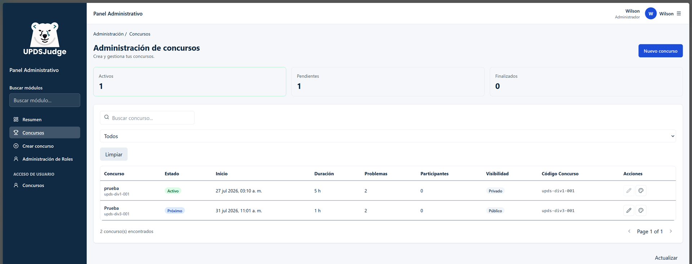
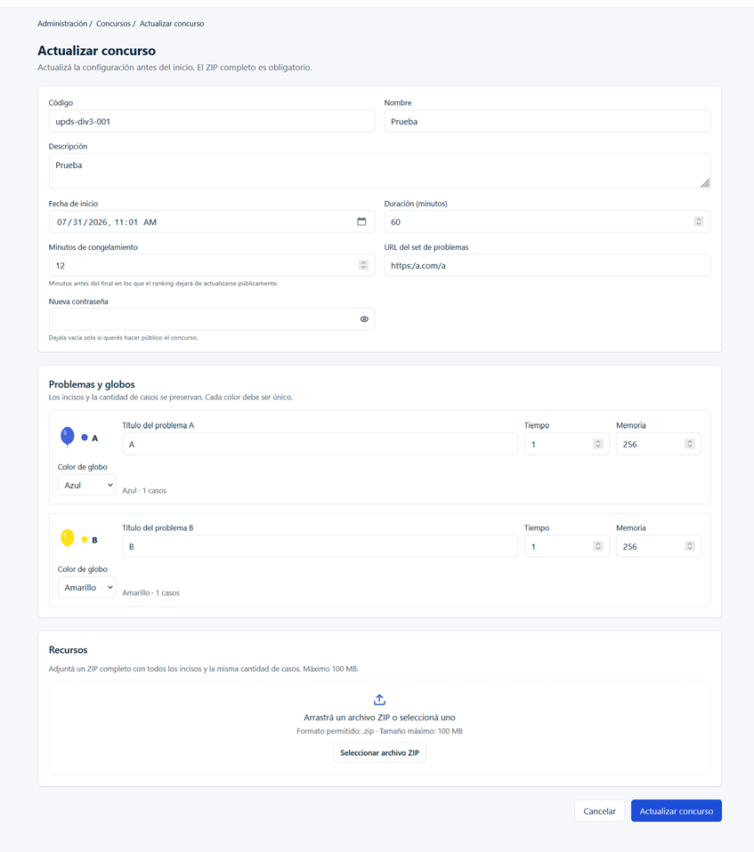
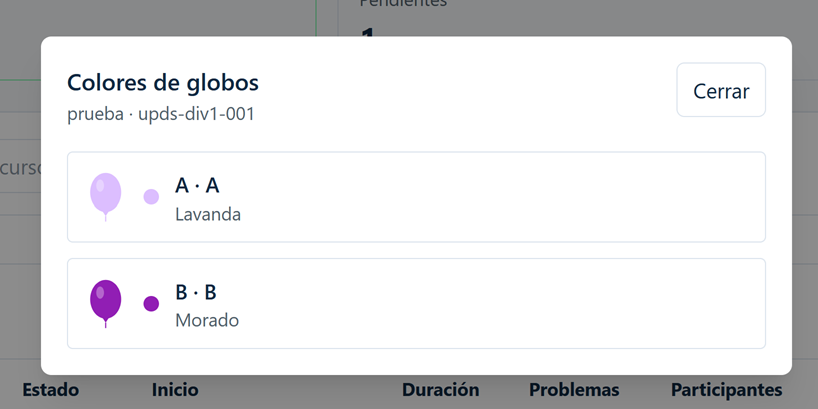

# UJ-19 — Edición de concurso, congelamiento del ranking y colores de globos

## Historia de usuario

Como Admin de Concursos, quiero que el ranking deje de actualizarse públicamente cuando falten "X" minutos para el final.

## Objetivo funcional

UJ-19 configura administrativamente `minutosCongelamiento` y los colores de
problemas. No implementa la presentación pública ni el congelamiento visual del
ranking.

## Alcance implementado

- Ruta protegida `/admin/contests/:contestCode/edit` dentro de `AdminLayout`.
- Precarga, validación y actualización multipart del concurso.
- Campo de congelamiento, ZIP obligatorio y lista fija de problemas.
- Mapper tipado de colores y selector cerrado.
- Acciones de editar y consultar globos en el listado administrativo.
- Modal read-only con `GlobeIllustration`, Escape y devolución de foco.

## Flujo final

El administrador abre el listado, navega a edición con el código del concurso,
carga `GET /api/Concursos/editar/{codigo}`, adjunta el ZIP requerido y envía
`PUT /api/Concursos/{codigo}`. La mutación invalida la lista administrativa y
el detalle editable.

## Contratos backend utilizados

| Método | Ruta                             | Autorización             | Uso                     |
| ------ | -------------------------------- | ------------------------ | ----------------------- |
| GET    | `/api/Concursos/mis-creados`     | `AdministradorConcursos` | Listado administrativo  |
| GET    | `/api/Concursos/editar/{codigo}` | `AdministradorConcursos` | Precarga de edición     |
| PUT    | `/api/Concursos/{codigo}`        | `AdministradorConcursos` | Actualización multipart |

El PUT usa `listaProblemas[n].inciso`, `titulo`, `tiempo`, `memoria` y
`colorGlobo`, además de escalares y `archivoZip`.

## Reglas de edición

Solo el creador puede editar un concurso próximo. El código, incisos y cantidad
de casos son informativos/read-only; no se agregan ni eliminan problemas.

## Minutos de congelamiento

El formulario exige un entero mayor o igual a cero y menor que la duración. La
conversión de fecha usa UTC al serializar el `datetime-local`.

## Colores de globos

El backend actual persiste valores hexadecimales y valida unicidad. El mapper
central usa sus trece valores actuales y normaliza casing/espacios antes de
validar. El backend actual difiere del catálogo funcional original en los
valores `#DCBEFF` (Lavanda) y `#9A6324` (Marrón).

## Catálogo de colores

La fuente única es `frontend/src/domain/balloon-colors.ts`; sus opciones usan
`apiValue`, etiqueta y hexadecimal.

## Mapper compartido

Expone opciones, normalización, valor API, etiqueta, hexadecimal, fallback y
validación de repetidos. Está fuera de pages y puede ser consumido por ranking
sin importar la feature de concursos.

## Modal de consulta de globos

`BalloonColorsModal` consume `problemas` del listado administrativo real. No
realiza GET de edición ni peticiones por fila; los problemas activos llegan
ordenados por inciso con su título y `colorGlobo` hexadecimal.

## Privacidad y contraseña

Decisión aceptada para el alcance: se conserva el comportamiento contractual
actual de privacidad. No se requiere una modificación adicional dentro de
UJ-19. La interfaz no persiste ni muestra contraseñas, y este change no agrega
un contrato ni campos nuevos de privacidad.

## Archivo ZIP y casos de prueba

El backend exige ZIP en cada actualización, con extensión `.zip`, máximo 100
MB, problemas completos y la misma cantidad de casos por inciso.

## Rutas y permisos

La edición está protegida por `ProtectedRoute` y `RoleRoute` con
`AdministradorConcursos`, y conserva `AdminSidebar` mediante `AdminLayout`.

## Archivos creados

| Archivo                                                       | Responsabilidad             |
| ------------------------------------------------------------- | --------------------------- |
| `frontend/src/domain/balloon-colors.ts`                       | Dominio y mapper de colores |
| `frontend/src/domain/balloon-colors.test.ts`                  | Pruebas del dominio         |
| `frontend/src/features/contests/admin/EditContestPage.tsx`    | Página de edición           |
| `frontend/src/features/contests/admin/BalloonColorsModal.tsx` | Consulta read-only          |
| `frontend/src/features/contests/admin/edit-mapper.test.ts`    | Precarga y FormData         |

## Archivos modificados

| Archivo                                                                  | Cambio realizado           |
| ------------------------------------------------------------------------ | -------------------------- |
| `frontend/src/features/contests/admin/types.ts`                          | Modelos de edición y modal |
| `frontend/src/features/contests/admin/mapper.ts`                         | Adaptadores y FormData     |
| `frontend/src/features/contests/admin/schema.ts`                         | Validación de edición      |
| `frontend/src/features/contests/admin/service.ts`                        | GET y PUT                  |
| `frontend/src/features/contests/admin/hooks.ts`                          | Query y cache              |
| `frontend/src/features/contests/admin/components/ContestsAdminTable.tsx` | Acciones y modal           |
| `frontend/src/routes/constants.ts`                                       | Route builder              |
| `frontend/src/routes/router.tsx`                                         | Ruta protegida             |

## Pruebas automatizadas

La suite final registrada tiene 28 archivos y 116 tests, todos aprobados.
Incluye mapper de colores, serialización de actualización, listado, globos
reactivos e instancias simultáneas.

## Validaciones técnicas

`npm audit` y audit high: cero vulnerabilidades. Typecheck, tests y build pasan.
`format:check` conserva deuda preexistente fuera de los archivos tocados.

## Evidencia

### 1. Captura del listado administrativo

---

### 2. Captura de Formulario de edición

---

### 3. Captura de Ver colores de globos

---

## Incidencias corregidas

El listado administrativo ahora devuelve `problemas` activos, ordenados por
inciso, con título y `colorGlobo`; el modal los consume desde caché sin una
solicitud adicional. La privacidad conserva el comportamiento contractual actual
por decisión funcional aceptada para este alcance.

## Evidencias verificadas

| Escenario                                      | Archivo                                    | Estado     |
| ---------------------------------------------- | ------------------------------------------ | ---------- |
| Acciones Editar y Ver globos                   | `../capturas/UJ-19-listado-acciones.png`   | Verificado |
| Precarga, congelamiento y globos Azul/Amarillo | `../capturas/UJ-19-formulario-edicion.png` | Verificado |
| Modal con colores distintos                    | `../capturas/UJ-19-balloon-colors.png`     | Verificado |

Las transiciones hover, el cambio reactivo y el responsive están cubiertos por
la implementación y pruebas automatizadas. El responsable autorizó el cierre
con las capturas disponibles como evidencia manual parcial.

## Estado final

UJ-19 está cerrada dentro de su alcance: edición, congelamiento, problemas,
colores, globos reactivos, modal, hover, caché y contratos OpenAPI están
integrados.

## Corrección de representación dinámica

El síntoma de globos rojos se originaba en `GlobeIllustration`: consumía un
archivo SVG estático rojo y no recibía ni aplicaba `colorGlobo`. Ahora expone la
prop opcional `color` (hexadecimal, rojo legacy por defecto) y renderiza un SVG
inline cuyo cuerpo, nudo y cuerda usan ese valor. No usa gradientes ni IDs
compartidos; por eso múltiples instancias conservan colores independientes y
un cambio del selector actualiza el globo desde el estado observado del
formulario.

El listado administrativo backend devuelve `problemas` activos ordenados con
`inciso`, `titulo` y `colorGlobo`. El modal usa esa colección cacheada sin una
petición adicional. Las acciones Editar y Ver globos incorporan hover,
transición, foco y estado disabled coherentes con los tokens existentes.
