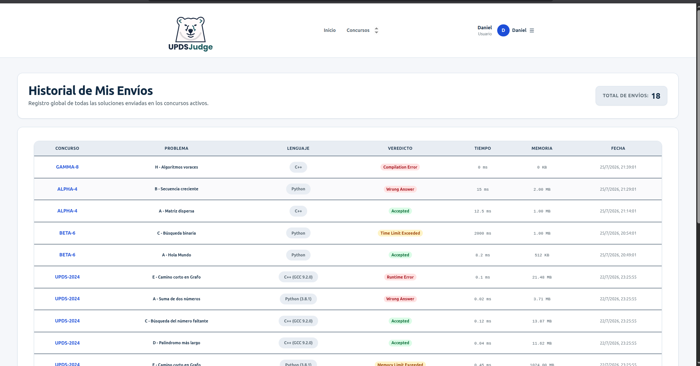
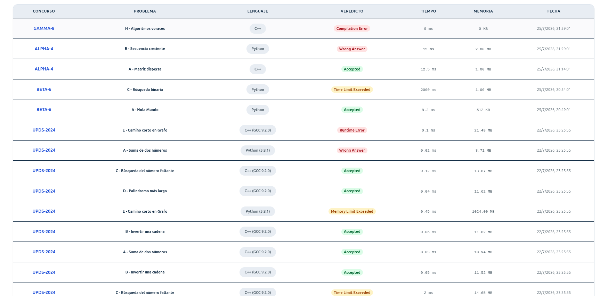

# UJ-20 — Visualización e historial de envíos con filtros y paginación

## Estado

- Frontend implementation functional complete
- Backend integration in progress
- Dynamic filters implementation in progress
- Responsive visual refinement pending
- Manual captures pending / non-blocking

La implementación cubre el flujo principal para que un estudiante pueda consultar el historial de todas sus soluciones enviadas durante los concursos. El módulo consume el endpoint protegido del backend, soporta paginación del lado del servidor y presenta la información en una tabla reutilizable con filtros y navegación entre páginas. Actualmente se encuentra en proceso la integración completa de los filtros dinámicos utilizando los datos reales del backend.

## Change asociado

**uj20-user-submissions-history-frontend**

## Motivo

UJ-20 permite al estudiante revisar todas las soluciones que ha enviado durante los concursos disponibles en la plataforma. Esta funcionalidad facilita el seguimiento del desempeño del participante mostrando el concurso al que pertenece cada envío, el problema resuelto, el lenguaje utilizado, el veredicto obtenido, el tiempo de ejecución, el consumo de memoria y la fecha del envío.

La implementación reutiliza componentes comunes de la plataforma para mantener consistencia visual y reducir duplicación de código, integrándose directamente con el endpoint protegido del módulo de envíos.

# Historia de usuario

| ID    | Historia                                                                                                                                      | Prioridad | Estimación |
| ----- | --------------------------------------------------------------------------------------------------------------------------------------------- | --------- | ---------- |
| UJ-20 | Como usuario, quiero visualizar el historial de todos mis envíos con filtros y paginación para analizar mi desempeño dentro de los concursos. | Alta      | 3 puntos   |

# Alcance implementado

La ruta correspondiente al historial renderiza una página dedicada encargada de consultar el endpoint protegido del backend (`GET /mis-envios`).

La página obtiene únicamente los envíos pertenecientes al usuario autenticado utilizando el JWT almacenado durante el inicio de sesión.

El flujo implementado incluye:

- Consulta paginada utilizando parámetros de página y tamaño.
- Integración con el servicio HTTP centralizado (`httpClient`).
- Conversión automática del DTO recibido hacia el modelo utilizado por la interfaz.
- Renderizado mediante un componente independiente (`RecentSubmissionsTable`).
- Paginación reutilizable mediante el componente `Pagination`.
- Actualización manual del historial mediante el botón **Actualizar**.
- Preparación para filtros dinámicos de concurso, inciso y veredicto.

# Criterios cumplidos

- Consulta únicamente los envíos pertenecientes al usuario autenticado.
- Consume el endpoint protegido mediante JWT.
- Presenta el historial utilizando una tabla reutilizable.
- Muestra el concurso al que pertenece cada envío.
- Muestra el inciso del problema.
- Muestra el título del problema.
- Muestra el lenguaje utilizado.
- Muestra el veredicto devuelto por Judge0.
- Muestra el tiempo de ejecución.
- Muestra el consumo de memoria.
- Muestra la fecha de envío.
- Soporta paginación del lado del servidor.

# Contrato backend

El historial de envíos consume el endpoint autenticado **GET `/api/envios/mis-envios`**, el cual devuelve únicamente los envíos pertenecientes al usuario autenticado mediante el JWT. El endpoint incorpora filtros opcionales y paginación para optimizar la consulta cuando el usuario posee una gran cantidad de soluciones registradas.

## Solicitud

```http
GET /api/envios/mis-envios?pagina=1&tamanoPagina=20
```

También es posible aplicar filtros de búsqueda:

```http
GET /api/envios/mis-envios?resultado=AC&concursoCodigo=upds-div4-001&inciso=A&pagina=1&tamanoPagina=20
```

### Parámetros soportados

| Parámetro        | Tipo   | Descripción                                      |
| ---------------- | ------ | ------------------------------------------------ |
| `resultado`      | string | Filtra por veredicto (AC, WA, TLE, MLE, CE, RE). |
| `concursoCodigo` | string | Filtra por el código del concurso.               |
| `inciso`         | string | Filtra por el inciso del problema (A, B, C...).  |
| `pagina`         | number | Página solicitada.                               |
| `tamanoPagina`   | number | Cantidad de registros por página (máximo 50).    |

## Respuesta consumida por el frontend

```json
{
  "total": 3,
  "pagina": 1,
  "tamanoPagina": 20,
  "datos": [
    {
      "idEnvio": 40,
      "concursoCodigo": "upds-div4-001",
      "problemaTitulo": "Resta",
      "inciso": "B",
      "lenguaje": "C++ (GCC 9.2.0)",
      "veredicto": "Wrong Answer",
      "consumoTiempo": 4,
      "consumoMemoria": 1976,
      "fechaEnvio": "2026-07-24T21:16:50.793145Z"
    }
  ]
}
```

La respuesta es utilizada por el frontend para construir la tabla del historial de envíos, calcular la paginación, mostrar las métricas de ejecución y aplicar los filtros seleccionados por el usuario.

## Flujo frontend

`UserHistoryPage` renderiza el componente `RecentSubmissionsTable` junto con los controles de filtrado y paginación. Al cargarse la página, o cuando el usuario modifica un filtro o cambia de página, se ejecuta `historyService.getMisEnvios()`. El servicio construye la petición utilizando los parámetros de búsqueda (`resultado`, `concursoCodigo`, `inciso`, `pagina` y `tamanoPagina`) y realiza la consulta mediante el `httpClient`, el cual agrega automáticamente el JWT en el encabezado **Authorization**.

La respuesta recibida se transforma a los tipos definidos en `historyTypes.ts` y posteriormente es utilizada para actualizar el estado del historial mostrado por `RecentSubmissionsTable`.

Si la consulta es exitosa:

1. se obtiene el listado paginado de envíos del usuario autenticado;
2. se actualizan el total de registros y la información de paginación;
3. `RecentSubmissionsTable` renderiza los envíos mediante el componente reutilizable `DataTable`;
4. `VerdictBadge` representa visualmente el veredicto de cada envío;
5. el usuario puede aplicar nuevos filtros o navegar entre páginas, provocando una nueva consulta al backend y manteniendo sincronizada la información mostrada en pantalla.

# Validaciones implementadas

Durante la consulta del historial se aplican las siguientes validaciones:

## Filtros

- Todos los filtros son opcionales.
- Los filtros vacíos no se envían al backend.
- Al modificar un filtro, la paginación vuelve automáticamente a la primera página.

## Paginación

- No se permiten páginas menores a uno.
- El botón **Anterior** permanece deshabilitado cuando el usuario se encuentra en la primera página.
- El botón **Siguiente** se deshabilita cuando se alcanza la última página.
- El número total de páginas se calcula utilizando el valor `total` retornado por el backend.

## Formato de datos

Antes de renderizar la información se realizan varias transformaciones:

- La fecha se convierte al formato local del navegador.
- El tiempo se muestra en milisegundos (ms).
- La memoria se presenta en KB o MB según corresponda.

# Manejo de errores

El módulo contempla distintos escenarios durante la consulta del historial.

| Escenario           | Comportamiento                                                             |
| ------------------- | -------------------------------------------------------------------------- |
| Error de conexión   | Se muestra un mensaje indicando que no fue posible cargar el historial.    |
| Error del servidor  | Se presenta el mensaje devuelto por la API.                                |
| Usuario sin envíos  | La tabla muestra un mensaje indicando que aún no existen registros.        |
| Consulta en proceso | Se presentan indicadores de carga hasta recibir la respuesta del servidor. |

Mientras la solicitud permanece activa, la interfaz mantiene el estado de carga para evitar mostrar información incompleta.

# Integración con rutas

La navegación del historial utiliza las rutas centralizadas de la aplicación.

Desde la tabla es posible acceder nuevamente al concurso correspondiente utilizando el código del concurso mostrado en cada fila.

Toda la navegación es gestionada mediante **React Router**, permitiendo una experiencia consistente sin recargar la aplicación.

# Archivos principales

- `frontend/src/features/history/Pages/historyPage.tsx`
- `frontend/src/features/history/Types/historyService.ts`
- `frontend/src/features/history/Types/historyTypes.ts`
- `frontend/src/features/contest/user/RecentSubmissionsTable.tsx`
- `frontend/src/components/tables/DataTable.tsx`
- `frontend/src/lib/api/endpoints.ts`
- `frontend/src/lib/api/httpClient.ts`
- `frontend/src/routes/router.tsx`

## Evidencia

| Evidencia | Descripción                                |
| --------- | ------------------------------------------ |
| Captura 1 | Pantalla principal del historial de envíos |
| Captura 2 | Historial mostrando distintos veredictos   |

### 1. Pantalla principal del historial de envíos



---

### 2. Historial mostrando distintos veredictos



---

# Confirmaciones de seguridad

La consulta del historial requiere que el usuario se encuentre autenticado mediante un **JWT** válido.

Todas las solicitudes realizadas por `historyService` utilizan el `httpClient`, el cual agrega automáticamente el encabezado **Authorization: Bearer Token**, evitando que el componente tenga que manipular directamente la autenticación.

El backend únicamente devuelve los envíos pertenecientes al usuario autenticado, impidiendo que un estudiante pueda consultar información de otros participantes.

Los filtros enviados al servidor se encuentran tipados mediante TypeScript, reduciendo errores en la construcción de las consultas y evitando parámetros inválidos.

La paginación limita la cantidad de registros obtenidos por petición, evitando cargas excesivas sobre el servidor y mejorando el rendimiento de la interfaz.

# Integraciones pendientes

- Implementar filtros avanzados combinando concurso, inciso y veredicto en una única búsqueda.
- Agregar actualización automática del historial después de realizar un nuevo envío sin necesidad de refrescar la página.
- Incorporar ordenamiento por fecha, tiempo de ejecución y consumo de memoria.
- Completar las capturas definitivas para el manual de usuario.
- Validar completamente el funcionamiento con el backend en ambiente de producción.

# Fuera de alcance

Las siguientes funcionalidades no forman parte del alcance de la UJ-20:

- Descarga del código fuente enviado.
- Reenvío automático de una solución desde el historial.
- Eliminación de envíos realizados.
- Exportación del historial a PDF, Excel o CSV.
- Comparación entre diferentes envíos.
- Actualización en tiempo real mediante WebSockets.

# Conclusión

La **UJ-20** implementa el módulo encargado de visualizar el historial de envíos realizados por el estudiante dentro de la plataforma.

La solución permite consultar la información de manera paginada, aplicar filtros, visualizar los veredictos obtenidos y revisar las métricas de ejecución devueltas por Judge0. La arquitectura separa claramente la lógica de negocio (`historyService`), los modelos (`historyTypes`) y los componentes de interfaz (`RecentSubmissionsTable` y `Pagination`), favoreciendo la reutilización y el mantenimiento del código.

La integración con el backend se realiza mediante un contrato REST tipado y autenticado con JWT, garantizando que únicamente se consulten los envíos pertenecientes al usuario autenticado. Con ello, el historial constituye una herramienta útil para que el estudiante pueda realizar un seguimiento continuo de su desempeño durante los concursos de programación.

## Integración del change

La ruta final `/student/history` está protegida y se renderiza bajo `UserLayout`.
La navegación principal expone **Mis envíos**, diferenciada de los envíos dentro
de un concurso. `UserHistoryPage` conserva la tabla existente y ahora conecta
los filtros contractuales `concursoCodigo` y `resultado`, con página reiniciada
a 1 al cambiarlos, limpieza y query key parametrizada.

El endpoint centralizado es `GET /api/Envios/mis-envios`; usa paginación
server-side con `pagina` y `tamanoPagina=20`. Los veredictos, unidades, badges,
scroll horizontal y la ausencia de columna ID se mantienen mediante el mapper y
la tabla existente. UJ-20 no se expone en `Acceso de Usuario` administrativo:
el spec no aporta evidencia para ese contexto.

Las pruebas verifican serialización de filtros y query key. Lint, typecheck,
suite y build fueron ejecutados. No existen capturas UJ-20 nuevas en
`docs/capturas/`; la validación visual manual permanece pendiente.

## Integración en Acceso de Usuario administrativo

`routes.adminUserSubmissions` resuelve `/admin/user-access/submissions`. El sidebar administrativo muestra **Mis Envíos** después de **Concursos** y la ruta protegida reutiliza `UserHistoryContent` dentro de `AdminLayout`; no anida `UserLayout`.

El administrador consulta sus propios envíos dentro del flujo de Acceso de Usuario. No es una pantalla para inspeccionar envíos de otros usuarios. Se preservan el endpoint, query key, filtros por concurso y resultado, tabla y paginación del contenido compartido.
