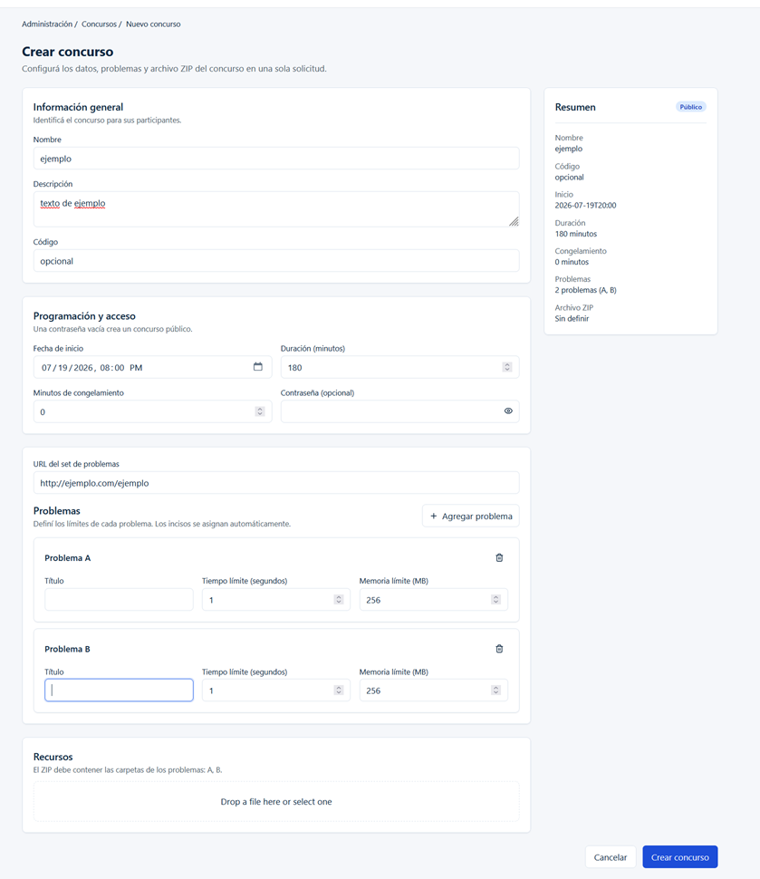
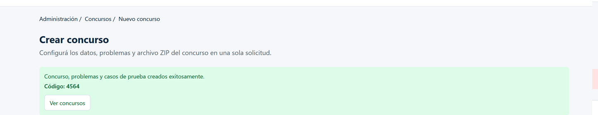
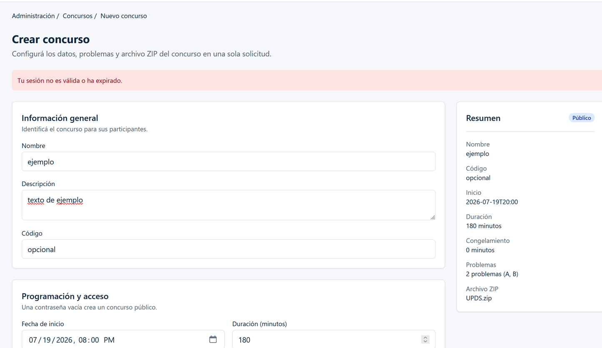

# UJ-08 y UJ-09 — Crear concurso e importar paquete ZIP

## Estado

- frontend implementation functional complete
- authenticated end-to-end pending
- final visual refinement pending
- manual captures pending/non-blocking

La implementación cubre el flujo funcional aislado del frontend. Los pendientes indicados no deben interpretarse como comportamiento ya confirmado en un entorno autenticado real.

## Change asociado

`uj08-uj09-create-contest-zip-import-frontend`

## Motivo

UJ-08 y UJ-09 se implementan como una unidad atómica: un único formulario de creación y una única solicitud multipart. Así, la configuración del concurso, sus problemas y el archivo ZIP se envían de forma coherente en la misma operación, sin separar la carga de casos de prueba de la creación del concurso.

## Historias de usuario

| ID    | Historia                                                                                                                                                                                           | Prioridad | Estimación académica normalizada |
| ----- | -------------------------------------------------------------------------------------------------------------------------------------------------------------------------------------------------- | --------- | -------------------------------- |
| UJ-08 | Como Administrador de Concursos, quiero crear un concurso con nombre, descripción, fecha de inicio, duración, enlace al PDF y minutos de congelamiento, para publicar una competencia configurada. | Alta      | 3 puntos                         |
| UJ-09 | Como Administrador de Concursos, quiero subir un archivo ZIP con la estructura de carpetas A, B, C… para que los casos de prueba se carguen automáticamente.                                       | Crítica   | 8 puntos                         |

## Alcance implementado

La ruta `/admin/contests/new` renderiza `CreateContestPage` dentro de `AdminLayout`. La pantalla reúne información general, programación y acceso, enlace al set de problemas, problemas dinámicos y recursos ZIP.

`Cancelar` navega a `/admin/contests`; `Crear concurso` envía el formulario. La composición es responsive: en pantallas pequeñas sigue un flujo vertical y, desde tamaños grandes, muestra formulario y resumen lateral. El resumen se mantiene visible desde tamaño medio.

## Criterios cumplidos — UJ-08

- Captura nombre, descripción y código obligatorios, con recorte de espacios para validación.
- Requiere fecha y hora de inicio.
- Valida duración como entero mayor que cero.
- Valida minutos de congelamiento como entero mayor o igual que cero y no mayor que la duración.
- Admite contraseña opcional; una contraseña vacía o formada solo por espacios deriva modalidad pública y una con contenido deriva modalidad privada en el resumen.
- Requiere un enlace válido al set de problemas.

## Criterios cumplidos — UJ-09

- Requiere seleccionar un archivo ZIP con extensión `.zip`, sin distinguir mayúsculas de minúsculas.
- Permite entre uno y veintiséis problemas.
- Cada problema requiere título, tiempo mayor que cero en segundos y memoria entera positiva en MB.
- Deriva los incisos A a Z según la posición; al eliminar un problema, recalcula los incisos.
- Impide eliminar el único problema y agregar más de veintiséis.
- Envía los problemas y el archivo ZIP junto con el concurso en una sola solicitud multipart.

## Diseño de la pantalla

La página presenta migas de pan, título, texto explicativo, tarjetas de formulario, resumen y acciones finales. El resumen refleja modalidad, nombre, código, fecha y hora de inicio, duración, minutos de congelamiento, cantidad e incisos de los problemas y nombre del ZIP; no muestra contraseña ni información de autenticación.

Durante el envío se deshabilitan campos, selector ZIP, acciones de problemas, `Cancelar` y envío para evitar activaciones duplicadas.

## Secciones del formulario

- **Información general:** nombre, descripción y código.
- **Programación y acceso:** fecha/hora de inicio, duración, contraseña y minutos de congelamiento.
- **Problemas:** URL del set y lista dinámica de problemas.
- **Recursos:** selector del archivo ZIP de casos de prueba.

## Contrato backend

El cliente realiza `POST` a la ruta relativa centralizada `Concursos/crear` mediante el cliente HTTP compartido. Esta documentación describe el contrato que construye el frontend; no confirma detalles internos ni el procesamiento real del backend.

La respuesta que consume la interfaz tiene la forma:

```json
{
  "codigo": "<codigo-devuelto>",
  "mensaje": "<mensaje-devuelto>"
}
```

## Formulario multipart

El cuerpo se construye con `FormData`. El navegador genera el encabezado `multipart/form-data` y su boundary; el cliente no fija ese encabezado manualmente.

Campos simples enviados:

```text
nombre
descripcion
fechaInicio
duracionMinutos
contrasena
urlSetProblemas
minutosCongelamiento
codigo
archivoZip
```

Por cada problema se envían campos indexados:

```text
listaProblemas[n].inciso
listaProblemas[n].titulo
listaProblemas[n].tiempo
listaProblemas[n].memoria
```

La fecha se serializa en ISO 8601. Los textos se recortan y los números se serializan como texto antes de agregarse a `FormData`.

## Flujo frontend

`CreateContestPage` usa React Hook Form con el esquema de validación y envía a través de `useCreateContestMutation`. El mapper crea el `FormData`; el servicio utiliza el cliente HTTP compartido.

Los errores de campo se presentan junto al control correspondiente. Los errores generales se muestran en una alerta. No se afirma que todos los comportamientos individuales de la página y de errores estén directamente cubiertos por pruebas de página.

## Registro dinámico de problemas

`ContestProblemList` usa una lista dinámica. Un problema nuevo comienza con tiempo `1` y memoria `256`; su inciso se calcula desde la posición actual. Los títulos se recortan antes de validarse, el tiempo no exige ser entero y la memoria sí debe ser un entero positivo.

## Tratamiento del paquete ZIP

La interfaz muestra la expectativa de carpetas según los incisos definidos. El frontend no descomprime el archivo, no inspecciona sus carpetas, no valida pares de entrada/salida y no impone un límite de tamaño. La interpretación de carpetas A, B, C… y la carga efectiva de casos requieren verificación autenticada de extremo a extremo.

## Respuesta exitosa

Ante una respuesta satisfactoria de la aplicación, la pantalla muestra el `mensaje` y el `codigo` recibidos, restablece los valores iniciales y ofrece `Ver concursos`. No hay redirección automática.

## Manejo de errores

Los mensajes seguros conocidos en la interfaz son:

```text
Tu sesión no es válida o ha expirado.
```

Ese mensaje se muestra para una respuesta 401. Para otros errores se muestra en una alerta el mensaje normalizado disponible. La documentación no presupone formatos ni mensajes adicionales del backend.

## Estado de la integración de autenticación

El transporte admite un encabezado Bearer por medio de una abstracción configurada externamente. Esta pantalla no lee tokens ni almacenamiento y no configura por sí misma el proveedor de sesión. Por ello, la verificación de una solicitud autenticada real permanece pendiente.

## Simulación con MSW

Los manejadores MSW cubren `POST /api/Concursos/crear` con respuestas controladas de éxito, 400 y 401. El manejador lee `FormData`, requiere `nombre` no vacío y usa `codigo === 'unauthorized'` para la rama controlada 401. No inspecciona el contenido interno del ZIP.

## Archivos principales

- `frontend/src/features/contests/CreateContestPage.tsx`
- `frontend/src/features/contests/ContestProblemList.tsx`
- `frontend/src/features/contests/CreateContestSummary.tsx`
- `frontend/src/features/contests/schema.ts`
- `frontend/src/features/contests/mapper.ts`
- `frontend/src/features/contests/service.ts`
- `frontend/src/features/contests/use-create-contest.ts`
- `frontend/src/features/contests/types.ts`
- `frontend/src/lib/api/endpoints.ts`
- `frontend/src/lib/api/http-client.ts`
- `frontend/src/lib/auth/auth-transport.ts`
- `frontend/src/routes/constants.ts`
- `frontend/src/routes/router.tsx`
- `frontend/src/mocks/handlers/index.ts`

## Pruebas realizadas

La evidencia automatizada registrada cubre esquema, mapper multipart, servicio, mutación, renderizado e interacción básica de página, ruta y manejadores MSW. Las pruebas de página no constituyen evidencia directa de todos los estados individuales de envío, éxito, errores y cancelación.

Resultados previamente registrados para la implementación:

| Comando                | Resultado registrado               |
| ---------------------- | ---------------------------------- |
| `npm run format:check` | aprobado                           |
| `npm run lint`         | aprobado                           |
| `npm run typecheck`    | aprobado                           |
| `npm run test:run`     | aprobado: 11 archivos y 41 pruebas |
| `npm run build`        | aprobado                           |

No se ejecutaron comandos, pruebas ni OpenSpec CLI para esta actualización documental.

## Evidencia

### 1. Captura del Formulario



---

### 2. Captura de sección para importar ZIP


---

### 3. Captura de concurso creado con éxito



---

### 4. Captura de fallo al crear concurso sin sesión



---

## Confirmaciones de seguridad

- El resumen no expone la contraseña ni datos de autenticación.
- El formulario no lee tokens ni almacenamiento.
- El cliente deja que el navegador genere el boundary multipart.
- Mientras existe una mutación pendiente, se bloquean controles y acciones para evitar envíos duplicados.
- El contenido del ZIP no se procesa ni se expone en el navegador.

## Integraciones pendientes

- Configurar y verificar el proveedor de token/sesión para una ejecución autenticada real.
- Validar de extremo a extremo el multipart con un ZIP real y la interpretación de sus carpetas.
- Incorporar el acceso a la pantalla desde la barra lateral o navegación administrativa correspondiente.
- Implementar e integrar el listado de concursos y el destino posterior a la creación.
- Completar el refinamiento visual final y la validación manual responsive.
- Generar capturas actuales y verificadas.

## Fuera de alcance

- Estados de publicación y borradores.
- Inspección, descompresión o validación interna del ZIP en frontend.
- Límite de tamaño del archivo en frontend.
- Listado de concursos y flujo posterior completo a la creación.
- Confirmación de comportamiento del backend real sin sesión autenticada.

## Conclusión

UJ-08 y UJ-09 cuentan con una implementación funcional aislada en frontend que centraliza la creación del concurso y la carga ZIP en una solicitud multipart. La integración autenticada real, el listado y acceso de navegación, el refinamiento visual y las capturas continúan pendientes.
