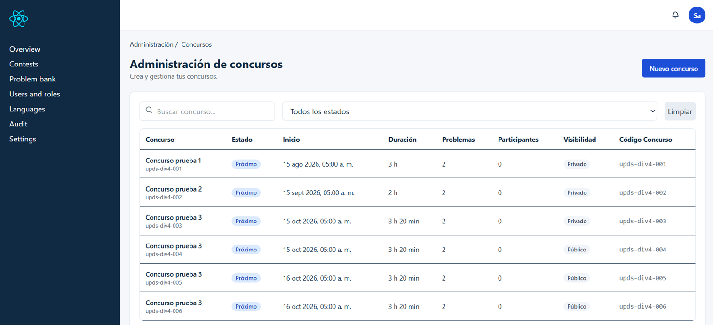
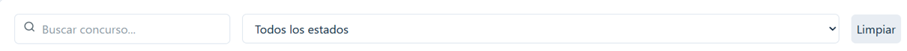
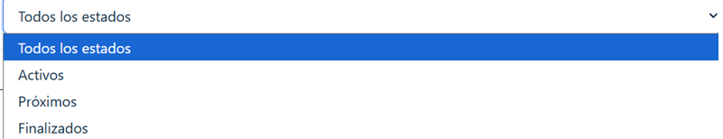
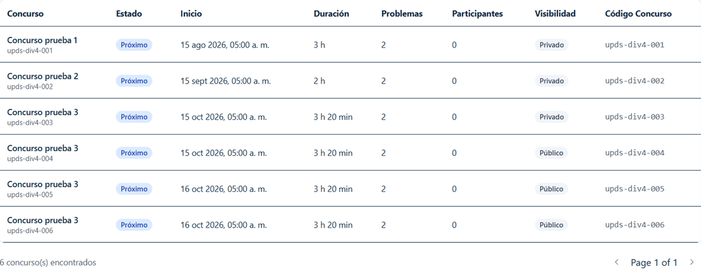

# UJ-08 — Administración de Concursos

## Estado

- **Estado frontend: IMPLEMENTADO.**
- Listado, filtros, resumen y paginación conectados.
- Contratos consumidos asumidos correctos para esta auditoría.
- Las capturas referenciadas existen.

## Change asociado

La implementación queda trazada por los changes activos `integrate-sprint-1-auth-admin-contests-minimal-frontend` y `fix-admin-contests-filters-summary-branding-user-layout`.

## Motivo

Documentar la implementación de la vista de administración de concursos siguiendo la misma estructura utilizada en UJ08-UJ09.

## Historias de usuario

| ID | Historia | Prioridad | Estimación |
|---|---|---|---|
| UJ-08 | Como Administrador de Concursos, quiero visualizar y gestionar los concursos creados para dar seguimiento desde el panel administrativo. | Alta | 5 puntos |

## Alcance implementado

Se implementó la vista de administración de concursos con listado, filtros, búsqueda, resumen y paginación, consumiendo el endpoint correspondiente.

## Criterios cumplidos

- Listado paginado.
- Filtros por estado, visibilidad, fecha y búsqueda.
- Resumen de estadísticas.
- Integración con JWT.
- Consumo del endpoint de concursos creados.

## Diseño de la pantalla

> **Captura 1 – Vista principal**



<br>

> **Captura 2 – Filtros y búsqueda**





<br>

> **Captura 3 – Tabla y paginación**



## Flujo frontend

UI → Hook → Servicio → HttpClient → API → Renderizado.

## Archivos principales

- `frontend/src/features/contests/admin/types.ts`
- `frontend/src/features/contests/admin/service.ts`
- `frontend/src/features/contests/admin/hooks.ts`
- `frontend/src/features/contests/admin/ContestsAdminScreen.tsx`
- `frontend/src/features/contests/admin/components/ContestsSummaryCards.tsx`
- `frontend/src/features/contests/admin/components/ContestsFiltersBar.tsx`
- `frontend/src/features/contests/admin/components/ContestsAdminTable.tsx`
- `frontend/src/features/contests/admin/pages/AdminContestsPage.tsx`
- `frontend/src/routes/router.tsx`

#### Cambios realizados

- Se reemplazó el botón de fecha por un campo de tipo date con estilo visual más claro.
- Se hizo funcional el botón de limpiar filtros.
- Se amplió el estado de filtros para incluir la propiedad fecha.
- Se ajustó la tabla para mejorar visualmente su presentación con bordes, sombras y hover.
- Se renombró la columna "Modalidad" como "Visibilidad" para que coincidiera con la propuesta de diseño.

#### Archivos actuales relacionados

- `frontend/src/features/contests/admin/components/ContestsFiltersBar.tsx`
- `frontend/src/features/contests/admin/ContestsAdminScreen.tsx`
- `frontend/src/features/contests/admin/types.ts`
- `frontend/src/features/contests/admin/service.ts`
- `frontend/src/components/tables/index.tsx`
- `frontend/src/features/contests/admin/components/ContestsAdminTable.tsx`
- `frontend/src/mocks/handlers/index.ts`

## Evidencia sugerida

```text
docs/capturas/uj08-pantalla-principal.png
docs/capturas/uj08-barra-filtros.png
docs/capturas/uj08-listado-concursos.png
```

## Confirmaciones de seguridad

- Separación entre UI y lógica.
- Consumo de endpoints aprobados.

## Estado actual

La ruta `/admin/contests` usa `AdminLayout`, `ProtectedRoute` y `RoleRoute` para `AdministradorConcursos`. El frontend consume `Concursos/mis-creados` y `Concursos/mis-resumen`; contratos asumidos correctos para esta auditoría.

## Fuera de alcance

- Creación y edición de concursos.
- Funcionalidades no respaldadas por el backend.

## Conclusión

El feature de administración de concursos quedó consolidado como una vista funcional

- consumo del endpoint de listado base,
- integración del endpoint de concursos creados por administradores de concursos,
- filtros y paginación,
- mejoras visuales y de experiencia.
