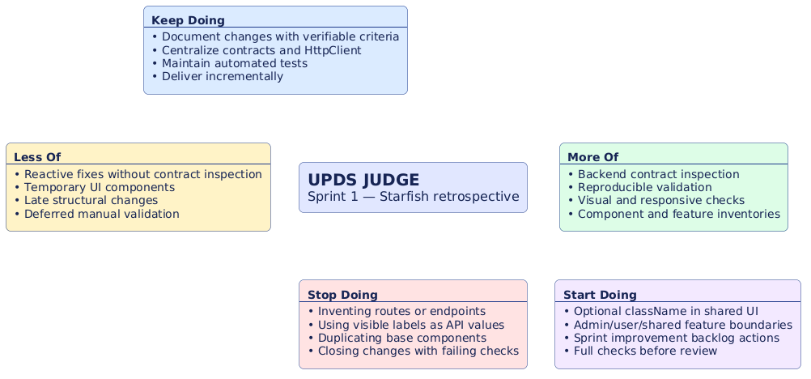
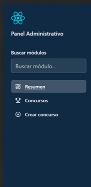
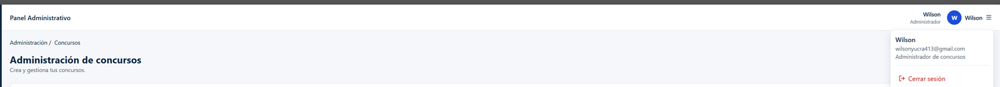
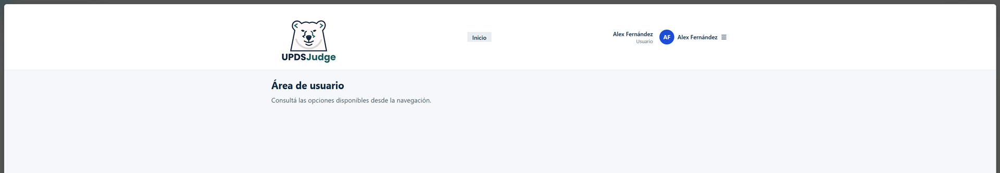
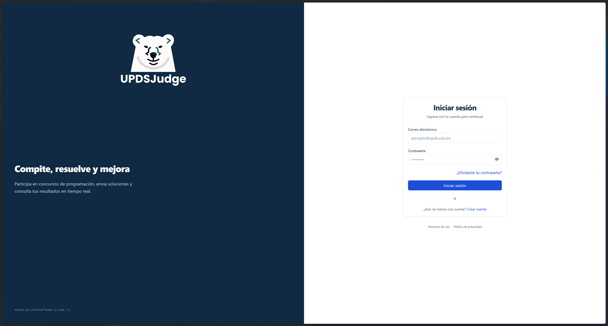
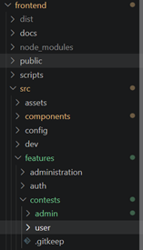

# Retrospectiva Sprint 1 — UPDS JUDGE

- **Proyecto:** UPDS JUDGE
- **Sprint:** 1
- **Técnica:** Starfish
- **Objetivo:** revisar la base de autenticación, shell, administración de concursos y fundamentos visuales entregados durante el sprint para acordar mejoras verificables del Sprint 2.

## Contexto y evidencia

El sprint dejó rutas protegidas por rol, `AdminLayout`, `UserLayout` sobre las rutas existentes, creación y administración de concursos, y componentes visuales compartidos. La autorización continúa siendo responsabilidad del backend; los guards y la visibilidad son controles de UX. Las afirmaciones de este documento se basan en los changes presentes y en el código y pruebas del workspace.

Changes existentes relacionados:

- `sprint-0-initialize`
- `sprint-1-frontend-core-api-ui-foundation`
- `integrate-sprint-1-auth-admin-contests-minimal-frontend`
- `role-aware-app-shell-sidebar-layouts-routing`
- `fix-create-contest-password-zip-and-form-ux`
- `uj08-uj09-create-contest-zip-import-frontend`
- `fix-admin-contests-filters-summary-branding-user-layout`
- `sprint-1-retrospective-shared-components-contests-boundaries`

## Starfish

### Keep Doing

- Mantener changes y pruebas de comportamiento como trazabilidad de contratos.
- Usar los contratos del backend como autoridad para filtros, resumen y creación.
- Validar rutas protegidas, formularios y componentes compartidos antes del cierre.

### Less Of

- Resolver diferencias de contratos de manera reactiva después de integrar una pantalla.
- Acumular movimientos estructurales hasta que coexistan límites de administración y usuario.
- Dejar deuda de formato para el final del cambio.

### More Of

- Inspeccionar exports públicos, refs y props nativas antes de extender componentes.
- Validar visualmente `/dev/ui` y mantener checks reproducibles.
- Coordinar los límites de una feature antes de agregar flujos futuros.

### Stop Doing

- Inventar rutas o presentar controles visuales como autorización.
- Duplicar primitivas visuales para una personalización puntual.
- Cerrar un change con checks técnicos fallidos.

### Start Doing

- Aplicar `className?: string` en la raíz visual pública mediante `cn`.
- Mantener `features/contests/admin/` como límite del código administrativo.
- Registrar evidencia de validación y pendientes explícitos en cada cierre.

## Análisis

### Funcionalidad

Las rutas administrativas existentes conservan listado, filtros, resumen y creación de concursos. La contribución `uj11-partial-user-dashboard-stats-recent-submissions` permanece pendiente: no se implementaron estadísticas, envíos ni listado de concursos del usuario.

### Calidad técnica

Los componentes compartidos cuentan con una utilidad central `cn`; este change estandariza la personalización de raíces aplicables y conserva props nativas, semántica y estados. Los controles de tabla y formularios se validan con pruebas de comportamiento.

### Experiencia de usuario

El shell ofrece navegación por rol sobre rutas reales, feedback accesible y formularios con estados de error. La ruta estudiantil existente no implica todavía un dashboard de concursos del usuario.

### Mantenibilidad

El código exclusivo de administración de concursos reside bajo `features/contests/admin/`. No se crea `user/` ni `shared/` sin archivos y consumidores reales; `user/` queda reservado para el trabajo futuro de UJ-11.

### Proceso del equipo

El trabajo incremental y las pruebas focalizadas redujeron riesgo en contratos de frontend. Como mejora, acordamos ejecutar la secuencia completa de validación y registrar bloqueos reales antes de cerrar cambios.

## Acciones SMART para Sprint 2

| Mejora                       | Acción SMART                                                                                                                                                                              | Medición                                                                                              |
| ---------------------------- | ----------------------------------------------------------------------------------------------------------------------------------------------------------------------------------------- | ----------------------------------------------------------------------------------------------------- |
| Componentes base extensibles | Al inicio del Sprint 2, inventariar y actualizar cada componente visual público aplicable para aceptar `className` opcional, conservar su base y combinarla con `cn`.                     | Inventario completo, pruebas de clase base/externa y `format`, lint, typecheck, tests y build verdes. |
| Límites de contests          | Antes de sumar un flujo de usuario en Sprint 2, mantener el código administrativo en `contests/admin`; crear `user` solo con código real y `shared` solo con consumidores de ambas áreas. | Sin imports a rutas anteriores, sin carpetas vacías y regresión administrativa verde.                 |
| Validación reproducible      | En cada cierre del Sprint 2, ejecutar y registrar format, lint, typecheck, tests, build, dev y diff check.                                                                                | Registro por change con resultados y bloqueos no atribuibles identificados.                           |

## Coordinación con UJ-11

`uj11-partial-user-dashboard-stats-recent-submissions` sigue pendiente y debe coordinarse con el responsable principal antes de crear `features/contests/user/`. Este change prepara el boundary administrativo; no entrega componentes, endpoints, filtros ni rutas de UJ-11.

## Evidencia

### 1. Captura del Tablero Starfish

---

### 2. Captura de SideBar administrativo corregido

---

### 3. Captura de Layout del administrador actualizado

---

### 4. Captura de Layout del usuario actualizado

---

### 5. Captura de Logos en el autenticación actualizados

---

### 6. Captura de la nueva distribución de las features en contests

---

## Definition of Done

- [x] Inventario y contrato de `className` aplicable implementados y cubiertos por pruebas.
- [x] Estilos base y semántica preservados por implementación y tests.
- [x] Código administrativo de contests movido bajo `features/contests/admin/`.
- [x] Imports de router actualizados.
- [x] Documento anterior movido a esta retrospectiva.
- [x] Starfish, análisis y acciones SMART incluidos.
- [x] Validación visual manual y evidencias de capturas completadas.
- [ ] UJ-11 parcial implementada (trabajo futuro).
