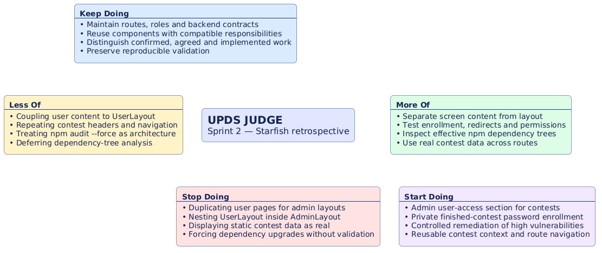
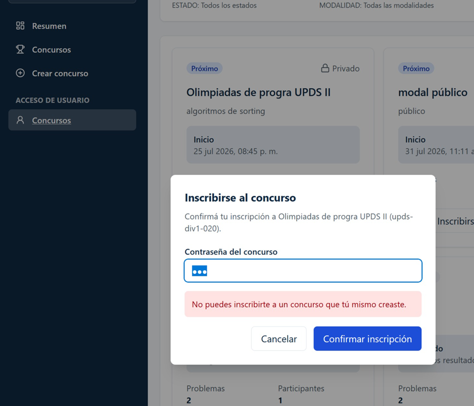
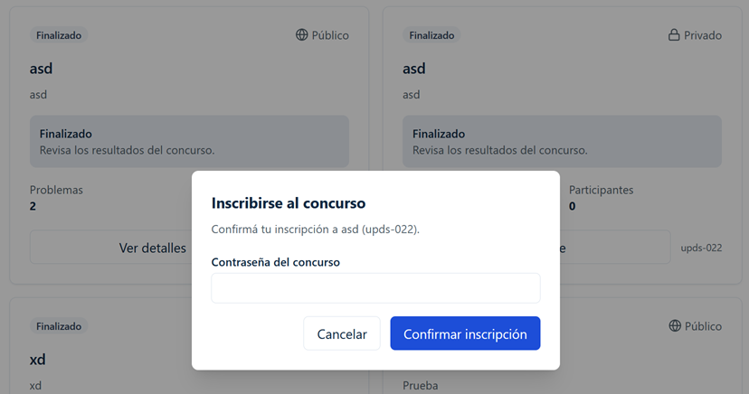
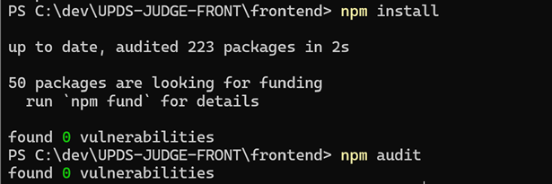
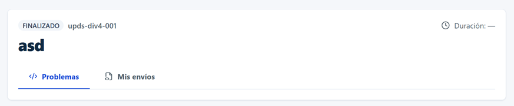

# Retrospectiva Sprint 2 — UPDS JUDGE

- **Proyecto:** UPDS JUDGE
- **Sprint:** 2
- **Técnica:** Starfish
- **Objetivo:** registrar acuerdos funcionales, de arquitectura frontend y de seguridad identificados al cierre del trabajo reciente; estos acuerdos orientan trabajo futuro y no constituyen implementación.

## Contexto y evidencia

El workspace cuenta con navegación por roles mediante `ProtectedRoute` y `RoleRoute`, los layouts `AdminLayout` y `UserLayout`, y rutas estudiantiles reales para concursos, problemas y envíos. La navegación administrativa se concentra en `AdminSidebar` y actualmente no incluye un acceso integrado a la experiencia de concursos del usuario.

La experiencia de concursos del usuario ya tiene componentes reutilizables bajo `features/contests/user/`, entre ellos `UserContestsPage`, `ContestCard` y `JoinContestModal`. Sin embargo, `SubmissionsPage` contiene de forma local un bloque de contexto del concurso con datos estáticos o incompletos. Por su parte, `ContestProblemsPage` consume `getContestDashboard(contestCode)` y usa rutas reales para problemas y envíos.

El backend confirmó el comportamiento esperado para concursos privados finalizados: un usuario todavía no inscrito puede proporcionar la contraseña; si es correcta, el backend lo inscribe y permite el acceso posterior al detalle. Este acuerdo sustituye la interpretación anterior de `PRIVATE_FINISHED_REQUIRES_BACKEND` como bloqueo funcional sin una regla definida; la implementación frontend continúa pendiente de verificación e integración.

Después de `npm install` en `frontend/`, se reportaron **6 vulnerabilidades de severidad alta**. El reporte identificó las cadenas de `brace-expansion` a través de `minimatch`, `@redocly/openapi-core` y `openapi-typescript`, y de `react-router` a través de `react-router-dom`. Este documento registra el hallazgo y la estrategia de análisis; no modifica dependencias ni lockfile.

## Starfish

### Keep Doing

- Mantener rutas, roles y contratos de backend como fuente de verdad funcional.
- Reutilizar componentes existentes cuando su responsabilidad sea compatible con el nuevo contexto.
- Registrar explícitamente diferencias entre comportamiento confirmado, acordado e implementado.
- Conservar validaciones reproducibles antes de cerrar cambios técnicos.

### Less Of

- Acoplar contenido funcional de usuario a `UserLayout` cuando el contenido pueda requerirse desde otra experiencia.
- Repetir encabezados y navegación del mismo concurso en páginas diferentes.
- Tratar propuestas automáticas de `npm audit fix --force` como decisiones arquitectónicas.

### More Of

- Separar contenido de pantalla y layout contenedor al diseñar reutilización entre roles.
- Cubrir con pruebas los flujos de inscripción, redirección, permisos y recarga directa.
- Inspeccionar el árbol efectivo de dependencias antes de aceptar actualizaciones de seguridad.

### Stop Doing

- Duplicar una página de usuario solamente para renderizarla bajo el layout administrativo.
- Anidar `UserLayout` dentro de `AdminLayout` o mostrar dos sidebars.
- Mantener datos estáticos que aparenten describir un concurso real.
- Forzar actualizaciones de paquetes sin revisar compatibilidad, API, lockfile y validaciones.

## Análisis

### Funcionalidad

Las rutas actuales del usuario incluyen `routes.studentListCompetitions`, `routes.studentContestProblems(contestCode)` y `routes.studentContestSubmissions(contestCode)`. La navegación de `ContestProblemsPage` ya deriva la pestaña activa de la ruta, mientras que `SubmissionsPage` todavía contiene navegación visual y contexto de concurso escritos localmente.

La política actual de `getContestUserAction` devuelve `PRIVATE_FINISHED_REQUIRES_BACKEND` para un concurso privado finalizado cuando el usuario no está inscrito. La confirmación del backend define ahora el comportamiento de producto que debe reemplazar ese bloqueo en un change futuro: solicitar contraseña, inscribir tras validación correcta y habilitar el detalle.

### Calidad técnica y arquitectura

`AdminLayout` ya contiene `AdminSidebar`; `UserLayout` contiene la navegación de usuario. La reutilización administrativa debe mantener el primer layout y reutilizar únicamente contenido funcional, sin anidar layouts. `UserContestsPage` ya concentra filtros, consulta y grilla de concursos, por lo que es un punto real a evaluar para extraer o formalizar el contenido reutilizable sin fijar prematuramente un nombre nuevo.

Los guards actuales validan autenticación con `ProtectedRoute` y roles con `RoleRoute`. El frontend debe conservar esa defensa de UX y validar que el rol administrativo autorizado incluya las capacidades requeridas; la autorización definitiva sigue siendo responsabilidad del backend.

### Seguridad y deuda técnica

`frontend/package.json` declara `openapi-typescript` como dependencia de desarrollo y `react-router-dom` como dependencia directa. El lockfile resuelve, entre otras, `openapi-typescript@7.13.0`, `@redocly/openapi-core@1.34.17`, `minimatch@5.1.9`, `brace-expansion@2.1.2`, `react-router@7.18.1` y `react-router-dom@7.18.1`. Estas versiones deben analizarse junto con el reporte de auditoría completo antes de proponer un cambio.

### Experiencia de usuario y mantenibilidad

Un contexto del concurso único y basado en datos contractuales evita que Problemas, Mis envíos y el futuro Ranking expongan identidades, estados o duraciones diferentes. El componente futuro debe limitarse a identidad, estado, duración y navegación; no debe asumir ownership de layouts, sidebars ni contenido completo de cada página.

## Problemas identificados

1. La navegación administrativa no ofrece todavía una entrada clara hacia la experiencia de concursos del usuario para administradores con capacidades compatibles.
2. La política frontend de concursos privados finalizados no refleja todavía la regla funcional confirmada por backend.
3. `SubmissionsPage` muestra nombre, estado y duración de concurso con información estática o incompleta y duplica una responsabilidad de contexto y navegación.
4. El reporte posterior a `npm install` informa seis vulnerabilidades altas cuya remediación requiere análisis técnico controlado.

## Acuerdos de la retrospectiva

### 1. Acceso de Usuario desde administración

**Estado: Acordado; no implementado.**

Se agregará en `AdminSidebar` una sección denominada **Acceso de Usuario** con la opción inicial **Concursos**. La opción estará disponible únicamente para el administrador autorizado que también posea la capacidad o rol de usuario requerida por la ruta resultante.

La solución debe conservar la composición:

```text
AdminLayout
├── Sidebar administrativo
│   └── Acceso de Usuario
│       └── Concursos
└── contenido reutilizado de concursos del usuario
```

Debe permanecer `AdminLayout` con el sidebar administrativo visible. No se debe renderizar `UserLayout`, no se deben mostrar dos sidebars, no se debe anidar un layout dentro del otro y no se debe duplicar toda la página para cambiar de contenedor.

El trabajo futuro debe separar el contenido funcional de la pantalla del layout que lo contiene. En el estado actual, `UserDashboardPage` compone `UserContestsPage` dentro de la experiencia de usuario; la futura solución debe evaluar conservar o extraer ese contenido bajo un límite reutilizable para que pueda ser consumido tanto por el flujo del usuario como por una futura pantalla administrativa de acceso de usuario. Los nombres definitivos quedan pendientes de diseño.

**Criterios esperados para el change futuro:**

- Sección **Acceso de Usuario** visible para el administrador autorizado.
- Opción **Concursos** funcional.
- `AdminSidebar` y `AdminLayout` permanecen visibles.
- `UserLayout` no se renderiza en la ruta administrativa.
- Contenido funcional reutilizado sin duplicación innecesaria de lógica.
- Acceso y permisos validados con `ProtectedRoute`, `RoleRoute` y backend.
- Ruta directa y recargable.
- Diseño responsive y accesible preservado.

### 2. Acceso a concursos privados finalizados

**Estado: Comportamiento confirmado por backend; implementación por verificar.**

El encargado del backend confirmó la siguiente regla: cuando un concurso privado ya finalizó y el usuario todavía no está inscrito, el usuario debe poder ingresar la contraseña del concurso. Si la contraseña es correcta, el backend lo inscribe y el usuario puede acceder al detalle del concurso finalizado.

Flujo acordado:

```text
Usuario selecciona concurso privado finalizado
→ sistema solicita contraseña
→ usuario envía contraseña
→ backend valida contraseña
→ backend inscribe al usuario
→ usuario obtiene acceso al detalle del concurso
```

La finalización por sí sola no debe bloquear la inscripción mediante contraseña cuando esta es la regla confirmada por backend.

| Caso                        | Resultado esperado                                                         | Estado                                                                     |
| --------------------------- | -------------------------------------------------------------------------- | -------------------------------------------------------------------------- |
| Contraseña correcta         | Inscripción exitosa y acceso al detalle.                                   | Confirmado por backend; pendiente de implementación/verificación frontend. |
| Contraseña incorrecta       | No hay inscripción, se muestra error y no se concede acceso.               | Acordado para validación futura.                                           |
| Usuario ya inscrito         | Acceso directo sin solicitar nuevamente la contraseña.                     | Debe conservarse.                                                          |
| Concurso público finalizado | Se mantiene la política pública vigente; no se inventa una política nueva. | Pendiente de validar contra el contrato vigente.                           |

El próximo trabajo deberá revisar `features/contests/user/access-policy.ts`, `JoinContestModal`, el endpoint `endpoints.contests.join`, el tratamiento de concursos finalizados, la invalidación o actualización de consultas, la redirección al detalle tras inscribirse y las pruebas frontend, backend o de integración correspondientes.

### 3. Vulnerabilidades npm de severidad alta

**Estado: Hallazgo confirmado; remediación pendiente de análisis técnico.**

Después de ejecutar `npm install` en `frontend/`, se reportaron **6 vulnerabilidades de severidad alta**. `npm audit` señaló dos cadenas principales:

```text
brace-expansion
└── minimatch
    └── @redocly/openapi-core
        └── openapi-typescript
```

- Advisory reportado: `GHSA-mh99-v99m-4gvg`.
- Riesgo reportado: DoS mediante expansión sin límites que puede provocar agotamiento de memoria.
- La propuesta automática menciona `openapi-typescript@6.7.6` y npm la clasifica como potencialmente incompatible respecto de la versión resuelta actual.

```text
react-router
└── react-router-dom
```

- Advisory reportado: `GHSA-qwww-vcr4-c8h2`.
- Riesgo reportado: posible bypass CSRF en RSC Mode que permite ejecutar una acción antes de una respuesta 400.
- La propuesta automática menciona `react-router-dom@7.11.0` y npm la clasifica como breaking change respecto de la versión instalada.

No se debe ejecutar `npm audit fix --force` ciegamente. Su salida es una propuesta automática, no una decisión arquitectónica aprobada. Tampoco se acuerda bajar `openapi-typescript` ni `react-router-dom` sin análisis previo.

El trabajo técnico específico deberá:

1. Capturar el resultado completo de `npm audit`.
2. Ejecutar y registrar `npm ls brace-expansion minimatch @redocly/openapi-core openapi-typescript`.
3. Ejecutar y registrar `npm ls react-router react-router-dom`.
4. Confirmar versiones declaradas en `frontend/package.json` y resueltas en `frontend/package-lock.json`.
5. Investigar una actualización segura sin usar `--force` como primera opción.
6. Evaluar `overrides` solo si es técnicamente compatible y no oculta una incompatibilidad.
7. Validar luego de cualquier actualización con `npm install`, `npm audit`, `npm run lint`, `npm run typecheck`, `npm run test:run`, `npm run build` y `npm run dev`.
8. Confirmar que `npm audit` no reporte vulnerabilidades de severidad alta dentro del alcance corregible.

La evaluación debe cubrir árbol real de dependencias, versiones directas y transitivas, compatibilidad con Vite, React, el router actual, generación de tipos OpenAPI, scripts, cambios de API, breaking changes, lockfile y suite de validación.

### 4. Encabezado reutilizable del concurso

**Estado: Refactor acordado; no implementado.**

`frontend/src/features/submissions/Pages/SubmissionsPage.tsx` contiene directamente un bloque superior de concurso. El código del concurso proviene de `contestCode`, pero el nombre, estado, duración y una parte de la navegación usan información estática o incompleta. La duración no debe permanecer hardcodeada.

Se acordó extraer un componente reutilizable de contexto de concurso. Su nombre definitivo está pendiente de diseño; `ContestContextHeader` es solamente una referencia conceptual. Debe representar:

```text
nombre real
código real
estado real
duración real
navegación del concurso
```

La implementación futura deberá determinar la fuente contractual real para nombre, código, estado, fecha de inicio, fecha de finalización y duración. Si el contrato solo entrega fechas, la duración podrá derivarse de `fechaFin - fechaInicio` únicamente cuando esa interpretación sea funcionalmente acordada. No se deben inventar campos de DTO.

El componente debe reutilizar rutas reales: `routes.studentContestProblems(contestCode)` y `routes.studentContestSubmissions(contestCode)`. Cuando exista una ruta y funcionalidad real de Ranking, podrá agregarse a la misma navegación. Cada sección debe conservar una ruta propia; no se deben implementar tabs con estado local. La pestaña activa debe derivarse de la ruta actual.

El límite del componente será únicamente información y navegación del concurso. No debe incluir `UserLayout`, `AdminLayout`, sidebars ni el contenido completo de una página.

**Criterios esperados para el change futuro:**

- Datos reales, sin textos estáticos que aparenten ser datos del concurso.
- Nombre, código, estado y duración correctos.
- Ruta activa, navegación recargable y accesible.
- Reutilización en Problemas o Incisos, Mis envíos y Ranking cuando exista realmente.
- Responsive preservado.
- Pruebas unitarias y de rutas relevantes.
- Sin duplicación de encabezado o lógica de navegación.

## Acciones SMART para el siguiente ciclo

| Acción                                                                                                            | Tipo                                     | Prioridad | Estado                        | Dependencias                                                                          |
| ----------------------------------------------------------------------------------------------------------------- | ---------------------------------------- | --------- | ----------------------------- | ------------------------------------------------------------------------------------- |
| Diseñar una ruta administrativa de acceso de usuario y reutilizar el contenido de concursos sin `UserLayout`.     | Funcional / arquitectura frontend        | Alta      | Acordado                      | `AdminLayout`, `AdminSidebar`, `RoleRoute`, contenido de `features/contests/user/`.   |
| Alinear la política de concurso privado finalizado con la inscripción mediante contraseña confirmada por backend. | Funcional / integración frontend-backend | Alta      | Confirmado por backend        | Política frontend, modal, endpoint de inscripción, contrato backend y pruebas.        |
| Analizar y remediar las seis vulnerabilidades altas sin forzar actualizaciones.                                   | Seguridad / deuda técnica                | Crítica   | Pendiente de análisis técnico | Árbol npm, compatibilidad de paquetes, lockfile, scripts y validaciones.              |
| Diseñar y extraer el contexto reutilizable del concurso para sus rutas reales.                                    | Arquitectura frontend / mantenibilidad   | Alta      | Pendiente de implementación   | Contrato de detalle/dashboard, rutas y páginas de Problemas, Envíos y Ranking futuro. |

## Riesgos y consideraciones

- El acceso administrativo a contenido de usuario no reemplaza la autorización backend: los guards frontend son controles de navegación y UX.
- Reutilizar contenido sin separar correctamente el layout puede producir sidebars duplicados, navegación contradictoria o CSS acoplado.
- La regla confirmada de inscripción privada finalizada requiere validar que endpoint, errores, inscripción y consulta posterior tengan contratos compatibles.
- El comportamiento de concursos públicos finalizados debe permanecer sujeto a la política vigente y al backend; no se define por analogía con los privados.
- Una remediación de dependencias puede afectar Router, Vite, React, generación OpenAPI y lockfile; las versiones sugeridas por npm no se aprueban automáticamente.
- El futuro Ranking solo debe incorporarse al encabezado compartido cuando exista una ruta y funcionalidad real.

## Criterios de seguimiento

- [ ] Existe propuesta revisada para el acceso administrativo a Concursos de usuario con sidebar administrativo único.
- [ ] Se verifica que la ruta administrativa no renderice `UserLayout` ni duplique la lógica de concursos.
- [ ] La inscripción de concursos privados finalizados con contraseña correcta está cubierta por contrato y pruebas.
- [ ] Los errores de contraseña y el usuario ya inscrito están cubiertos por pruebas.
- [ ] Se adjunta evidencia completa de `npm audit` y de ambos comandos `npm ls` antes de decidir versiones.
- [ ] La remediación de seguridad valida lint, typecheck, tests, build y dev.
- [ ] El contexto reutilizable del concurso consume datos contractuales y se reutiliza en Problemas y Envíos.
- [ ] Ranking se incorpora solo después de contar con ruta y funcionalidad reales.

## Actualización posterior al Sprint 2

La retrospectiva conserva correctamente el estado de sus acuerdos al momento del cierre. La auditoría del frontend actual comprobó implementaciones posteriores:

- **Acceso de Usuario:** implementado en `AdminSidebar` con **Concursos** y **Mis Envíos**, bajo `AdminLayout` y sin `UserLayout` anidado.
- **Concurso privado finalizado:** implementado mediante `PRIVATE_FINISHED_REQUIRES_PASSWORD`, `JoinContestModal` y `POST /api/ParticipanteConcursos/unirse`.
- **Dependencias:** `package.json` y el lockfile reflejan la remediación posterior; el resultado actual se registra en el informe de auditoría y no reescribe el hallazgo histórico de seis vulnerabilidades altas.
- **Contexto reutilizable:** `ContestContextHeader` está implementado y se reutiliza en Problemas, Mis envíos y Ranking, tanto en rutas de usuario como administrativas.

Estos resultados pertenecen a changes posteriores y no alteran el valor histórico de los acuerdos originales.

## Conclusiones

El Sprint 2 cierra con cuatro decisiones explícitas: habilitar un acceso de usuario desde administración sin romper la composición de layouts; implementar la regla confirmada de inscripción mediante contraseña para privados finalizados; tratar las seis vulnerabilidades altas como trabajo técnico controlado; y unificar el contexto del concurso a partir de datos reales y rutas reales.

Ninguno de los acuerdos de arquitectura o frontend de esta retrospectiva se considera implementado. Se recomienda abordarlos en changes futuros separados por alcance conceptual: acceso de usuario desde administración, política de inscripción privada finalizada, remediación de vulnerabilidades frontend y contexto reutilizable del concurso.

## Evidencia

### 1. Captura del Tablero Starfish



---

### 2. Captura de SideBar administrativo corregido



---

### 3. Captura del ingreso a un concurso privado finalizado



---

### 4. Captura de npm sin vulnerabilidades



---

### 5. Captura de Encabezado reutilizable del concurso



---

## Definition of Done

- [x] Retrospectiva del Sprint 1 leída y utilizada como referencia de convención.
- [x] Nuevo documento creado sin sobrescribir la retrospectiva anterior.
- [x] Cuatro acuerdos documentados con estado distinguido entre acordado, confirmado y pendiente.
- [x] Sidebar administrativo y exclusión de `UserLayout` documentados para el acceso futuro.
- [x] Regla de inscripción privada finalizada confirmada por backend documentada.
- [x] Seis vulnerabilidades altas, ambas cadenas, advisories y restricción contra `npm audit fix --force` documentados.
- [x] Reutilización futura del contexto en Problemas, Envíos y Ranking documentada.
- [x] Sin implementación, actualización de dependencias, commit ni push.
